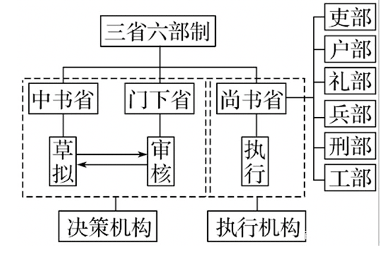

# 中国通史

## 1 中华道路

中国古代思想发展历程及中华民族走向统一的过程，探索中华道路中儒家思想的引领作用及各民族集大统的客观规律。

## 2 中华起源

中华民族祖先进化的过程。云南禄丰古猿。云南元谋直立人和周口店北京猿人。古人，也称早期智人，处于旧石器中期，包括陕西大荔人，山西丁村人等。新人，即现代智人，包括内蒙古河套人，周口店山顶洞人等，同时发现家族墓穴，标志家族和氏族公社的产生。旧石器时代和新石器时代最大区别是工具由简单变复杂，出现了陶器，从狩猎收集向农业和畜牧业发展。

## 3 农业起源

中华民族开始种植及生产粮食的过程，南方驯化野生稻，北方驯化狗尾巴草为谷子（去皮称作小米）。五谷指谷子，黄米，水稻，小麦，大豆。农业为文明出现奠定物质基础。

## 4 文明起源

中国辽河流域、黄河流域、长江流域出现很多以玉器为祭祀礼器的聚落文明，出现中华文明的曙光。仰韶遗址（今河南渑池），出现彩陶文化。良渚古城，发现城墙壕沟，玉器祭祀。各部落之间出现交流互访的痕迹。

## 5 邦国时代

中国出现一系列邦国文化，陶寺文化、石峁文化、石家河文化（苗蛮被灭）、良渚文化、二里头文化。山西陶寺文化发现天文台、圭表器具进行天文观测，制定历法，标识中土之国，进而产生中国的概念，这与尧制定历法相合，可能为帝尧之都。陕西石峁文化是中国史前规模最大的城址。长江流域的良渚文化带有强烈巫术色彩，发现大量精美玉石礼器。河南偃师二里头文化作为广域王权国家，昭示中华文明从多元无序走向多元一体。

## 6 夏王朝觅踪

河南偃师二里头发现宫殿遗址，应为夏王朝后期的都城所在。出土陶器上的刻符，被认为是文字雏形。河南嵩山（今登封）一带发现新砦遗址，被认为是夏的早期文化遗存。华夏文明出现*尧*、*舜*、*禹*部落领袖，其中*大禹*治水传说。后来首领禅让给东夷部落的*益*，但被*夏启*夺权建立夏王朝，从此世袭制代替禅让制。夏初经历政治动荡，东夷部落首领*后羿*夺权，*太康*失国，之后夏王朝复辟。夏王朝中期以后，统治者逐渐失去民心，暴君*夏桀*最终被*商汤*取代，夏王朝灭亡，中间历经470年左右。

## 7 殷商兴亡

*大禹*治水封邑商人，*伊尹*辅佐*成汤*（*商汤*）灭*夏桀*建立商王朝。后来*盘庚*迁都至殷都，今河南安阳。*武丁*时期商王朝达到鼎盛巅峰。*帝辛*（*商纣王*）囚禁*季历*，及其儿子*姬昌*（*周文王*，撰写《易经》，拜*姜子牙*为相），后被*姬发*（*周武王*）所灭，建立周王朝。商王朝历经500余年。

## 8 商代文明

商代已有后来中华文明的基础，甲骨文，祭祀体系，青铜器，礼器，酒器，乐器，农器，玉器，白陶（早期瓷器），经商文化（贝壳作为一般等价物），天文历法指导农耕。

## 9 武王克商

牧野之战，*周武王*（*姬昌*）在朝歌打败*商纣王*。牧野是方位词，邑外称郊，郊外称牧，牧外称野，野外称林。

## 10 周公摄政

西周初期刚推翻商朝统治，政治上民心不稳，危机四伏。*周公旦*施行仁政，创建分封制和宗法制，以礼治国。*周公*摄政七年，通过军事东征、分封制、移民商人、封前朝没落贵族*微子启*到宋地等一系列措施，巩固西周政权的政治基础，成就了后来的成康之治（*周成王，周康王*）。

## 11 周王朝衰落

*周穆王*西征，周王朝达到鼎盛时期。但同时因穷兵黩武，与西北的戎狄部落结仇。之后，经历*周宣王*中兴，*周幽王*为*褒姒*，烽火戏诸侯，最后因宠爱*褒姒*儿子，而追杀太子，导致戎狄侵占都城镐京，周天子逃亡，西周王朝覆灭。*周平王*迁都洛邑（洛阳），西周结束，进入东周。东周因分封制，势力不断被削弱，早已失去对各诸侯的控制。

## 12 春秋争霸

*管仲*辅佐*齐桓公*（*小白*）成为第一位春秋霸主，遵循尊王攘夷的政策。*晋文公*（*重耳*）62岁回到晋国当国君，取代周王成为实际的天下霸主。*楚庄王*在邲之战打败晋国，将楚国从“蛮夷”变为“霸主”，霸政取代了尊主。与*秦穆公*，*宋襄公*，合称春秋五霸。

## 13 孔子

*孔子*是没落贵族阶层，为了天下安定，希望能够恢复西周礼制。但在春秋诸侯割据的背景下，难以实现自己的政治抱负。后回到鲁国，开坛讲学，广收弟子，有教无类，通过孔子及其弟子的努力，儒学成为春秋战国最兴旺的学派之一。

## 14 列国变法

春秋礼乐崩坏，卿大夫篡权夺位，霸主政治退出舞台，进入诸侯兼并的局面。春秋战国以晋国分家为赵魏韩三家为标志，出现七雄并立，齐、燕、楚、秦、赵、魏、韩。各国都有增强国力的需求，重用有才能的士阶层，比如*吴起*《吴子兵法》，*李悝*《法经》，*商鞅*《商君书》等。内修文德，外置武备。变革需要推翻世卿世禄制度，与旧贵族阶级利益冲突，通常在失去国君的支持后，被旧势力反扑。战国时期出现郡县制，巩固君主集权，奠定了后世封建集权的制度基础。

## 15 战国七雄

春秋时期，兵家*孙子*著《孙子兵法》，侧重战略。战国时期，孙膑兵法侧重战术。桂陵之战（围魏救赵）与马陵之战（减灶之策），齐国*孙膑*打败魏国*庞涓*。长平之战，秦国*白起*打败赵国*赵括*。纵横家*苏秦*（主张合纵抗秦）与*张仪*（主张秦国连横）通过游说诸国，达到自己的政治目的。

## 16 诸子百家

儒家，亚圣*孟子*，性善论，*墨子*兼爱非攻；道家，*老子*《道德经》，*庄子*；名家，*惠施*，*公孙龙*，概念的定义有贡献；阴阳家，*邹衍*吹律，通过气候指导农业；儒家，*荀子*（其弟子*李斯*和*韩非子*）性恶论。*韩非子*，先秦法家的集大成者，反对思想自由。百家争鸣塑造了中华民族的思想文化历史。

## 17 秦国崛起

*秦穆公*，春秋五霸，夺取了晋国河西之地。后来，魏国夺回河西，*秦孝公*发奋图强，支持*商鞅*变法。商鞅新法通过郡县制，将秦国变为中央集权的官僚制国家。

## 18 秦始皇统一中国

*秦庄襄王*之后，*嬴政*即位，朝政掌控在相国*吕不韦*和*嫪毐*手中，后被铲除。兴建郑国渠，为秦国统一中国奠定物质基础。采纳*李斯*的《谏逐客令》，留用外国人才。*秦始皇*统一了中国，继续开疆拓土，岭南越族，北方匈奴，修建秦长城，秦直道交通网络。修建阿房宫，骊山墓。在全国巡游中去世，赵高联合李斯立胡亥，赐死扶苏。*陈胜* *吴广*起义，各地揭竿而起，秦王朝历时15年。

## 19 楚汉战争

各地起义反抗秦王朝统治，*项梁*和*项羽*大败秦军，其中巨鹿之战名震天下。*刘邦*进入关中后，向项羽请罪，鸿门宴。后来被贬派为汉中王。*刘邦*拜*韩信*为将军，后来，*楚怀王*被*项羽*杀害，*刘邦*向*项羽*发起楚汉战争，并在垓下之战消灭*楚霸王*。

## 20 郡国并行

汉初，七位异姓诸侯王割据势力强大，*汉高祖*四处征伐，以同姓诸侯王取代，并和大臣们立下白马之盟。*吕雉*临朝称制，傀儡皇帝，后来引入外戚诸侯。大臣拥立*汉文帝*即位后，迅速铲除外戚政权。*贾谊*主张“众建诸侯而少其力”。*汉景帝*时期，*晁错*主张削藩，吴楚七国叛乱，被腰斩。任命*周亚夫*平定叛乱以后，诸侯的地方官员由中央任命，*汉武帝*推行推恩令，从此分封制在中国历史名存实亡。

## 21 文景之治

汉初，*汉惠帝、吕后、文帝、景帝*推行休养生息的政策，轻徭薄赋，重视农业生产，社会恢复生产，为后面汉代盛世奠定经济基础。

## 22 汉武帝

汉初匈奴通过河西走廊频繁入侵，*汉武帝*通过河南漠南、河西、漠北之战，三大战争安定北部侵扰。通过军事外交，开疆拓土，展开了西汉盛世。实行各种中央集权的经济措施，盐铁专营，增加中央财政收入。因为穷兵黩武，后期国家处于崩溃边缘，颁布轮台诏，国家恢复生产。

## 23 两汉经学

汉初统治者采用黄老之学，与民休息，国力得到恢复和增长。随着社会发展，社会矛盾开始出现，需要新的学说来维护统治秩序。汉武帝采用大儒*董仲舒*建议，罢黜百家，独尊儒术。儒学被统治者采用为治国经典，儒学转向经学发展。《诗》、《书》、《礼》、《易》、《乐》（汉代已经失传）、《春秋》合称六经。

## 24 昭宣政治

*汉武帝*驾崩，指定*霍光*、*金日磾*、*上官桀*、*桑弘羊*为托孤大臣。*汉昭帝*延续*汉武帝*后期的休养生息政策。*汉昭帝*死后，*霍光*等大臣拥护*汉宣帝*即位。*霍光*嚣张跋扈，*霍光*死后因霍氏谋反，被满门清算。*汉宣帝*利用循吏和能吏，让中央的政策能在地方顺利落实，揭开了“昭宣中兴”的兴盛景象。

## 25 王莽改制

西汉后期，人口激增，社会矛盾频发，急切需要新的意识形态来解决社会问题。*王莽*提倡古文经学来批判今文经学的迂腐陈旧保守，今文经学被小部分既得利益集团所垄断，改革愿景符合当时大部分仕人的政治诉求。用过禅让方式，*王莽*称帝，改国号为“新”，建立新朝。托孤改制，进行全面社会变革，但理想脱离实际，最后改革失败，社会矛盾愈发严重，形成赤眉、绿林大规模的起义反抗，新朝灭亡，也证明了生搬儒家思想做法去治国失败。

## 26 光武中兴

*刘秀*昆阳之战，击溃*王莽*主力，一战成名。受*刘玄*猜忌，在华北积攒独立势力，顺应人心思汉，并最终建立东汉政权。建立政权后，退功臣而进文吏。通过度田制，缓解土地兼并问题。柔道治国，铁腕治吏。在社会上掀起重儒尊儒的风气。

## 27 丝绸之路

*张骞*开拓了丝绸之路，连接了中西方文明中心。同时佛教在两汉之际传入中原，白马寺是第一座官办佛教寺院。汉朝设置了西域都护府，保障丝绸之路的畅通，传播了汉王朝的文化软实力。东汉时期，*班超*为西域回归做出巨大贡献。大秦派出使者访问东汉，开拓了海上丝绸之路。

## 28 清议与党锢

东汉后期，皇帝年幼，太后临朝称制，导致外戚专权。*汉桓帝*联合宦官夺权，造成宦官专权的局面，与外廷士大夫官僚集团形成权力斗争。宦官本质也是皇权的一种延伸，在政治斗争中，*汉灵帝*时期下，通过两次党锢之祸，挤占甚至断绝士人阶层的政治出路，打破了政治平衡，引起没落贵族阶级反抗现有社会秩序的局面。

## 29 黄巾起义

东汉晚期，土地兼并严重，导致流民问题突出，成为东汉王朝覆灭的根本原因。*张角*张氏家族结合宗教信仰发动农民起义，黄巾军被东汉*卢植*、*皇甫嵩*所镇压。平叛之后，宦官集团与官僚集团矛盾依然没有得到解决，十常侍把控朝政。*汉灵帝*为对抗地方起义，下放权力给地方州牧，地方军阀，形成新的军阀割据势力。其中，*曹操*收编黄巾军为青州兵，作为势力发展的基础。

## 30 三国鼎立

东汉晚期，*汉灵帝*驾崩，*汉少帝*继位，外戚*何进*掌权，欲联合*董卓*地方势力清除宦官集团，东窗事发被十常侍所杀。*董卓*趁机控制洛阳。另立*汉献帝*。各路诸侯联军伐*董卓*，推举*袁绍*为盟主，但最后以失败告终。*曹操*奉天子以令诸侯。*孙坚*及*孙策*为东吴政权打下基础。*曹操*通过官渡之战，统一北方。*孙权刘备*通过赤壁之战，初步形成三分天下的局面。通过夷陵之战，三足鼎立的天下局势正式形成。

## 31 诸葛亮治蜀

*刘备*托孤以后，*诸葛亮*执掌蜀汉政权。南征南中，七擒孟获。修订法律，制订《蜀科》。修都江堰，设置堰官。国营盐铁，推广蜀锦，制订一系列经济措施。最后，军事上五出祁山伐魏，为蜀汉事业死而后已。

## 32 西晋统一

*司马懿*作为曹丕托孤大臣之一，曹魏政权到*曹睿*时期，又托孤*曹爽*和*司马懿*。*曹芳*即位，*曹爽*开始排挤司马氏家族，*司马懿*称病回家。趁曹氏宗族出京扫墓，发动高平陵事件，消除曹氏宗室的势力。*司马师*继承接管*司马懿*的权力，废除*曹芳*，另立*曹髦*为帝。*司马师*病逝后，*司马昭*继承*司马师*，*曹髦*率兵讨伐*司马昭*，被*司马昭*指使武士杀害，另立*曹奂*为帝。*司马昭*确立先灭蜀汉，再灭孙吴。*钟会*和*邓艾*攻占蜀汉，*司马炎*逼迫*曹奂*禅让，*晋武帝*建立西晋政权。*孙皓*归降于西晋，至此完成了中国的统一。西晋初期，因为分封诸侯，导致八王之乱，严重打击了西晋王朝。八王混战，天灾战乱导致人口南北大迁徙，北部少数民族入侵中原，国家分裂，五胡乱华，最终西晋灭亡。

## 33 魏晋风度

*孔融*因清议反对曹魏政权，被杀。曹魏后期，因复杂的政治斗争，*嵇康*等人的竹林七贤躲避政治风险，寄情山水。*嵇康*提出“越名教而任自然”，最后因反对司马氏篡权而被杀。*王羲之*天下第一行书。*谢安*指挥淝水之战打败前秦军队，使东晋得以存继。*陶渊明*中国第一位田园诗人。

## 34 门阀政治

*司马睿*来到南方建康，在*王导*和世族大家的拥护下，成立了东晋政权，中国进入了门阀政治的时代。政治天平在皇权和世家贵族之间反复钟摆，取得相对平衡。*谢安*在淝水之战战胜前秦的百万军队，解除了来自北方的外部军事威胁。皇权和世家贵族共治天下，让东晋偏安一方，为南方人民和北方难民保留一片净土。政治权利平衡，限制了专制皇权，激发魏晋士人自由个性和思想，在文化和艺术上达到兴盛景象。*桓玄*通过清君侧的名义起兵，后来称帝，国号楚。北府军*刘裕*起兵反对*桓玄*，迎回*司马德宗*。后来，出身寒门的*刘裕*代晋自立，建立刘宋王朝。“寒人掌机要”，从此寒族冲击士族统治，东晋灭亡，东晋门阀政治正式结束。

## 34.5 刘宋南齐（补遗）

五胡指匈奴，羌，鲜卑，氐，羯。五胡十六国时期，北方被前秦（氐族）和北魏（鲜卑）统一过。宋、齐、梁、陈四朝统称为南朝，均以建康为都。*刘裕*通过改革开启了后来的“元嘉之治”。刘宋后期，政权内部争夺激烈，*萧道成*掌握大权，逼迫皇帝禅让，改国号为齐。

## 35 梁武帝治国

*萧衍*反攻前来讨伐的*齐废帝萧宝卷*军队，最终攻陷建康，接受禅让，成为梁武帝，取代南齐建立南梁政权。设置五经馆，招揽寒门子弟，制订儒学五礼制度，编撰佛教在家受菩萨戒，恢复礼制孝道，以儒治国，史称“天监之治”。*梁武帝*后期，助长迷信佛教的社会风气，大兴人力建造寺庙，社会劳动力减少，国力渐衰。最终在“*侯景*之乱”后，被软禁于宫殿。

## 36 孝文帝改革

前秦*苻坚*军队被东晋*谢安*打败，拓跋鲜卑*拓跋珪*趁机创建北魏政权。*拓跋焘*统一北方，宣传礼义，崇尚儒学，治国安邦。命*崔浩*编撰《国书》，因秉笔直书，“国史之狱”被杀。*冯太后*和*孝文帝拓跋宏*相继进行一系列汉化改革，史称“太和新制”，实行均田制，发展农业生产，并且从平城（山西大同）迁都洛阳，改变语言、服饰，改姓汉姓，将儒学作为国家意识形态，为中华多民族融合作出贡献。

## 37 北周武帝

北魏汉化改制的同时，镇守北方边疆鲜卑旧贵族失势不满，发起六镇兵变，对农业生产造成破坏，各地起义，政局动荡。北魏分裂为东魏西魏，分别为*高欢*和*宇文泰*掌控。初期，东魏依靠六镇鲜卑，国力强大，执行鲜卑化政策，鲜卑贵族愈发跋扈，国力日渐衰败。*宇文泰、宇文护*让西魏被北周取代。*北周武帝宇文邕*尊崇儒学，实行均田制，倡导汉文化。因为佛教思想盛行，导致国家财政收入减少，开始推行灭佛运动，让僧尼还俗，解放社会生产力。*北周武帝*从*宇文护*手上夺回兵权，通过两次伐齐战争，统一北方。

## 38 陈朝兴亡

出身寒门的*陈霸先*，平定南梁的*侯景*之乱。在与北齐交战中夺回建康，通过禅让方式称帝，建立陈朝。期间克勤自律，恭俭勤政，削弱地方士族，招揽寒门子弟，社会得到恢复。到*陈后主*时期，*陈叔宝*文采风流，但乐于苟安，怠于政事，最后陈朝被隋灭亡。

## 39 魏晋佛教

*鸠摩罗什*被前秦派*吕光*军队从西域掳走，后来被后秦*姚兴*迎入长安，在长安组织译经场，让佛教真正在中国传播扎根。*佛图澄*，*道安*，*慧远*（净土宗创始人，沙门不敬王者论），将外来佛教文化融入中华文化之中，成为中国佛教。

## 40 再造统一

北魏汉化改革激起鲜卑旧贵族的矛盾，*破六韩拔陵*发起六镇兵变，政权最后落入东魏*高欢*和西魏*宇文泰*。西魏重视联合汉族地方豪强和士族，形成关陇集团，采取八大柱国，府兵制。北齐轻视汉人，朝政也不断腐化，最终被北周统一。*杨坚*因战功卓著，势力不断壮大，最终取代北周，开启隋政权。出兵打败突厥，将其分裂为东西突厥，再也无力对抗隋朝，解决北方游牧侵略问题。之后挥师南方，攻占陈朝建康，岭南*冼夫人*率众归降，隋最终统一中国。

## 41 隋炀帝功过

开皇初期，*隋文帝杨坚*将地方官员任命收归中央吏部，不得连任，州郡县三级改革为州县两级，加强中央集权。建立三省六部制，将决策和行政分开，程序分工。*隋炀帝杨广*创建科举制度选拔人才，迁都洛阳，修建京杭大运河（涿郡到余杭），西征吐谷浑维护丝绸之路，开发西域，开拓中国疆域。但三次高丽辽东战争，耗费了大量国力，统治阶级内部分裂，农民起义频发，导致隋朝迅速灭亡。

## 42 贞观之治

*李世民*唆使*李渊*起兵反隋，推翻*隋炀帝*，定都长安，建立唐朝。*李世民*发动玄武门之变，开启“贞观之治”。*唐太宗*创立文学馆，招贤纳士（包括*房玄龄*），制订唐律，施行平等的民族政策，被尊为“天可汗”。贞观之治以*魏征*去世为界限，君臣关系和政治风气可以划分为前、后两个阶段，后期渐不克终。

## 43 武则天

*武则天*在*唐太宗*时期入宫，*唐高宗*时期，联合寒门出身的官员，打击关陇贵族集团（*长孙无忌*），封为皇后，进而封为天后共治天下。高宗驾崩后，临朝称制，最后称帝，改国号为周。为政知人善任，开拓科举入士的通道，结束中国门阀贵族政治，所培养提拔的人才为后来开天盛世打下基础。晚年，*武则天*遭遇神龙政变，被迫退位，大臣拥立太子，唐朝复辟。

## 44 开天盛世

*李隆基*拥立父亲*李旦*称帝，取代*韦皇后*和*太平公主*的势力。后来*李旦*让位于*李隆基*。*唐玄宗*任命*姚崇*，*宋璟*为相，有丰富的地方工作经验，进行改革政策。农业生产力得到发展，出现筒车和曲辕犁。编撰《唐六典》行政法典。政治清明，社会安定，经济发展，文化繁荣，疆域辽阔，对外关系稳定，史称“开天盛世”。

## 44.5 皇权相权之争

宰相开府辟僚，自成一套与皇宫并行的机构，形成了相权。相权虽来源于皇权，但因为它的独立性非常大，反而分割、制约了皇权，制约相权就成为封建专制制度的趋势。汉代在丞相府设司直，用于监督检举丞相，用低级文官尚书，直接传达圣旨。但后来尚书台取代宰相成为事实相权掌控者。

隋朝设立三省六部制，流程分工明确，避免一人独大的可能性，但实质上还是封建中央专制集权下的一种工具。

## 45 安史之乱

*唐玄宗*后期怠政，*张九龄*罢相以后，*李林甫*把持朝政，打压政敌，导致国家人才流失。*李林甫*死后，因宠幸*杨贵妃*，*杨国忠*上位并大权独揽。*安禄山*身兼多地节度使，手握帝国重兵，发起安史之乱，至此唐王朝由盛转衰，*唐玄宗*出逃长安。

## 46 中晚唐的困局

为迅速平定安史之乱，*唐代宗*对节度使采取妥协政策，从此节度使成为割据一方的军事政治势力。*德宗*和*宪宗*依次进行削藩，全国暂归统一，史称“元和中兴”，但客观上已无力彻底消灭地方割据。后来*宪宗*被宦官杀害，*唐穆宗*继位，进入晚唐。*宪宗*时期，朝廷内部发生朋党之争。同时宦官专权危害更甚，唐代掌握禁军兵权，枢密使成为皇帝与宰相沟通的枢纽，内廷宦官掌握军政，成为政府实际统治者，拥有皇帝的废立生杀之权。宦官与朝官的权力斗争，称为南衙北司之争。*唐僖宗*时期，终于发生*黄巢*农民起义。最后，藩镇博弈中，*朱温*胜出并推翻唐朝。唐王朝衰落的根本原因是，随着经济发展，土地集中，大地主大官僚利益集团互相勾结，反对有利于民生的改革，脱离人民群众利益。

## 47 世界都会长安

西汉长安城到隋唐时，已被毁坏殆尽。隋朝开始在汉长安旧址上建设大兴城，到唐朝时，改回长安。长安城市规划宏伟，独立的供水和排水系统，城市分为京城、皇城、宫城的机构，京城里有坊市，东市西市。各国派遣使者、留学生来长安参观、学习，长安也以包容自信的文化魅力吸引八方旅人。最后，长安城也随着唐朝灭亡而毁灭没落。

## 48 吐蕃兴衰

藏族作为一个民族共同体，始于吐蕃政权。*松赞干布*向*唐太宗*请求和婚，*文成公主*远嫁吐蕃，并带去先进科技和文化。*赤德祖赞*作为吐蕃赞普，吐蕃进入鼎盛时期，迎娶*金城公主*。苯教作为西藏本土的原始宗教信仰，一直与*松赞干布*引进的佛教文化有冲突。吐蕃和唐王朝时战时和，长庆会盟（*唐穆宗*长庆年间）作为唐蕃最后一次和约会盟，划定彼此边界。

## 49 敦煌

敦煌自从西汉开始，便成为河西走廊上军事和商业中心，是西域进入中原的第一站。北朝前秦时期，*乐尊*于敦煌三危山开凿禅窟，此为莫高窟，从此成为佛教圣地。盛唐时期，因安西都护府和安西四镇的设置，敦煌成为军事后方，发展至鼎盛时期。之后敦煌被吐蕃政权占领，*张议潮*起义反抗吐蕃，重归唐朝。后来丝绸之路北移，敦煌衰败，同时莫高窟藏经洞里的文物宝藏流落至国外。

## 50 唐朝的对外关系

东亚文化圈在唐朝正式形成，文化要素有汉字，儒学，律令制度，汉传佛教，科学技术等。新罗在唐朝时统一朝鲜半岛，作为新罗留学生*崔志远*成为韩国汉文学鼻祖，韩国深受儒家文化影响。日本大化改新，推动政治制度改革，奈良时期（都城平城京）到平安时期（都城平安京），日本社会方方面面吸收唐风文化影响，形成后来的国风文化。广州作为唐朝最大的经商口岸，是海上丝绸之路沟通南洋，南亚，中东波斯的重要港口。开放、包容、多元是唐朝文化精神的特征。

## 51 唐代宗教

## 52 五代十国

五代指后梁，后唐，后晋，后汉，后周。
