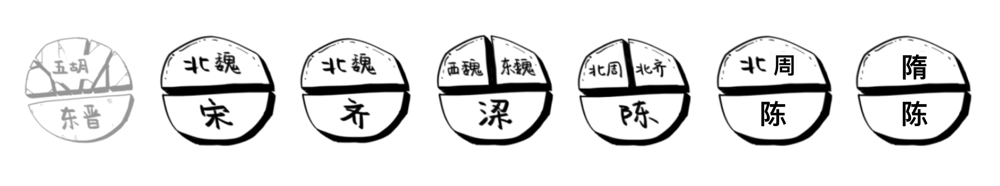
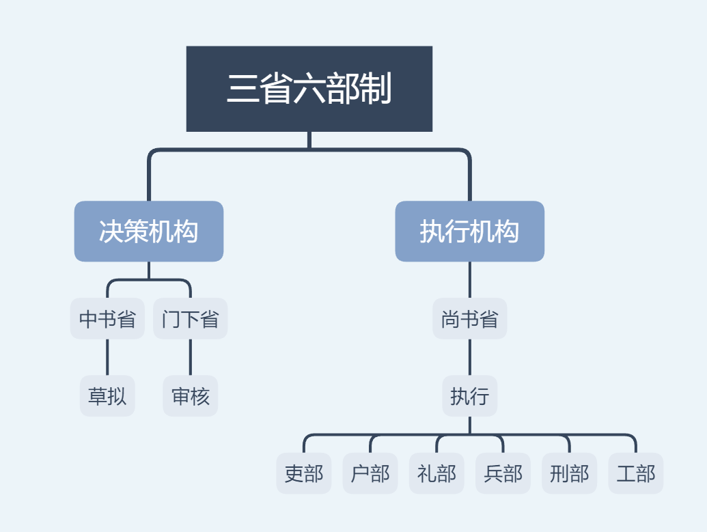
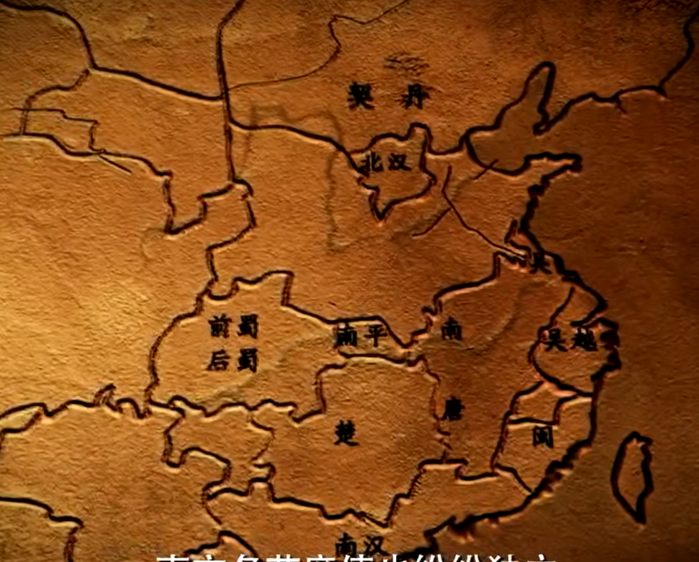
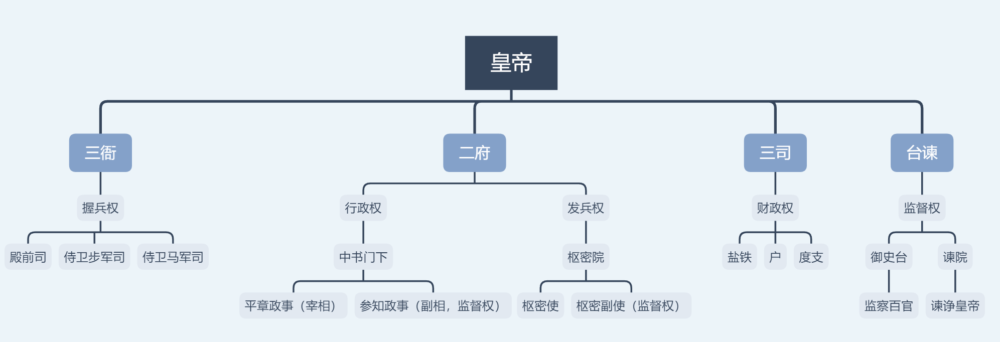
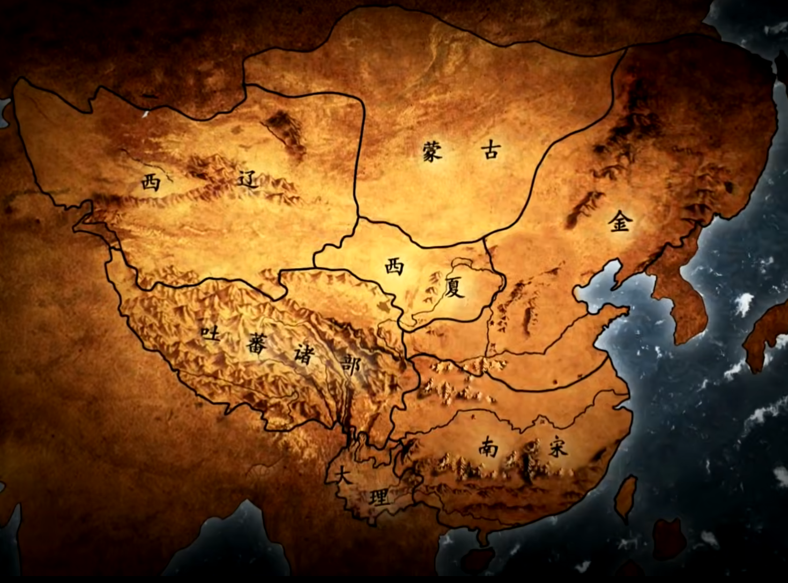
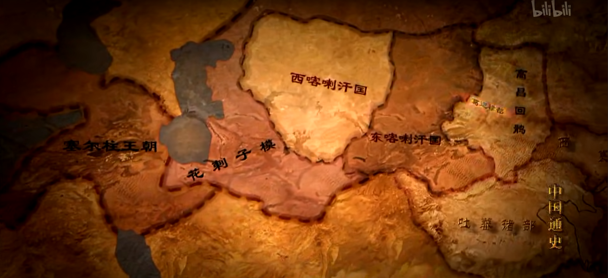
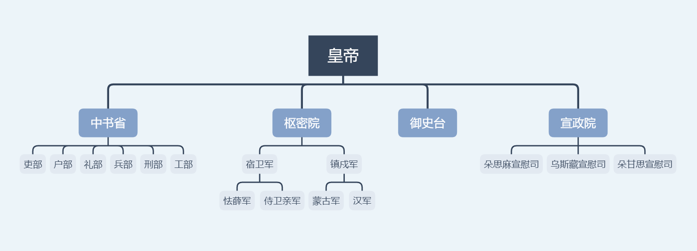
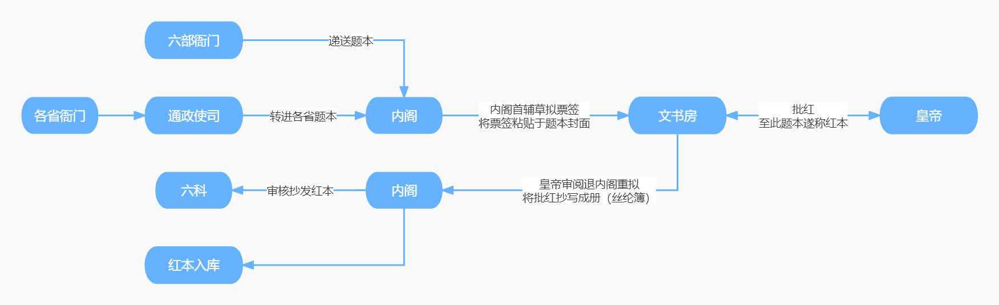

# 中国通史

[TOC]

## 1 中华道路

作为序言，讲述中国古代思想发展历程和儒家思想的引领作用，探索中华民族走向统一及各民族相互融合的客观规律。

## 2 中华起源

追溯中华民族祖先进化的历程，古猿，直立人，早期智人，晚期智人，佐证中华地区完整独立的人类进化史。

云南禄丰古猿，距今约800万年前，栖息在树上的猿类。

直立人开始直立行走，解放双手，能够使用石器，视野开阔。云南的元谋直立人，距今约170万年，考古发现会使用石器。周口店北京猿人，距今50万年左右，学会保存使用天然火。

古人，也称早期智人，处于旧石器中期，身上遗留的原始特征趋于消失，广西木榄山智人距今约11万年。

新人，即现代智人，北京周口店的山顶洞人距今3万年左右。狩猎采集能力提高，能够制造复杂的工具（比如骨针）和装饰品。同时考古发现家族墓穴，标志家族概念和氏族公社组织的产生。

**新旧石器时代**

> 旧石器时代和新石器时代最大区别是工具由简单变复杂，出现了陶器，从狩猎采集向农业和畜牧业发展。

## 3 农业起源

聚落开始种植生产粮食，南方驯化野生稻，北方驯化狗尾巴草为谷子。农业的出现为文明形成奠定物质基础。

**五谷**

> 五谷指谷子，黄米，水稻，小麦，大豆。其中谷子去皮称为小米。

## 4 文明起源

中国辽河流域、黄河流域、长江流域出现很多以玉器为祭祀礼器的部落文明，出现阶级地位差别，闪现中华文明出现的曙光。

仰韶遗址（今河南渑池），出现彩陶文化。

良渚古城，发现城墙壕沟，玉器祭祀。

各部落上层之间出现交流互访的痕迹。

**龙山文化**

> 龙山文化泛指中国黄河中、下游地区约新石器时代晚期的一类文化遗存，分布于黄河中下游的河南、山东、山西、陕西等省。龙山文化时期相当于文献记载的夏代之前或与夏初略有交错。

## 5 邦国时代

中国出现一系列邦国文化，如陶寺文化、石峁文化、石家河文化（推测是苗蛮部落遗址，当时因战争被毁）、良渚文化（推测是东夷部落遗址）、二里头文化。

山西陶寺文化发现天文台和圭表器具进行天文观测，制定历法指导农耕，标识出中土之国，进而产生“中国”的概念。这与传说中*尧*制定历法暗合，可能为帝*尧*之都。

陕西石峁文化是中国史前规模最大的城址。

长江流域的良渚文化带有强烈巫术色彩，发现大量精美玉石礼器。

河南偃师二里头文化作为广域王权国家，昭示中华文明从多元无序走向多元一体。

## 6 夏王朝觅踪

河南嵩山（今登封）一带发现新砦遗址，考古认为是龙山文化和夏的早期文化遗存。

河南偃师二里头发现宫殿遗址，应为夏王朝后期的都城所在。出土陶器上的刻符，被认为是文字雏形。

华夏文明里有*尧*、*舜*、*禹*作为部落领袖的传说，其中*大禹*治水，反映了中华民族不肯屈服于自然，自强不息的精神内核。

*大禹*后来将首领禅让给东夷部落的*益*，但*益*后被*大禹*的儿子*启*夺权，建立夏王朝，从此世袭制代替禅让制。

夏初经历政治动荡，东夷部落首领*后羿*夺权，史称“*太康*失国”，之后夏王朝复辟。

夏王朝中期以后，统治者逐渐失去民心，末代暴君*夏桀*被*商汤*推翻，夏王朝灭亡，夏朝（约公元前2070 - 约公元前1600年）历经约470年。

## 7 殷商兴亡

*大禹*因*契*治水有功，将其受封于商地，*契*成为商族部落的始祖。

*伊尹*辅佐商国君主*成汤*（即*商汤*）推翻*夏桀*统治，建立商王朝。

*盘庚*从奄（今山东曲阜）迁都至殷（今河南安阳）。

*武丁*时期商王朝达到鼎盛巅峰。

*帝辛*（*商纣王*）囚禁*季历*及其儿子*姬昌*（即*周文王*，撰写《易经》，后来拜*姜子牙*为相）。后被*姬发*（即*周武王*，*姬昌*的儿子）所灭，商朝（约公元前1600 - 前1046年）历经约550年。

## 8 商代文明

商代已有后来中华文明的基本特征，包括甲骨文，祭祀体系，青铜器，礼器，酒器，乐器，农器，玉器，白陶（早期瓷器），经商文化（贝壳作为一般等价物），利用天文历法指导农耕。

## 9 武王克商

*周武王*（*姬昌*）一边麻痹商王朝的注意，一边精心策划准备，终于觅得良机，果断向商朝发动战争。*商纣王*因为主力军队正征讨东夷，只能临时征用奴隶，组建军队抵抗*周武王*。双方在都城朝歌的郊外遭遇，战争一开打，商朝军队内部就发生倒戈一击，很快就被*周武王*的军队打溃。*商纣王*战败自杀，商朝也随之灭亡。

**牧野之战**

> 牧野是方位词，邑外称郊，郊外称牧，牧外称野，野外称林。

## 10 周公摄政

西周初期刚推翻商朝统治，政治上民心不稳，危机四伏。*周武王*托孤*周公旦*，辅佐*周成王*。*周公*施行仁政，以礼治国。到*成王*年长，*周公*还政于*成王*，后来成为千古美谈。

*周公*摄政七年，通过军事东征，推行分封制和宗法制，以移民方式分散商人，封前朝贵族*微子启*到宋地，一系列措施巩固西周政治基础，铺垫了后来的成康之治（*周成王*和*周康王*时期）。

## 11 周王朝衰落

*周穆王*西征，周王朝疆域达到鼎盛。但同时因穷兵黩武，与西北的戎狄部落结仇。

*周厉王*搜刮民脂民膏，对国民言行实施高压政策，人民生活困苦，导致贵族和平民暴动造反，*周厉王*仓皇逃跑。*邵穆公*为了保护年幼的太子（即*周宣王*），牺牲自己的儿子。

周天子逃出宗周镐京，西周实行贵族联盟政治，由*共伯和*代行周天子，*召公*等辅政，进入“共和行政”。

**共和元年**

> 共和元年指公元前841年，西周进入短暂的共和时期，也是中国历史有确切纪年的开始。

*周厉王*死后，贵族们共同拥立*周宣王*。*周宣王*使西周的国力得到短暂恢复，史称“*宣王*中兴”。

*周幽王*迷恋*褒姒*，导演烽火戏诸侯。后因宠爱*褒姒*的儿子，而派兵追杀太子。戎狄部落趁机出兵侵占都城镐京，周王室向东逃亡，西周王朝覆灭。西周（公元前1046 - 前771年）历时275年。

*周平王*迁都洛邑（今河南洛阳），进入东周政权。东周天子因分封制，势力不断被削弱，早已失去对各诸侯的控制。

## 12 春秋争霸

*管仲*辅佐*齐桓公*（*小白*）成为春秋时期的第一位霸主，采用尊王攘夷的政策。

*晋文公*（*重耳*）62岁才回到晋国当国君，取代周王成为实际意义的天下霸主。

*楚庄王*在邲之战打败晋国，正式将楚国从“蛮夷”变为“霸主”，霸政开始取代尊主成为潮流。

**春秋五霸**

> *齐桓公*，*晋文公*，*楚庄王*，*秦穆公*，*宋襄公*，合称春秋五霸。

## 13 孔子

*孔子*原本是没落的贵族阶层。为了天下安定，希望统治者能够恢复西周的礼制。但在春秋时期，诸侯割据的背景下，难以实现自己的政治抱负。

后来回到鲁国，开坛讲学，广收弟子，有教无类。通过*孔子*及其弟子的努力，儒学成为春秋战国最兴旺的学派之一。

## 14 列国变法

春秋礼乐崩坏，卿大夫篡权夺位，霸主政治退出舞台，进入战国诸侯兼并的局面。战国时期出现七雄并立，齐、燕、楚、秦、赵、魏、韩。

诸侯纷战，各国都有增强国力的愿望，重用有才能的士阶层，出现了*吴起*（《吴子兵法》，提倡“内修文德，外治武备”），*李悝*（《法经》），*商鞅*（《商君书》）等。

改革变法通常是推翻世卿世禄的旧制度，与旧贵族阶级的既得利益冲突，在失去国君的支持以后，被旧势力反扑。战国时期开始出现郡县制，加强君主集权，奠定了后世封建集权的制度基础。

**春秋战国的划分**

> 春秋战国的划分，一种说法是春秋战国以晋国分家为赵、魏、韩三家作为标志。这是基于历史重大事件的划分。

> 按照《中国历史纪年简表》，是在公元前476年，即周敬王卒年。此时井田制已经瓦解，各诸侯国逐渐承认私田，地主阶级开始形成，铁器农具的应用，生产力得到发展，新的生产关系已经形成，中国已进入事实意义的封建社会。这是基于社会性质改变节点的划分。

## 15 战国七雄

春秋时期，兵家*孙子*著《孙子兵法》，侧重战略。

战国时期，孙膑兵法侧重战术。桂陵之战（围魏救赵）与马陵之战（减灶之策），齐国*孙膑*打败魏国*庞涓*。

长平之战，秦国*白起*击败赵国*赵括*的军队，坑杀四十万投降的赵军，加速秦统一六国的步伐。

纵横家*苏秦*（主张合纵抗秦）与*张仪*（主张秦国连横）通过游说诸国，达到自己的政治目的。

## 16 诸子百家

春秋战国时期，政治氛围宽松，为士人提供展示才华的舞台，诸子学说百家争鸣，思想文化空前繁荣，塑造了此后中华民族的思想文化历史。

儒家亚圣*孟子*提出性善论。

源自儒家学说的*墨子*提出兼爱非攻。

道家创始人*老子*（*李耳*）撰写《道德经》。

*庄子*与*老子*并称“老庄”。

名家的*惠施*和*公孙龙*，对于哲学上概念的定义有启发意义。

阴阳家*邹衍*吹律，实质是通过气候指导农业生产。

儒家*荀子*（其弟子有*李斯*和*韩非子*）提出性恶论。

法家*韩非子*，作为先秦法家的集大成者，推行酷法，反对思想自由。

## 17 秦国崛起

*秦穆公*作为春秋五霸之一，夺取了晋国河西之地。

战国时期，魏国和秦国之间为争夺河西，反复交战。*秦孝公*在国内推行改革，支持*商鞅*变法。*商鞅*新法通过郡县制取代分封制，官员任命上以君主任命取代世卿世禄，将秦国变为中央集权的官僚制国家。

最终秦国与魏国较量之中，先败后胜，夺得了河西之地。

**东周灭亡**

> 公元前256年，*秦昭襄王*发兵攻打洛邑，周朝灭亡。周朝（公元前1046 - 前256年）共历时790年，其中东周（公元前770 - 前256年）历时514年。

## 18 秦始皇统一中国

*秦庄襄王*之后，*嬴政*即位，此时朝政掌控在相国*吕不韦*和*嫪毐*手中。*嬴政*先后平定*嫪毐*叛乱，除掉权臣*吕不韦*，终于独揽大权。

内政上，*嬴政*兴建郑国渠，为秦国统一中国奠定经济基础。采纳*李斯*的《谏逐客令》，留用外国人才。

*嬴政*完成统一中国，称“*秦始皇*”，都城咸阳（陕西境内）。继续开疆拓土，南征岭南越族，北伐匈奴，修建秦长城，构建秦直道作为全国交通网络主干。修建阿房宫，骊山墓。

在一次全国巡游中暴毙，宦官*赵高*胁迫丞相*李斯*合谋立*胡亥*为秦二世，逼长子*扶苏*自杀，*赵高*开始独揽大权。

因为秦暴政，各地揭竿而起，*陈胜吴广*掀起农民起义，*刘邦*攻占都城咸阳，秦朝灭亡。秦王朝（公元前221 - 前207年）仅历时15年。

## 19 楚汉战争

各地起义反抗秦王朝统治，其中*项梁*和*项羽*大败秦军，在巨鹿之战名震天下。为从民望，*项梁*迎立*楚怀王*，恢复楚国社稷。

*刘邦*率先攻占咸阳，灭亡秦朝。*刘邦*以请罪的名义，赴*项羽*的鸿门宴，后被贬派到汉中。

*刘邦*拜*韩信*为将军。

后来，*楚怀王*被*项羽*杀害，*刘邦*向*项羽*发起楚汉战争，并在垓下之战消灭*楚霸王*。

## 20 郡国并行

汉初，七位异姓诸侯王割据势力强大，*汉高祖*四处征伐，以同姓诸侯王取代，并与大臣立下白马之盟，“非刘氏而王，天下共击之”。

*吕雉*临朝称制，傀儡皇帝，引入外戚诸侯。

*吕太后*死后，大臣拥立*汉文帝*即位，迅速铲除外戚政权。

*贾谊*向*汉文帝*提出“众建诸侯而少其力”的主张。

*汉景帝*时期，*晁错*主张削藩。吴楚七国起兵“清君侧”，*晁错*被腰斩于市，但叛乱仍未结束。*汉景帝*任命*周亚夫*最终平定诸侯叛乱。

此后诸侯的地方官员由中央任命。到*汉武帝*时，实行推恩令，从此分封制在中国历史名存实亡。

## 21 文景之治

汉初，*汉惠帝*、*吕后*、*文帝*、*景帝*遵循黄老之道，无为而治，推行休养生息的政策，轻徭薄赋，重视农业生产。社会开始恢复生产，为后面的汉代盛世奠定经济基础。

## 22 汉武帝

汉初匈奴通过河西走廊频繁入侵，*汉武帝*通过河南漠南、河西、漠北之战，三大战役安定北部匈奴侵扰。

军事外交上，开疆拓土。内政上，实行各种中央集权的经济措施，盐铁专营，增加中央财政收入。呈现出西汉盛世。

*汉武帝*后期因穷兵黩武，国家处于崩溃边缘，颁布轮台诏（中国历史上第一份皇帝的罪己诏），国家重新恢复生产。

## 23 两汉经学

汉初统治者采用黄老之学，与民休息，国力得到恢复和增长。

随着社会发展，社会矛盾开始出现，需要新的学说来维护统治秩序。*汉武帝*采用大儒*董仲舒*的建议，罢黜百家，独尊儒术。儒学被统治者采用为治国经典，儒学开始转向经学发展。

**六经**

> 《诗》、《书》、《礼》、《易》、《乐》（汉代已经失传）、《春秋》合称六经。

## 24 昭宣政治

*汉武帝*驾崩，指定*霍光*、*金日磾*、*上官桀*、*桑弘羊*为托孤大臣。*汉昭帝*延续*汉武帝*后期的休养生息政策。

*汉昭帝*死后，*霍光*等大臣拥护*汉宣帝*即位。*霍光*开始嚣张跋扈，*霍光*死后因霍氏谋反，被满门清算。

*汉宣帝*利用循吏和能吏，让中央的政策能在地方顺利落实，揭开了“昭宣中兴”的景象。

## 25 王莽改制

西汉后期，人口激增，社会矛盾频发，急切需要新的意识形态来解决社会问题。

今文经学一直被小部分既得利益集团所垄断，*王莽*提倡古文经学来批判今文经学的迂腐陈旧保守。当时西汉后期政治腐败，社会矛盾日益严重，而*王莽*的改革愿景符合当时大部分仕人的政治诉求，因此*王莽*逐渐声名显赫，朝政大权在握。

*王莽*经过策划，接受禅让，代汉称帝，改国号为新，西汉灭亡。西汉（公元前202 - 公元8年）历时210年。

*王莽*托古改制，进行全面的社会变革。但一味迷信复古，生搬硬照儒家经典治国，理想脱离实际，社会矛盾愈发严重，最后改革宣告失败。

改革失败和天灾激起了赤眉、绿林等农民起义，绿林军攻入长安，新朝迅速灭亡。

## 26 光武中兴

*刘玄*作为汉朝宗室，被绿林军拥戴为皇帝，称更始帝。

*刘秀*作为联军，在昆阳之战中抵御新军精锐，击溃*王莽*主力，一战成名。

*刘秀*功高震主，受*刘玄*所猜忌。*刘秀*趁着被派招抚河北州郡，开始积攒独立势力。后来时机成熟，与*刘玄*公开决裂，*刘秀*顺应人心思汉，建立东汉政权，并统一全国。

统一全国后，*光武帝刘秀*退功臣而进文吏。政策上，通过度田制，缓解土地兼并问题。柔道治国，铁腕治吏。*光武帝*时期社会上掀起重儒尊儒的风气。

## 27 丝绸之路

*张骞*开拓了丝绸之路，连接了中西方文明中心。

同时佛教在两汉之际传入中原，白马寺是第一座官办佛教寺院。

西汉设置了西域都护府，保障丝绸之路的畅通，传播了汉王朝的文化软实力。

东汉时期，*班超*出使西域，通过外交和军事手段，拓展东汉在西域的势力范围，为西域回归中央政权作出巨大贡献。

大秦（古罗马）派出使者成功访问东汉，开拓了海上丝绸之路。

## 28 清议与党锢

东汉后期，皇帝年幼，太后临朝称制，导致外戚专权。

*汉桓帝*联合宦官与外戚集团夺权，成功以后又造成宦官专权的局面。宦官集团与外廷的士大夫官僚集团形成权力斗争。

东汉政治腐败，士大夫集团联合起来反抗宦官势力，发起清议。但东汉宦官集团本质上已成为皇权的一种延伸。*汉灵帝*时期的政治斗争中，皇帝和宦官集团大量囚禁处死清议官员，清流党的官员朝廷永不复用，史称“党锢之祸”。

宦官集团挤占甚至断绝士人阶层入仕的政治道路，打破了政治平衡，引起没落贵族阶级反抗现有社会秩序的局面。

**清流与清议**

> *桓帝灵帝*时期，宠信宦官，官场腐朽，*李膺*（ying）等一批有见识的士大夫挺身而出，激浊扬清，谓之清流，喻指德行高洁、负有名望的士大夫。清流派发出的尖锐深刻、针砭时弊的社会舆论和谏言称为清议。

## 29 黄巾起义

东汉晚期，土地兼并严重，导致流民问题突出，成为东汉王朝覆灭的根本原因。

*张角*和张氏家族结合宗教信仰发动农民起义，黄巾军被东汉*卢植*、*皇甫嵩*所镇压。

平叛之后，宦官集团与官僚集团矛盾依然没有得到解决，由十常侍把控朝政。

*汉灵帝*为对抗地方起义，下放权力给地方州牧，地方军阀，形成新的军阀割据势力。其中，*曹操*收编黄巾军为青州兵，作为日后势力发展的基础。

## 30 三国鼎立

东汉晚期，*汉灵帝*驾崩，*汉少帝*继位，外戚*何进*掌权，欲联合*董卓*地方势力清除宦官集团，东窗事发被十常侍所杀。

*董卓*集团趁机控制洛阳，另立*汉献帝*。

各路诸侯联军讨伐*董卓*，推举*袁绍*为盟主，但各为私利，讨伐军以失败告终。

*曹操*迎奉天子到都城许昌，奉天子以令诸侯。

*孙坚*及*孙策*为东吴政权打下基础。

*曹操*通过官渡之战，统一北方。

*孙权*和*刘备*通过赤壁之战，初步形成三分天下的局面。

吴蜀之间的夷陵之战后，三足鼎立的局势正式形成。

**东汉灭亡**

> *汉献帝*禅让帝位，*曹丕*称帝，东汉灭亡。东汉（公元25年 - 公元220年）历经195年。

## 31 诸葛亮治蜀

*刘备*托孤于*诸葛亮*，让其执掌蜀汉政权。

*诸葛亮*南征南中，七擒*孟获*。修订法律，制订《蜀科》。修都江堰，设置堰官。国营盐铁。推广蜀锦，制订一系列经济措施。军事上，五出祁山伐魏，为蜀汉事业死而后已。

## 32 西晋统一

*司马懿*作为*曹丕*的托孤大臣之一。后来*曹睿*托孤于*曹爽*和*司马懿*。

*曹芳*即位，*曹爽*开始排挤司马氏家族，*司马懿*称病回家。趁曹氏宗族出京扫墓，发动“高平陵事变”，消除曹氏宗室在朝廷的势力。

*司马师*继承接管*司马懿*的权力，废除*曹芳*，另立*曹髦*为帝。

*司马师*病逝后，*司马昭*继承*司马师*，*曹髦*率兵讨伐*司马昭*，被*司马昭*指使他人杀害，另立*曹奂*为帝。

*司马昭*确立先灭蜀汉，再灭孙吴，派*钟会*和*邓艾*攻占蜀汉。

*司马昭*死后，儿子*司马炎*逼迫*曹奂*禅让，称*晋武帝*，建立西晋政权。

*孙皓*归降于西晋，至此西晋完成统一中国。

西晋初期，因为分封诸侯，导致八王之乱，严重打击了西晋王朝。八王混战，天灾战乱导致人口南北大迁徙，北部少数民族入侵中原，国家分裂，五胡乱华，最终西晋灭亡。

**西晋灭亡**

> 匈奴兵攻入长安，俘了*晋愍帝*，西晋灭亡。西晋（公元265 - 317年）历时52年。

## 33 魏晋风度

*孔融*因清议反对曹魏政权而被杀害。

曹魏后期，因复杂的政治斗争，*嵇康*等人的竹林七贤躲避政治风险，寄情山水。*嵇康*提出“越名教而任自然”的主张，后因反对司马氏篡权而被杀。

*王羲之*的书法被称为天下第一行书。

*谢安*指挥淝水之战打败前秦军队，这场关键战役的胜利使得东晋政权赖以存续。

*陶渊明*是中国第一位田园诗人，开创了田园诗派。

**清谈与谈玄**

> 清谈与谈玄，是对形而上的儒学理论进行探讨，从理论的角度，来争辩学问，大到世界的本源，小到个人一生应该追求的理想等理论问题的方式，就是魏晋时期士人“谈玄”的肇始。

> 汉朝后期，察举制被世家门阀所掌握，从此门阀政治开始步入历史舞台，并在魏晋南北朝时期达到巅峰。士族门阀政治的兴起，促使世家们为了保证自己的地位，只能下意识的给文化设置壁垒，具有玄奥难名，刻意追求不落俗套的特点，将寒门子弟排挤在社会名流之外，也导致了主流文化与社会现实的脱节。

## 34 门阀政治

西晋宗室的*司马睿*和世家贵族一起迁到南方建康。西晋灭亡后，在*王导*和当地世族大家的拥护下，*司马睿*成立东晋政权。中国开始进入了门阀政治的时代，政治天平在皇权和世家贵族之间反复钟摆，取得短暂的相对平衡。

*谢安*于淝水之战，战胜前秦的百万军队，解除了来自北方的外部军事威胁。皇权和世家贵族共治天下，让东晋偏安一方，为南方人民和北方难民保留一片净土。

政治上的权利平衡，限制了专制皇权，激发魏晋士人自由个性和思想，在文化和艺术上达到兴盛景象。

*桓玄*以清君侧的名义，起兵造反称帝，国号楚。北府军*刘裕*起兵讨伐*桓玄*，迎回*司马德宗*。*刘裕*最终代晋自立，建立刘宋王朝。

出身寒门的*刘裕*推行“寒人掌机要”，从此寒族冲击士族统治，取代门阀政治。东晋灭亡，东晋门阀政治也随之结束。

**五胡十六国**

> 五胡指匈奴，羌，鲜卑，氐，羯。五胡十六国时期，北方少数民族割据政权，中原被前秦（氐族政权，十六国中最强大的国家）和北魏（鲜卑族政权，结束北方十六国分裂的局面）统一过。

**南朝**

> 宋、齐、梁、陈四朝统称为南朝，均以建康为都。

**刘宋和南齐**

> *刘裕*推行改革，为后来的“元嘉之治”奠定政策基础。刘宋后期，政权内部争夺激烈，*萧道成*掌握大权，逼迫皇帝禅让，改国号为齐，史称南齐。

## 35 梁武帝治国

*齐废帝萧宝卷*忌惮*萧衍*势力，主动派兵讨伐，后被*萧衍*攻陷建康。*萧衍*接受禅让，即*梁武帝*，取代南齐建立南梁政权。

*梁武帝*设置五经馆，招揽寒门子弟。编撰佛教的在家受菩萨戒。制订儒学五礼制度，恢复礼制孝道，以儒治国，开启“天监之治”。

*梁武帝*后期，助长迷信佛教的社会风气，大兴人力建造寺庙，百姓出家成为僧尼，导致社会劳动力减少，国力渐衰。

“*侯景*之乱”后，*梁武帝*被*侯景*软禁于宫中。

## 36 孝文帝改革

前秦*苻坚*军队被东晋*谢安*打败，前秦政权从此一跌不振。鲜卑族*拓跋珪*趁机创建北魏政权。

*拓跋焘*统一北方，宣传礼义，崇尚儒学，治国安邦。*拓跋焘*命汉臣*崔浩*编撰《国书》，因其秉笔直书，惹怒鲜卑贵族，招致“国史之狱”而被杀。

*冯太后*和*孝文帝拓跋宏*相继进行一系列汉化改革，史称“太和新制”。实行均田制，发展农业生产。*孝文帝*从平城（今山西大同）迁都洛阳，改变语言、服饰，改姓汉姓（*拓跋宏*改姓元，取名*元宏*），将儒学作为国家意识形态，为中华多民族融合作出贡献。

## 37 北周武帝

北魏汉化改制的同时，镇守北方边疆的鲜卑旧贵族因失势不满，发起六镇兵变。兵变对农业生产造成破坏，各地开始起义，政局动荡。

北魏分裂为东魏西魏，分别为*高欢*和*宇文泰*掌控。

初期，东魏依靠六镇鲜卑，国力军力强大，执行鲜卑化政策。北齐鲜卑贵族嚣张跋扈，政治腐败，国力日渐衰败。

西魏*宇文泰*推行胡汉杂糅，实行均田制和府兵制。

后来北周取代西魏，*北周武帝宇文邕*（yong），尊崇儒学，倡导汉文化。当时佛教思想盛行，导致国家财政收入减少，*北周武帝*开始推行灭佛运动，让僧尼还俗，解放社会生产力。

*北周武帝*随着政治资本的积累，发起宗室政治斗争，从*宇文护*手上夺回兵权。通过两次伐齐战争，统一北方。

**兰陵王入阵曲**

> 兰陵王*高长恭*，系北齐宗室，*高欢*的孙子，北齐晚期著名将领。因邙山之战，大胜北周而威名大震，士兵们讴歌他，即后来的《兰陵王入阵曲》。因为*北齐后主*所忌，遭到鸩杀。

## 38 陈朝兴亡

出身寒门的*陈霸先*，平定南梁的*侯景*之乱，又从北齐夺回都城建康。*陈霸先*接受禅让称帝，建立陈朝。

执政期间，克勤自律，恭俭勤政，削弱地方士族，招揽寒门子弟，社会得到恢复。

*陈后主*时期，*陈叔宝*文采风流，但乐于苟安，怠于政事，最后陈朝被隋灭亡。

## 39 魏晋佛教

*鸠摩罗什*作为西域高僧，声名远播中原，被前秦派*吕光*军队从西域掳走。后来又被后秦*姚兴*迎入长安，*鸠摩罗什*在长安组织译经场翻译佛经，让佛教真正在中国传播扎根。

*佛图澄*，*道安*，*慧远*（净土宗创始人，持沙门不敬王者论）等历代高僧的努力下，将外来佛教文化融入中华文化之中，成为中国佛教。

## 40 再造统一

北魏汉化改革激起鲜卑旧贵族的矛盾，*破六韩拔陵*作为起义领袖发起六镇兵变，政权最后落入东魏*高欢*和西魏*宇文泰*手中。

西魏北周重视联合汉族地方豪强和士族，形成关陇集团。采用八大柱国的权力结构，实行府兵制。

东魏北齐轻视汉人，推行鲜卑化政策，政治腐化，最终被北周统一。

*杨坚*因战功卓著，势力不断壮大，最终取代北周，开启隋朝政权。

*杨坚*出兵打败突厥，将其分裂为东西突厥，突厥再也无力对抗隋朝，解决北方游牧侵略问题。挥师南方，攻占陈朝建康，岭南*冼夫人*率众归降，隋最终统一中国。

**府兵制**

> 府兵制是古代兵制之一，特点是兵农合一，平时为耕种土地的农民，农隙训练，战时从军打仗。

## 41 隋炀帝功过

*隋文帝杨坚*为加强中央集权，推行一系列改革措施。将地方官员任命收归中央吏部，地方官员不得连任。州郡县三级改革为州县两级。设立三省六部制，以程序流程分工的思想，将决策和行政分权，避免一人独大的可能性，但实质上还是封建中央专制集权下的一种工具。

**皇权与相权之争**

> 宰相开府辟僚，自成一套与皇宫并行的机构，形成了相权。相权虽来源于皇权，但因为它的独立性非常大，反过来分割、制约了皇权，由此制约相权就成为封建专制制度的趋势。汉代在丞相府设司直，用于监督检举丞相，另外用低级文官尚书，直接传达圣旨。后来尚书台机构取代宰相，成为事实相权的掌控者。

*隋炀帝杨广*创建科举制度，选拔人才。迁都洛阳。修建京杭大运河，北起涿郡（今北京）南到余杭（今杭州）。西征吐谷浑维护丝绸之路，开发西域，开拓中国疆域。

*隋炀帝*发动三次征高丽的辽东战争，耗费大量国力，导致统治集团内部分裂，农民起义频发，成为隋朝迅速灭亡的直接导火索。

## 42 贞观之治

*李世民*唆使父亲*李渊*起兵反隋，成功推翻*隋炀帝*，定都长安，建立唐朝。

**隋朝灭亡**

> *李渊*在太原起兵，攻下长安，拥立*隋恭帝*。618年，*李渊*废黜*隋恭帝*，代隋称帝。隋朝（公元581 - 618年）灭亡，仅历时37年。

*李世民*发动“玄武门之变”，开启“贞观之治”。*唐太宗*创立文学馆，招贤纳士（招贤*房玄龄*）。制订唐律，施行平等的民族政策，被尊为“天可汗”。

贞观之治以*魏征*去世为界限，君臣关系和政治风气以此划分为前、后两个阶段，*太宗*后期渐不克终。

## 43 武则天

*武则天*在*唐太宗*时期入宫，*唐太宗*死后，被派去感业寺修佛。

*唐高宗*时期，*唐高宗*和*武则天*联合同样出身寒门的朝廷官员，合力打击关陇旧贵族集团（如*长孙无忌*），废*王皇后*，另封*武则天*皇后。后来*高宗*封*武则天*为天后，一起共治天下。

*高宗*驾崩后，*武则天*临朝称制，通过禅让称帝，改国号为周。

*武则天*为政知人善任，开拓科举入士的通道，结束中国门阀贵族政治。所培养提拔的人才为后来开天盛世奠定基础。

*武则天*晚年遭遇神龙政变，被迫退位，大臣拥立李氏太子，唐朝复辟。

## 44 开天盛世

*李隆基*拥立父亲*李旦*称帝，取代*韦皇后*和*太平公主*的势力。*唐睿宗李旦*后来让位于*唐玄宗李隆基*。

*唐玄宗*任命*姚崇*，*宋璟*为相，拥有丰富的地方工作经验，进行政策改革。农业生产力得到发展，出现筒车和曲辕犁。编撰《唐六典》作为行政法典。

开元年间政治清明，社会安定，经济发展，文化繁荣，疆域辽阔，对外关系稳定，史称“开天盛世”。

## 45 安史之乱

*唐玄宗*后期怠政，*张九龄*被罢相以后，*李林甫*把持朝政，打压政敌，导致国家人才流失。

*李林甫*死后，*唐玄宗*因宠信*杨贵妃*，其兄*杨国忠*上位并大权独揽。

*安禄山*身兼多地节度使，手握帝国重兵，伺机发动“安史之乱”。至此唐王朝由盛转衰，*唐玄宗*出逃长安。

## 46 中晚唐的困局

为迅速平定安史之乱，*唐代宗*对节度使采取妥协政策，从此节度使成为割据一方的独立军事政治势力。

*德宗*和*宪宗*依次进行削藩，在*唐宪宗*时期全国暂归统一，史称“元和中兴”，但客观上已无力彻底消灭地方割据势力。

*宪宗*时期，朝廷内部发生朋党之争。同时宦官专权危害更甚。

唐代枢密使由宦官担任，掌握禁军兵权，另外宦官作为皇帝与宰相沟通的枢纽，因此内廷宦官同时掌握军政，成为政府实际统治者，拥有皇帝的废立生杀之权。

*宪宗*后来被宦官杀害，宦官另立*唐穆宗*继位，进入晚唐时期。宦官与朝官权力斗争激烈，也称南衙北司之争。

*唐僖宗*时期，发生*黄巢*农民起义。

各地藩镇博弈中，节度使*朱温*胜出并推翻唐朝。

唐王朝衰落的根本原因是，随着经济发展，土地兼并问题严重，大地主阶级需要找政治上的利益代表，因此与大官僚集团利益相互勾结，反对一切有利于民生的改革，政权逐渐脱离人民群众的利益。

## 47 世界都会长安

西汉长安城到隋唐时，已被毁坏殆尽。隋朝开始在汉长安旧址上建设，更名大兴城，到唐朝时，名字改回长安。

长安城市规划宏伟，拥有独立的供水和排水系统，城市分为京城、皇城、宫城的机构。京城里有坊市，东市西市。

各国派遣使者、留学生来长安参观、学习，长安也以包容自信的文化魅力吸引各方旅人。遗憾的是，长安城也随着唐朝的灭亡而毁灭没落。

## 48 吐蕃兴衰

藏族作为一个民族共同体，始于吐蕃政权。

吐蕃赞普*松赞干布*向*唐太宗*请求和婚，由此*文成公主*远嫁吐蕃，并带去先进科技和文化。

*赤德祖赞*成为吐蕃赞普，吐蕃进入鼎盛时期，迎娶唐朝的*金城公主*。

一直以来，苯教作为吐蕃本土的原始宗教信仰，与*松赞干布*引进的佛教文化有冲突。伴随着吐蕃统治者在宗教信仰上的主张，吐蕃与唐王朝之间也时战时和。

长庆会盟（*唐穆宗*长庆年间）作为唐蕃最后一次和约会盟，划定彼此边界。

## 49 敦煌

敦煌自从西汉开始，便成为河西走廊上军事和商业的中心，也是西域进入中原的第一站。

北朝前秦时期，*乐尊*僧人于敦煌三危山开凿禅窟，即后来的莫高窟，从此成为佛教圣地。

盛唐时期，因安西都护府和安西四镇的设置，敦煌成为军事后方，文化发展进入鼎盛时期。

敦煌后来被吐蕃政权占领，*张议潮*起义反抗吐蕃，并重归唐朝。

随着历史推移，丝绸之路逐渐北移，敦煌开始衰败。

莫高窟藏经洞里的文物和宝藏，流落至国外，却也创造出“敦煌学”学科。

## 50 唐朝的对外关系

东亚文化圈在唐朝正式形成，文化要素有汉字，儒学，律令制度，汉传佛教，科学技术等。

新罗在唐朝时统一朝鲜半岛，作为新罗留学生*崔志远*成为韩国汉文学鼻祖，韩国至今深受儒家文化影响。

日本从唐朝学习政治制度，进行大化改新，推动制度改革。奈良时期（都城平城京）到平安时期（都城平安京），日本社会生活方方面面都在吸收唐风文化的影响，形成后来的国风文化。

广州作为唐朝最大的经商口岸，成为海上丝绸之路上沟通南洋，南亚，中东波斯的重要港口。

开放、包容、多元是唐朝文化精神的特征。

## 51 唐代宗教

*唐太宗*诏令，“令老先，次孔，末后释宗”，确立了道教为国教的地位，道教受到政策性引导。

*孙思邈*作为道士出身，执笔集唐代以前医学体系，编撰《千金方》，后人誉称为药王。

唐代是汉传佛教成熟的时期，*玄奘*的汉译佛经，为汉传佛教构建独立的佛经佛学体系奠定理论基础，成为唯识宗的创始人。

北魏时期的*达摩祖师*创建禅宗。*神秀*是北宗禅渐教的始祖。*六祖慧能*继承禅宗衣钵，成为南宗禅顿教的始祖，后人根据他开坛讲佛，总结编写《坛经》。禅宗形成南北两宗，其中顿教修行法使南宗流行开来。

**南宗禅和北宗禅**

> *五祖弘忍*要大家作偈（ji四声，佛家诗），察看各人见地，以便继承衣钵。*弘忍*密授*慧能*付法，继承禅宗正统，始成*六祖慧能*。

> *神秀*佛偈曰，身是菩提树，心如明镜台，时时勤拂拭，勿使惹尘埃。

> *慧能*佛偈曰，菩提本无树，明镜亦非台，本来无一物，何处惹尘埃。

*唐玄宗*提出会三归一，士大夫阶层（其宗教文化影响体现在诗歌，绘画，书法上）不断促进各宗教融合，宗教和谐作为构成社会和谐的重要因素。

安史之乱以后，社会矛盾加剧，佛教势力不断增强，皇权与教权产生矛盾，*唐武宗*采取灭佛政策。

## 52 五代十国

*唐昭宗*密诏*朱温*勤王，镇压宦官势力。结果引狼入室，*朱温*趁势控制了唐朝中央政权。*朱温*焚毁长安，迁往洛阳，代唐称帝，建立后梁。

**唐朝灭亡**

> 唐朝（公元618 - 907年）灭亡，历时289年。

*李克用*赴*朱温*的“上源驿盛宴”，大难不死。*李克用*的河东军事集团，以勤王讨逆的旗号对抗后梁。

*李克用*死后，由*李存勖*继承*李克用*的三支箭，先后讨平幽州，抵御契丹，消灭*朱温*雄霸中原。

*李存勖*建立后唐政权，听信伶官，杀死大将*郭崇韬*，导致遭遇兵变身亡。

*李嗣源*是*李克用*的十三太保之一，被拥立为皇帝。*李嗣源*着手加强中央集权，禁军派驻京师以外，也派驻各地牵制削弱藩镇实力，频繁调动节度使，分割藩镇。

养子*李从珂*经过一系列宫廷杀戮，自立称帝，也开始着手削弱藩镇势力。*石敬瑭*割让燕云十六州给契丹，借助契丹力量推翻后唐，建立后晋。

燕云十六州落入契丹手中，从此中原无险可守。契丹通过三次南下灭亡后晋。但因劫掠暴行，激起民众反抗，契丹人被迫撤退。

太原留守*刘知远*趁机建立后汉政权。后来发生兵变，邺都留守*郭威*被拥立为帝，建立后周。

*郭威*的养子*周世宗柴荣*作为继承人，进行改革防止兵变，组建殿前司和殿前军，与侍卫司的侍卫军一起构成中央禁军，相互制衡。

梁、唐、晋、汉、周，五代政权前后仅五十三年，经历十三位皇帝，所有开国之君皆为前朝重将，靠政变和杀戮夺取皇位，轮番登场。

相比较中原，南方割据政权以经济发展，文化兴盛为特点，人们商品意识崛起，商业贸易繁荣，却无力改写历史。

扬州作为东南第一大都市，淮南节度使*杨行密*在此建立吴国。后来被权臣*徐知诰*（后改*李昇*）代吴自立，史称南唐。南唐保境安民，以息兵安民为基本国策，经济繁盛，文化繁荣（出现*李后主李煜*）。

吴越国*钱镠*发展农桑，兴修水利，“上有天堂，下有苏杭”。

*王潮*建立闽政权，发展海洋经济。

蜀王*王建*建立前蜀，以成都为都，被后唐政权消灭。*后唐庄宗李存勖*于兵变身亡，节度使*孟知祥*趁势建立后蜀，偏安一隅。到*孟昶*时期，成都得名蓉城，经济繁盛，文化繁荣（辑唐五代词为《花间集》）。

楚国都城潭州（今湖南长沙），发展茶市。

地处湖北的南平位于各国缓冲地带，得以生存发展。

岭南的南汉发展文教，蛮荒之地也得以发展。

北方政权北汉与辽国结盟，守境割据。

**五代十国**

> 五代指中原政权前后更替的后梁，后唐，后晋，后汉，后周。除后唐定都洛阳，后梁、后晋、后汉、后周均定都东京（今河南开封）。十国指同时期的十个地方独立政权，包括吴/南唐，吴越，闽，前蜀/后蜀，楚，南平，南汉，北汉。

## 53 宋太祖

*赵匡胤*出身军人家庭，年轻时在嵩山少林寺习武（太祖长拳三十二式）。后来帮助*周世宗*打败来袭的北汉军队，*周世宗*托孤任命其为殿前都点检。

后周*周世宗*死后，*赵匡胤*经周密安排，发动陈桥驿兵变，回到开封建立北宋政权。

*宋太祖*平定地方造反，听从*赵普*建议，“杯酒释兵权”，完成功勋将领的新老更替。

制度改革方面，削弱地方节度使，确立三衙鼎立，殿前司、侍卫马军司、侍卫步军司统领禁军，三衙执掌握兵权，枢密院执掌发兵权。同时中枢分权，继续削弱相权，设三司分财政权，设参知政事为副相监督宰相。

文人治国作为基本国策，文人地位被提高到前所未有的高度。由于片面的崇文抑武，宋朝武功不振，削弱了抵御外侵的能力。同时过分注重权力之间相互牵制，导致影响行政效能的发挥。

根据*赵普*建议，宋朝先南后北统一全国。*宋太祖*驾崩，*赵匡胤*之弟*宋太宗赵光义*继位。

## 54 澶渊之盟

燕云十六州，是中原历来抵御外族侵扰的天然屏障。而在辽国，其地处农耕经济带和游牧经济带的分界，成为辽国发展农耕经济的基础。同时军事上对中原进可攻退可守。这为辽宋之间常年征战埋下伏笔。

*宋太宗*两次北伐战争均告失败，北宋从此由攻转守。

杨家将*杨延昭*冰冻遂城，抗击辽军。

*宋真宗*时期，辽国*辽圣宗*和*萧太后*发兵攻打北宋。宰相*寇准*力排众议主战，*宋真宗*御驾亲征。后来辽军因统帅*萧挞凛*阵亡，于澶州（今河南濮阳）与北宋订下“澶渊之盟”。

这次和约有利于辽宋双方经济发展，促进文化交流，辽国文化逐渐与宋朝中华文化趋同，推动中华民族融合统一。

另一方面，宋朝后来的执政者片面以为通过金钱赎买能够换来和平，疏于武备，忘战去兵，甚至屈己讲和。

## 55 与士大夫共治天下

因为晚唐五代的军事政治纷乱，宋代将右文政策作为基本国策，重视科举，士大夫拥有崇高的地位，士大夫主体意识被唤醒。同时宽松的政治环境，让宋代文化发展成为中国古代史的高峰。

*宋仁宗*时期，*范仲淹*推行“庆历新政”。受元老官僚（*吕夷简*）集团利益冲突，以及改革派内部（台谏分裂）行事风格冲突，*范仲淹*自身也被卷入朋党之议，改革最终失败。

*张载*作为理学家，在思想学术上开创关学。

## 56 王安石变法

北宋虽然商品经济发达，但因冗官冗兵的政策，导致国库虚空，频频遭受外敌骚扰。

*宋神宗*继位时，任命*王安石*主持变法，推行《青苗法》，《免役法》等新政。

虽然增加国库收入，但具体实施过程有所不当，导致部分地区人民负担反而增大，遭到包括*司马光*（撰写《资治通鉴》），*苏轼*在内的守旧势力激烈反对。北宋出现大面积旱灾，人民生活困苦，赋税沉重，*宋神宗*罢废新法，自此变法运动在实践上宣告失败。

*王安石*新政中，《农田水利法》促进水利新修，农业得到发展，《青苗法》利用金融手段刺激经济发展，增加国家财政收入，同时缓解了土地兼并问题。虽然变法有其前瞻性，但缺少必要的技术手段支持导致失败。

## 57 靖康之难

*宋哲宗*突然驾崩，*宋徽宗*仓促继位。*宋徽宗赵佶*在书画艺术上有深厚造诣，*蔡京*投其所好，“六贼”奸臣开始把持朝政，通过“新政”名目大肆敛财，政治黑暗，激起地方农民起义（*方腊*，*宋江*）。

同期辽国*天祚帝*朝政败坏，社会矛盾和民族矛盾激化，其中女真族领袖*完颜阿骨打*发起反辽战争，建立大金政权。

*宋徽宗*与金国订下“海上之盟”，夹击辽国，企图收复燕云十六州。

金国灭亡辽国以后，扩张欲望的矛头开始指向宋朝。金军一边攻打汴京，一边出使敲诈。

*宋徽宗*禅位给儿子*宋钦宗*，临战前躲避逃跑。在大臣*李纲*劝谏守城，汴京军民同仇敌忾之下，*宋钦宗*无奈留守汴京，但仍左右摇摆不定，最终屈辱答应金军苛刻的讲和条件。

金国获利以后，频频侵入北宋，最终攻破东京，*宋钦宗*和*宋徽宗*被擒贬为庶民，北宋灭亡，史称“靖康之难”。北宋（公元960 - 1127年）历时167年。

## 58 宋金和战

金国押走*宋徽宗*和*宋钦宗*后北撤，*宋徽宗*的儿子*宋高宗赵构*继承北宋，建立南宋政权。

*宋高宗*明面上安排*李纲*等抗战派部署抗金，暗地里出使求和，自己则连夜南逃。

*岳飞*取得黄天荡之战胜利，大败金军，收复建康，金国迅速灭亡南宋的计划破产。

金国改变战略，东守西攻，开始在西线进攻南宋。趁*岳飞*率领岳家军收复襄阳，*宋高宗*和*秦桧*屈辱求和，与*金熙宗*订下“天眷和议”，主动向金称臣，并且定都临安（今杭州），表明不再图谋收复中原。

金国发生政治斗争，*完颜兀术*得势，金国毁约再次攻打南宋。*岳飞*收复河南和陕西，正剑指中原东京，但因*宋高宗*只想求和，以莫须有的罪名降罪处死*岳飞*，全盘接受屈辱的苛刻条件，与金国*完颜兀术*达成“绍兴和议”。

宋朝以来为防止武人干政，受分兵权、重内虚外、疏于武备的政策导向影响，官员文恬武嬉，最终屡尝苦果。

## 59 偏南东南

**题临安邸**

> 山外青山楼外楼，西湖歌舞几时休？暖风熏得游人醉，直把杭州作汴州。

*宋高宗*时期，因金国在“绍兴和议”中要求不得罢免*秦桧*宰相职务，从此*秦桧*有恃无恐，独揽朝政，任用非亲既故，饱吞私囊，败坏纲纪。

*完颜亮*因受正统思想的影响，决意统一南宋，再次率军南侵。在长江受到*虞允文*的阻击，此时金国后方政变称帝，*完颜亮*在军队内乱之中被部将所杀，金军北撤，宣告金国灭亡南宋的计划破产。同期南宋*高宗*禅位给*孝宗*。

*金世宗*在金中都（今北京）登基，推行偃兵息武的政策，主动与南宋议和。

南宋*孝宗*登基后，为*岳飞*平反，对内推行改革，对外发兵北伐，意图复国。但因南宋长期羸弱，只能再次讲和。和议内容改双方君臣关系为叔侄关系，岁贡改为岁币，史称“隆兴和议”。

*南宋宁宗*时期，*铁木真*统一蒙古各部，对金国形成威胁。在*韩侂胄*，*辛弃疾*等主战派建言下，南宋趁机对金发动“开禧北伐”，意图复国，最终失败。宋金重新订下“嘉定和议”，南宋朝政也落入奸臣*史弥远*手中。

*铁木真*建立蒙古政权，即汗位后，蒙古铁骑屡屡踏进金国。在*窝阔台*取得决定性胜利后，南宋趁机改变对金策略，联蒙灭金，金国灭亡，同时也拉开了宋蒙战争的序幕。

*忽必烈*夺得汗位，扫清内乱之后，发起灭宋战争。宰相*文天祥*在岭南组织流亡政府，最后以身殉国。在宋蒙之间长达四十五年的拉锯之后，南宋灭亡。

**南宋灭亡**

> 南宋（公元1127 - 1279年）历时152年。宋朝（公元960 - 1279年）共319年。

虽然南宋朝政萎靡腐败，官员文恬武嬉，但崇尚宽仁，采用文治的国策，孕育了忠君爱国，重视名节的文化。捐躯殉国者，惟宋末独多。

## 60 东京梦华

宋朝海洋经济发达，泉州作为海上丝绸之路的起点，商船经南洋群岛，穿过马六甲海峡，驶入孟加拉湾，经印度洋，进入阿拉伯海和波斯湾，或者沿阿拉伯半岛，进入红海。

*孟元老*的《东京梦华录》和*张择端*的《清明上河图》成为今天研究当时汴京社会生活的依据。

开封和临安商业繁荣，坊市制度被打破，百姓临街开市，市民娱乐场所（瓦舍）众多。

生产关系也发生变化，地主与农民之间依附关系减弱，开始产生雇佣关系，忙时农耕闲时经商。部分农民开始完全脱离农业生产，专门从事商业活动和手工业，成为市民阶级，政府针对这部分人群登记户籍，征收税赋。

市民阶级的产生使商业税收成为宋朝财政收入的重要来源。但宋朝政府为能进一步扩大经济收入，将大量商品（盐铁，茶叶，布匹）划归国家专卖，严重影响了商品经济的发展。纸币的产生促进货币流通，但执政者超额发放纸币，最终只是成为政府敛财的手段之一。

宋朝尽管商业贸易繁华，财政收入来源广泛，但两宋冗员冗兵冗费问题，尤其是军人职业化造成财政巨大负担，再加上常年与周边政权的战争，以及岁币支出，宋朝财政常年入不敷出，导致积贫积弱的局面。

## 61 宋代新儒学

宋代书院兴起，成为儒学士子寄居读书之地。同时由于其非官方的性质，养成自由讲学的风气，孕育新思想。

在宋代宽松的政治氛围下，士大夫主体思想开始觉醒，宋学对支离破碎，拘守师说的汉唐章句注疏之学进行否定，逐渐加入学者主观的思想。

*胡瑗*提出体用论，以纲常名教为体，以经世致用为用。

*欧阳修*，*苏轼*等掀起古文运动，提倡先秦两汉古文，反对贵族宫廷骈文，强调文以载道的文体改革运动。

*王安石*变法，重视经世致用，以“（效）法先王”的思想，改革科举选拔标准。编撰《三经新义》作为官方教材，成为主流显学，称为荆公新学。后来因政治原因和被理学家不断挞伐，影响力归于歇绝。

之后新儒学开始从经世致用转向重视纯理论的探讨和心性体悟，哲学思辨水平明显提高，学说趋于规范定型，由此理学体系开始确立。

*周敦颐*将天道本体论和心性本体论联系起来。*张载*（*横渠先生*）建立理学基本框架，创立关学。*程颢*和*程颐*一起开创洛学，两人之间差异体现在，*程颢*强调直觉体悟达成对真理的认识（启发陆氏心学），而*程颐*强调格物致知，由外知以体验内知（启发*朱熹*理学）。

*朱熹*作为理学集大成者，“理（思维）在气（物质）先，理气合一”，注重先验性知识，程朱理学作为后世封建社会占据统治地位的意识形态。

*陆九渊*创立陆氏心学，以心作为宇宙万物的本元，将人的道德理性上升为终极依据。

浙东学派侧重经世致用的外王之学，关注社会现实，重视经验性知识，强调建功立业，强调具体性的思想传统，称为事功学派，*陈亮*作为其中代表。

继先秦诸子，两汉经学，魏晋玄学，隋唐佛学，宋代理学成为儒学传统的一部分，维护内部统治秩序，但三纲五常成为礼教桎梏，科举时文占据士人精神生活，民主与科学精神难以产生和传播。

## 62 宋代文化

词起源于宴乐，具有婉约之柔的艺术特征。*柳永*作为北宋婉约派专业词人，对词这种文学体裁从内容与形式进行大胆的革新。南宋词人*陆游*写有《钗头凤》。

*范仲淹*将国家和社会问题反映到词作，通过词作寄托政治见解和理想情怀。

北宋*苏轼*开辟豪放派词风，作有《念奴娇 赤壁怀古》，描绘的景色清奇阔达，表达的情怀磊落旷达，高远古雅。通过词风的改造，“词至东坡，其体始尊”。南宋*辛弃疾*，作有《永遇乐 京口北固亭怀古》。

和*辛弃疾*并称“济南二安”的*李清照*，人称婉约词宗，易安词在词苑中独树一帜，自成一家。

宋诗进入高产期，《全宋诗》收录超过《全唐诗》的五倍，宋代诗人重视思想内容，擅长以文为诗，以议论为诗。*欧阳修*作为诗文运动的领袖，提倡写诗作文须以道义为旨归，不能雕琢以害正。

“晋人尚韵，唐人尚法，宋人尚意”，随着宋代哲学思想发展，文人画审美受禅宗影响，强调思辨和清虚感，宋代书法绘画的主要特征强调反映意境和意趣。同时翰林图画院促进宫廷绘画发展，*张择端*的《清明上河图》，*宋徽宗赵佶*创立瘦金体书法，也善于画花鸟和山水。

宋代科学技术有长足发展，科学家*沈括*著有《梦溪笔谈》，总结宋代的科学成就。*苏颂*主持编撰《本草图经》，也是第一部有图解的药物学著作。

## 63 契丹兴起

*耶律阿保机*出身契丹迭剌部，通过战争威信成为迭剌部的可汗。

契丹部落传统是通过世选制产生首领，*阿保机*筹划用世袭制代替，仿效中原王朝建立专制皇权。通过军事行动，最终平定胞弟*剌葛*叛乱和杀掉契丹诸部酋长，统一契丹八部，称帝建国，国号契丹。废除旧制，契丹八部改为南北二府，分设宰相，由皇帝直接任命，中央集权制度正式建立。

建国以后，*阿保机*着手草创制度。借鉴汉字，创建契丹文字。建立以藩汉分治为原则的法制，保留游牧民族的习惯法，又受唐朝法律的影响。辽国疆域不断拓宽，开始在草原上建立城廓。

在与*李存勖*的交战中，国力不足抗衡，*阿保机*大败，后来病死，由儿子*耶律德光*继位。*耶律德光*伺机南下等待机会中，*石敬瑭*为获取契丹支持，愿意割让幽云十六州作为条件。幽云十六州让契丹居于进可攻退可守的军事地位，其农耕经济也支持了契丹的经济发展。

*石敬瑭*死后，*耶律德光*通过三次南侵，消灭后晋，在开封登基，改国号大辽。但因纵容契丹抢掠，遭到百姓强烈抵制，被迫北撤。

到*辽景宗*时期，*萧绰*作为深悉治国大义的女政治家，和*景宗*一起执政，合称“宫中二圣”，辽国内部开始气象一新。同期宋朝*宋太宗*攻占辽国的附属国北汉，意欲夺回幽云十六州，结果*萧绰*调兵遣将，大败宋军，取得高梁河大捷。

*辽圣宗*年幼继位，宗室手握重兵，矛盾丛丛。*萧太后*联合*韩德让*控制朝廷内外大权，抵御了*宋太宗*的雍熙北伐。澶渊之盟后，正式结束与宋朝的战争，辽朝进入鼎盛时期。*韩德让*受赐皇姓，得名*耶律隆运*，死后葬于*萧太后*墓旁。

辽朝深受汉文化影响，设置科举制度，实行不分蕃汉的任官标准。辽国契丹文化和汉文化得到充分融合。

## 64 西辽建国

自*辽圣宗*死后，辽朝一直受困于宫廷内乱，权力斗争激烈。

到*天祚帝*时期，女真部落崛起，*阿保机*建立大金政权。*天祚帝*率军亲征与大金决战，此时后方*耶律章奴*叛乱，被迫撤军。结果受金朝军队追击，大败而还。

金军南侵，*天祚帝*往西逃窜，*耶律大石*等辽臣在辽上京拥护*耶律淳*为帝，建立北辽政权。北宋欲夺回幽云十六州，*耶律大石*两次率军大败宋军。但北辽后被金军所灭，*耶律大石*重新投奔*天祚帝*。

因劝阻*天祚帝*出兵攻金未果，*耶律大石*出逃至可敦城，开始筹划西征重建大辽，再徐图东征回到故土。

*耶律大石*交好高昌回鹘，在叶密立建立根据地，修建都城，建立西辽政权，称“菊儿汗”。

高昌回鹘主动归顺西辽。西征东喀喇汗国时，东喀喇汗国新继任者因无力控制国内动乱局势，请求*耶律大石*出兵支援。*耶律大石*平定动乱后，定都于此（虎思斡耳朵，位于今吉尔吉斯斯坦），东喀喇汗国成为附属国。所过之处，敌者胜之，降者安之。

*耶律大石*此时发兵东征金朝，但因大漠阻隔，补给困难，最终无功而返。此后将扩张重心放在西边的伊斯兰地区。

西辽击败西喀喇汗国，巩固新占领的区域。作为西喀喇汗国的宗主国，塞尔柱帝国发动伊斯兰圣战，出兵征讨葛逻禄部落。*耶律大石*调解无效后，于“卡特万会战”大败塞尔柱军队。从此塞尔柱势力退出河中地区，西喀喇汗国和花剌子模归属西辽。

西辽境内民族众多，宗教多样。西辽政策保留当地语言文字，汉语言作为官方语言。包容宗教信仰，沿用原有的治理模式，派遣监国进行督察。

## 65 完颜阿骨打

*辽圣宗*时期，一部分内附女真人迁入辽阳，归入辽籍，称为熟女真。生活在黑龙江和长白山的女真人，未归入辽籍，称为生女真。

生女真各部落分裂，常年受到辽朝欺压。完颜部通过战争扩张，逐渐统一生女真部落，成为部落联盟酋长。

*完颜阿骨打*继任生女真联盟首领（都勃极烈）后，积极备战。发动对辽的宁江州之战，完成女真各部的统一，建立女真政权，号大金，定都会宁（今哈尔滨）为上京。

*完颜阿骨打*在中央保持女真原有的勃极烈制度，地方上实行猛安谋克制度，战时为兵闲时为农，是军政合一的制度。

很快，*阿骨打*迎来*天祚帝*亲征讨伐的军队。此时辽军内讧，先锋*耶律章奴*临阵返回辽都发动叛乱，辽军只能撤退，金军趁机大败辽军，取得黄龙府之战胜利。

至此，*阿骨打*从建立女真政权转变为消灭辽朝政权，与北宋组成盟军。过程中，从北宋对辽溃败，看出了北宋军队的孱弱。

*阿骨打*病死于金上京，其弟*完颜吴乞买*继位*金太宗*。*金太宗*灭亡辽朝，*天祚帝*被俘。转向北宋，开封沦陷，北宋灭亡，*宋徽宗*和*钦宗*父子被俘。

**辽朝灭亡**

> 辽朝（公元907 - 1125年）历时218年。

## 66 金朝兴亡

金朝初期是部族制政权。

*金太宗*时期，*完颜宗翰*作为权臣崛起。*金熙宗*通过政治斗争，将权力收归中央，仿效实行汉制，加强中央集权。

*海陵王完颜亮*弑君（*金熙宗*），篡位称帝。上位后，迁都迁陵，烧毁上京，逼迫女真权贵一齐迁往燕京，北京第一次成为王朝首都。政治上为达到全国政令统一进行改革，废除南北面官制度。为金朝后来的盛世打下制度基础。

*海陵王*为统一南宋，意欲迁都汴京，终因穷兵黩武，导致兵变被杀。

*金世宗完颜雍*被拥立为帝，进行拨乱反正。国家开始转向偃武休兵，与南宋订下和约。继承完善*海陵王*制订的中央集权制度。励精图治，大胆任用非皇族的官员。

社会迎来安定发展局面，史称“大定盛世”，金朝达到鼎盛，和后来的*金章宗*并称“世章之治”。

随着社会发展，财富积累，女真军队疏于武备，统治者开始失去善武精神。而同时蒙古在金国北部逐渐强大，并不断侵扰边境。

*金宣宗*为逃避蒙古的军事压力，南迁汴京。北方迅速陷落，各地区爆发大规模起义。此时，*金宣宗*妄图向南发展，与南宋交战，结果陷入拉锯战。

最终到*金哀宗*时期，吏治腐朽无能，在蒙古和南宋合击下，金朝灭亡。

**金朝灭亡**

> 金朝（公元1115 - 1234年）历时119年。

## 67 辽金文化

辽朝创建契丹大字和契丹小字。金朝创建女真大字和女真小字。

辽初统治者为了抚恤民众，供奉佛教。后来*萧太后*及后继统治者崇信佛教，由此倡导信佛之风，广建佛庙，修佛经《辽藏》。辽朝确立儒家文化为正统，深受汉文化影响。

*王重阳*奉道家《道德经》，儒家《孝经》，佛家《般若心经》为经典，主张三教合一思想，创立道教的全真教。*丘处机*先后向当时统治者*金世宗*和*成吉思汗*宣传自己的政治主张，获得统治阶级的支持，扩大全真教的影响力。

金代戏曲为后来中国戏曲史起到奠基作用。

## 68 西夏文化

出身党项族拓跋氏的*拓跋思恭*因镇压黄巢起义有功，被赐李氏皇姓。

北宋时期，党项族领袖*李继捧*献出五州归附北宋，而*李继迁*率部叛宋。

*李继迁*和*李德明*利用辽宋之间的战争，依辽附宋，在大国夹缝中获得发展。同时西征回鹘和吐蕃，为后来的西夏奠定基础。

*李元昊*时期，西夏控制了河西走廊，建立西夏政权，正式称帝，定都兴庆府（今宁夏银川）。创立西夏文字，强调民族意识及其独特文化。

从*夏毅宗*开始，西夏认同推崇汉文化，政治上采用科举制度纳仕。

*成吉思汗*前后七次攻打西夏的军事重镇黑水城，并攻陷西夏都城，西夏灭亡，*成吉思汗*也在这场战争中病逝，蒙古人悲愤屠城。

因为蒙古极大破坏西夏文化历史，元朝拒绝修撰西夏史，导致西夏历史文明无法完整展现在后人眼前，由此蒙上神秘色彩。

**西夏灭亡**

> 西夏（公元1038 - 1227年）历时189年。

## 69 蒙古兴起

*铁木真*的父亲*也速该*作为蒙古族乞颜部首领，被敌对部落杀害，*铁木真*从此在草原上开始了孤儿寡母的生活。

年轻的*铁木真*与*扎木合*结为安达，开始在草原上站稳脚跟并积蓄自己的力量。因受忌惮，*铁木真*离开*札木合*的势力，单独发展。“十三翼之战”交锋中，*铁木真*落败，但*札木合*的残暴大失人心，失去草原各部的支持。

最终*铁木真*统一蒙古各部，建立大蒙古国，称“*成吉思汗*”。同时蒙古高原上各个游牧民族部落融合形成蒙古民族共同体。

政治制度上，实行千户制，军政合一。组建万人怯薛护卫军，负责护卫汉王，另外战时起到中军的作用。分封子弟，设置“西道诸王”和“东道诸王”，由于被攻占地区可以直接被攻略者所有，所以受封者对外扩展的积极性高。*成吉思汗*的命令作为法典《大扎撒》。

*成吉思汗*先后占领金朝北方大片领土，灭亡西夏和西辽，第一次西征灭亡花拉子模。大蒙古国首次将丝绸之路置于同一个国家政权之下，保障和促进东西方的交流。

**大蒙古国可汗**

| 名讳   | 关系                                                   | 统治时间               |
| ------ | ------------------------------------------------------ | ---------------------- |
| 铁木真 | 父亲也速该，长子术赤，次子察合台，三子窝阔台，四子拖雷 | 1206年－1227年         |
| 拖雷   | 铁木真四子（幼子），儿子蒙哥，忽必烈，旭烈兀，阿不里哥 | 1227年－1229年（监国） |
| 窝阔台 | 铁木真三子，儿子贵由                                   | 1229年－1241年         |
|        | 皇后                                                   | 1241年－1246年（称制） |
| 贵由   | 窝阔台长子                                             | 1246年－1248年         |
|        | 皇后                                                   | 1248年－1251年（称制） |
| 蒙哥   | 拖雷长子                                               | 1251年－1259年         |
| 忽必烈 | 拖雷四子                                               |                        |

## 70 忽必烈大帝

*蒙哥*指派*忽必烈*管理漠南和中原地区，随着*忽必烈*势力不断壮大，被*蒙哥*剥夺兵权。

后来*蒙哥*和*忽必烈*率领蒙古攻打南宋，*蒙哥*突然去世，*忽必烈*和*拖雷*的幼子*阿不里哥*开始争夺汗位。*忽必烈*绕开忽里台大会称汗，而*阿不里哥*遵循蒙古旧制，召开忽里台大会得到蒙古其他汗国支持称汗。

*忽必烈*崇尚汉文化，依靠自己的金莲川幕僚和中原农业经济，最终打败*阿不里哥*，正式继承汗位。大蒙古国彻底分裂，其他蒙古汗国不再受大蒙古国的约束。

**大蒙古国和四大汗国**

> 大蒙古国分裂为元朝和四个汗国，分别是伊利汗国，钦察汗国，察合台汗国，窝阔台汗国。

> 钦察汗国是基于*术赤*的封地，儿子*拔都*发起的长子西征（蒙古第二次西征）扩张建立。

> 察合台汗国是*察合台*的封地。

> 伊利汗国是*拖雷*的儿子*旭烈兀*第三次西征建立。

> 窝阔台汗国是*窝阔台*的孙子*海都*建立。

元朝政治重心南移，灭亡南宋，完成中国统一，是少数民族建立的第一个全国性政权。

设立中书省（决策和执行），枢密院（执掌军事），御史台（监察）。建立行省制度。建立站赤制度，形成稠密的水陆交通网。

早期*忽必烈*倚重汉朝官员对汉地的统治，采取诸侯世袭制度，导致地方叛乱。由此削弱世侯势力，实行中央集权的统治方式。推行选官任人方面的四等人制，汉朝官员政治受到压制。

东西方交流，促进元代科学技术的发展。*郭守敬*编撰历法《授时历》，指导农耕生产。元朝设立劝课农桑的司农司和修建水利的都水监。限制蒙古贵族毁田变牧，游牧经济转变为农耕经济。

*忽必烈*企图开疆拓土，征日本，及东南亚均告失败。统治后期因兵戈征伐，出现财政赤字危机。

## 71 两都巡幸

大蒙古国原本的首都在哈拉和林（今蒙古国）。因和*阿里不哥*争夺汗位，*忽必烈*委派*刘秉忠*着手建立开平府（后来改名元上都，今内蒙古二连浩特），组建自己的金莲川幕僚。定都开平，改变蒙古四季捺钵，逐水草而居的游牧民族传统。

随着元朝政治重心继续南移，燕京作为运往北方粮食的枢纽，掌控汉地的治所，*忽必烈*同样委派*刘秉忠*建立元大都（今北京）。城内有发达的漕运和供水系统，北京的“胡同”正是来源于蒙古语的水井。

因碍于蒙古旧贵族的压力，为保留蒙古的正统和生活习俗，*忽必烈*开启两都巡幸制，既保持民族文化传统，又掌控中原军事经济政治中心。

元上都后来因红巾军起义被烧毁，两都巡幸制由此停摆，上都开始泯灭于历史。

## 72 大元帝师八思巴

*窝阔台*封次子*阔端*于凉州。青藏高原地势让蒙古骑兵难以攻占，*阔端*决定通过僧侣宗教信仰，说服吐蕃民众归顺蒙古。

*阔端*召见藏传佛教萨迦派的领袖*萨迦班智达*，在白塔寺举办“凉州会盟”。*萨迦班智达*出于希望当地民众生活安稳的大义，说服百姓答应归附蒙古。同时在蒙古支持下，萨迦派成为藏传佛教中居于领导地位的教派。

*八思巴*成为*萨迦班智达*的继承人。*忽必烈*出兵云南大理时，与*八思巴*建立弟子和上师的关系。

*蒙哥*时期，佛教开始受到蒙古统治者重视和维护，引起全真教的不满。*蒙哥*举行佛道大辩论，*八思巴*作为佛教领袖，取得对道教辩论的胜利。佛教成为占据主导地位的社会信仰。

蒙古设立总制院（也是后来的宣政院），作为佛教最高领导机构，以及吐蕃最高行政机构。*八思巴*作为机构长官，是萨迦政权形成的标志。

*八思巴*创制拼音文字“八思巴文”，将蒙古语，汉语，藏语的发音统一起来。*忽必烈*将其推广作为官方文字，是为蒙古字。*八思巴*翻译佛经，编撰完成藏文大藏经《甘珠尔》。

*八思巴*被封为帝师，成为吐蕃地区政教合一的领袖。帝师制度成为中央政府管理西藏的政治制度。*八思巴*促进汉藏，蒙藏的文化交流，推动祖国统一。

## 73 海上丝绸之路

陆地领土无法继续扩张，陆上丝绸之路受到其他汗国的阻断，*忽必烈*将眼光投向海洋，通过海洋交往，远播国威。元代海上丝绸之路繁荣更甚于陆上丝绸之路。

通过海上丝绸之路与波斯地区开始联络，册封*旭烈兀*的伊利汗国。元代使臣*孛罗*参与伊利汗国编撰世界史《史集》。

福建泉州作为海上丝绸之路的起点，商业发展在元代达到顶峰。

元代出口的瓷器，是根据客户需求高度定制化的产物之一，而青花瓷正是东西方交流的成果。江西景德镇成为世界的瓷都。

## 74 马可波罗与中国

热那亚与威尼斯发生战争，并取得全面胜利。威尼斯人成为囚犯和人质，其中包括*马可波罗*。狱友*鲁斯提契洛*将*马可波罗*口述的东方见闻，记录编写成《马可波罗游记》。

火铳是元代的发明。元朝发行纸币，作为债权人的凭证。

## 75 元顺帝

*忽必烈*之后，皇位更迭频繁。

*元明宗*在回大都的路上被毒杀，留下年幼的儿子*妥懽帖睦尔*。*文宗*继承皇位，策划谎言阴谋，将*妥懽帖睦尔*流放到广西。*妥懽帖睦尔*开始接受儒家文化，对建筑设计有天赋兴趣，后来有“鲁班天子”之称。

*文宗*死后，皇后和权臣开始迎回*妥懽帖睦尔*。直到权臣*燕铁木儿*死后，*妥懽帖睦尔*才能即位*元顺帝*。

朝政开始由*燕铁木儿*家族和*伯颜*联合执政，后来是*伯颜*独断的局面。权臣*伯颜*政治措施激化民族（汉人南人）矛盾，包括废除科举，不准汉人学习蒙古文。

*脱脱*原本作为*伯颜*的宗亲，却愿意大义灭亲，成功发动政变，帮助*元顺帝*夺回政权。*元顺帝*开始亲政，指派*脱脱*推动“至正更化”。

“至正更化”改革措施，包括重新恢复科举，建立孔庙和国子监，作为皇家祭祀孔子场所和最高学府。重修法典《大元通制》为《至正条格》。纂修辽、金、宋三史，确立其各为正统。

蒙古色目贵族依赖赏赐，导致国家土地兼并问题严重，百姓流离失所。改革措施更多体现为粉饰文治，调整蒙汉统治关系，极少触及根本的社会矛盾。

朝廷财政危机，*脱脱*推行变钞的财政改革，导致物价飞涨。黄河发生洪涝，组织恢复黄河旧道，但施工过程暴露了元朝统治的弊病，终于爆发红巾军为首的各地农民起义。

*脱脱*组织军队镇压*张士诚*起义，本来拥有军事上优势，但*元顺帝*受*哈麻*谗言，*脱脱*突然被临阵夺职，元朝大军一时溃散。*脱脱*最终被*哈麻*假诏赐死。

此后朝廷依靠由地方武装力量发展而来的地方军阀，对抗起义势力。但宫廷纷争，军阀混战，皇帝荒淫，导致元朝继续内讧不休。

终于*朱元璋*军队攻陷大都，结束元朝统治。*元顺帝*逃至漠北草原，建立北元政权。

**元朝灭亡**

> 元朝灭亡归根于民族矛盾和阶级矛盾的结果，元朝（公元1271 - 1368年）历时97年。

## 76 明太祖朱元璋

*朱元璋*出生于安徽凤阳，饥荒来临，父亲母亲大哥先后饿死，亲人死无葬身之地。被迫出家，踏遍大江南北作托钵僧，出走化缘。

因缘际遇加入反叛起义军，跟随*郭子兴*部队。回到家乡，召集军队，*徐达*等人来投。军纪严明，不扰民，受百姓拥戴。攻下应天府（今南京），作为革命根据地。笼络*宋濂*，*刘基*等一批知识分子。

遵循高筑墙，广积粮，缓称王的战略，先南后北，先西后东，依次打败*陈友谅*和*张士诚*，发出北伐口号“驱逐胡虏，恢复中华”。*朱元璋*登基称帝，建立明朝。随后北伐军攻占元大都，结束元朝统治。

明初百废待兴，田地荒废，*朱元璋*执行大移民政策，使土地得到耕种。

吸取前朝灭亡教训，整顿吏治，严惩贪污腐败案件，甚至要根除官本位的思想。明初承袭元朝体制，后来凭*胡惟庸*案，*朱元璋*果断废除中国历代一直继承的丞相制度，意欲消除权臣独断朝政的可能。

明初吏治清明，但官僚体制没有改变，没有从制度建设方面入手，只能片面要求官员为官清廉。*朱元璋*一生勤勉，清朝皇帝评价“治隆唐宋”。

## 77 永乐迁都

*建文帝朱允炆*继位后，开始着手削藩，引起燕王*朱棣*为首的割据势力反抗。

*朱棣*以清君侧的名号起兵，攻陷南京城，史称“靖难之役”。*朱棣*继位称帝，明朝进入永乐时代。

*朱棣*意欲将疆域延伸到长城以外，“控四夷而制天下"，开始着手迁都北京。

在北京设置政治机构，使其具有第二国都的政治功能。通过移民政策，重修大运河，开建紫禁城。紫禁城皇城前殿后寝，前殿作为朝廷大典和重要朝会之用，后寝作为皇帝日常事务场所。倾全国之力，花费将近二十年的时间，修建北京城，期间少部分工匠仕进为工部官员。

迁都北京，加强北方的控制，影响了后来几百年的政治格局，同时经济上，缓解宋元以来南强北弱的格局。

## 78 郑和下西洋

*朱棣*在位期间，组织编撰《永乐大典》，重修大运河，建造紫禁城，以及派遣*郑和*下西洋。

因靖难之役有突出表现，委派太监*郑和*率船队出使西洋，宣扬国力，加强沿海国家的贸易，维护周边地区的安定和平，宣传中华文化。

明朝航海技术发达，造船技术领先全球，西洋宝船吨位逾两万吨。七次下西洋，让东南亚各国将*郑和*供奉为圣明进行崇拜，各国使节来明王朝朝贡。

但当时迂腐的士大夫认为，下西洋只是劳民伤财，对百姓无益。*朱棣*猝死于第五次北征途中，太子*朱高炽*继位，将西洋宝船作为先朝弊政，加以罢除。航海图和有关下西洋的历史记载，被士大夫藏匿起来，后来下落不明。

虽然此后官方航海停滞不前，民间航海依然兴盛。

## 79 内阁制度

*朱元璋*时期，设立通政司，可将地方官员和百姓上疏传达至皇上。

明初，中书省权力过大，决策不一定需要皇帝参与即可执行，宰相*胡惟庸*权倾一时，后来以贪污和叛乱的罪名治罪，宰相制度也一并废除。

*朱元璋*设立翰林院作为顾问机构，任殿阁大学士以备咨询。*明成祖*时期，选任年轻的低品级官员作为秘书班子，即内阁。内阁开始拥有起草诏令（票拟），商议机务的职能。至此内阁制度正式形成。

*解缙*（作为内阁首辅）和*杨士奇*（后来“三杨”之首）成为第一批殿阁大学士，主持编撰《永乐大典》。

*朱高炽*继位后，内阁大学士兼尚书衔，是阁权重于部权的开端。

内阁设于紫禁城里的文渊阁，作为政本之地，重要性超过六部衙门。但只具有议政职能，没有决策权，内阁大学士的权力严重束缚于君主的专制权力。

明朝中后期，皇帝怠政，让司礼监机构的内廷宦官代为批红，实质是代行皇权，太监的权利作为皇权的延伸。宦官开始权倾朝野，而内阁大学士需要和太监打交道，结交太监，埋下内阁和宦官相勾结的隐患。

明朝设置各种机构，包括内阁、司礼监、东厂、锦衣卫等，机构之间相互制约，中央集权制度发展至巅峰，皇权牢牢掌控在皇帝手中。但各机构官员唯皇帝之命是从，因循守旧，越来越保守，乃至发展为贪婪腐败。

## 80 土木堡之变

经过*明太祖*，*明成祖*，尤其是*明仁宗*，*明宣宗*的保守收缩性政策，国力恢复，社会稳定，史称“仁宣之治”。

*明宣宗*驾崩后，*明英宗朱祁镇*继位，宠爱宦官*王振*，开始操纵皇权。

蒙古漠北瓦拉军南侵，*英宗*亲征，下令弟弟*朱祁钰*留守京城。结果亲征军到达前线，目睹战场惨状，后悔转而班师回朝。由于宦官*王振*外行的军事指挥，导致明军精锐被*也先*率领的瓦剌军包围歼灭，*朱祁镇*被俘。

兵部侍郎*于谦*为首的大臣拥立*朱祁钰*为皇帝，着手保卫北京，对抗瓦剌，使得明朝正统得以延续。一年后*朱祁镇*被*也先*送还京都，随即被*朱祁钰*软禁起来。

八年后，南宫复辟，*英宗*复位，幽禁*朱祁钰*。开始清算前朝旧臣，而*于谦*首当其冲，被斩于市。

“粉身碎骨全不怕，要留清白在人间”。

明朝掀起修建长城的高潮，至此，北部边疆由攻势转为守势。

## 81 王阳明心学

*王阳明*出生于东晋世家大族*王导*后裔，从小志向远大，富于思辨。

成年后，开始游历国家边疆，拜*娄谅*为精神导师，探索人生方向。

当时渐教的朱学作为社会的主流意识形态，强调礼教，束缚人性，社会风气保守。*王阳明*科举入仕后，上疏陈述边境戍守的对策，泥牛入河，得不到回应。官场失意，开始与*陈白沙*和*湛若水*交流儒学思想。

后来由于宦官*刘瑾*当权，因进谏，被贬谪到贵州，开始形成“*王阳明*心学”（亦称“陆王心学”），并在贵州的龙岗书院，收徒讲学。

*王阳明*心学，在程朱理学的基础上发展，启发于*孟子*性善论，修身齐家治国平天下的入世思想，提出“心即理”，“知行合一”的主张。

*王阳明*在贵州，接到朝廷调遣到江西平定寇乱，意识到“灭心中贼胜于灭山中贼”。紧接着又平定*宁王朱宸濠*的叛乱。由“发明本心”，“知行合一”，进而提出“致良知”的主张。

正值仕途得意之际，*王阳明*放弃仕途，辞官回乡著书讲学。学说开始传遍中国，主导后来中国知识界，被后世尊崇。

*王阳明*心学，尊重人性，提倡个性解放，掀起勇于表达自我的文化思潮，心学打破了程朱理学严格的礼俗制度。另外，启发了明末清初风格各异的艺术创作风潮。

*王阳明*受朝廷之命，再次出山，于广西平定叛乱后，返程途中病逝于江西。

## 82 海疆与互市

明朝中期，北部边疆修筑长城，南部海疆建立起以沿海军事卫所为主，设置巡检司，寨讯，烽火台为辅的海防体系。

明朝建立初期，一方面正值日本南北朝内战，日本失职武士和破产农民流亡海上，另一方面*张士诚*等起义军残余势力的死灰复燃，武装侵扰中国沿海。为防止沿海民众私通倭寇，明朝实行海禁政策，东南亚各国只能通过朝贡的方式，来华进行贸易以及文化交流。海禁成为明朝的一项基本国策。

政府的海禁政策下，葡萄牙商船与浙江舟山双屿港的海商，一拍即合，沿海走私贸易开始蓬勃兴盛起来，双屿港成为国际自由贸易港。

明朝政府派遣军舰对双屿港进行捣毁，这让日本平户开始作为亚洲新的自由贸易港发展起来，日本海外贸易飞速发展。

平户海上走私贸易的经营者和调停者，正是中国徽州海商*王直*。*王直*一直希望能够得到明朝政府的正式承认，被明朝官员诱降，后被斩。武装走私集团失去约束，中国东南沿海秩序大乱，倭寇横行。

*戚继光*为剿灭海盗，招募农民，组建新军，取名“戚家军”，取得台州之捷。后来又在福建和广东沿海剿灭倭寇。

但战争无法根本解决问题，倭寇不只是日本人，主体是走私势力的流亡中国人，而明朝本身占据广大的海外市场，海禁政策和军事行动无法禁绝。

鉴于日益紧张的财政危机和海禁政策的失败，*张居正*为首辅的内阁实行改革，同意放宽海禁，开放福建月港一地对外通商。放松海禁是海商集团反海禁斗争的结果，对外贸易迅速发展，福建漳州月港成为重要港口。

同一时期，世界海洋格局发生翻天覆地的变化。荷兰帆船航行到南洋群岛，占据了澎湖和台湾。英国击败了西班牙无敌舰队，成为新的海上霸主，东印度公司的商船畅行无阻。

受困于游牧经济的单一性，以及周边强敌环伺，蒙古土默特部首领*俺答汗*，希望能与明朝进行贡市贸易，获取汉地的农产品。明朝担心北元势力发展壮大，断然否决。蒙古发动南侵掳掠，由此展开双方漫长而曲折的边境攻防。

*嘉靖皇帝*时期，*俺答汗*兵临北京，史称“庚戌之变”。明王朝答应开关互市，进行马匹交易，明蒙贸易出现井喷现象。明朝政府随即以边境仍有蒙古军队侵扰为由，单方面关闭马市。边境重新陷入纷争。

求人不如求己，*俺答汗*政权开始鼓励开辟土地，发展农耕，大量汉人迁入，农耕逐渐发展起来，呈现农牧杂糅，蒙汉一体的局面。开始形成定居点，形成村落，称为板升。板升农业成为蒙古游牧经济的重要补充，是国家扩张的经济基础。

*俺答汗*目光想要重新打通丝绸之路，营造由东蒙古控制的中亚内陆自由贸易区，军事征服青海湖地区。

*俺答汗*的孙子*把汉那吉*误入汉地被俘，明朝正值*张居正*作为内阁大学士的内阁，建议放回*把汉那吉*，与蒙古讲和，进行互市贸易，签订和议，结束明蒙战争。*俺答汗*下的蒙古归附明朝，被封为顺义王，史称“隆庆和议”。后来明蒙之间还扩大了互市的地区。

蒙古在板升的基础上，打造呼和浩特作为根据地。明朝原有的遏制互市政策，反而刺激蒙古的壮大。呼和浩特成为明蒙贸易中心，以及漠南蒙古地区政治，文化的中心，与中亚贸易网络连接，成为世界贸易格局的重镇之一。

16世纪的世界，无论陆地还是海洋，都在企盼全球化时代的到来。

## 83 张居正改革

*嘉靖皇帝*后期，痴迷道教，命大臣撰写青词，*严嵩*精治其事，受到皇帝的信任，提拔为首辅。*严嵩*媚上欺下，政治风气日益败坏，而弹劾*严嵩*的官员只有充军和处死的下场。

*张居正*根据国家时弊，上疏《论时政疏》，犹如石沉大海。*张居正*对朝政不满，从翰林院称病回乡。

后来，*张居正*的导师*徐阶*受到皇帝信任，成功扳倒*严嵩*，*张居正*被安排为太子讲师。

*嘉靖皇帝*驾崩，*徐阶*和*张居正*起草*嘉靖皇帝*的遗诏，使得*朱载垕*顺利继位，并趁机在遗诏中加入皇帝对痴迷道教的反省，拨乱反正，惩处主持玄修的道士，平反受罚的官员和名誉。*张居正*进入核心领导层，上疏《陈六事疏》提出改革主张。

*朱载垕*驾崩，托孤*高拱*和*张居正*，*朱翊钧*（即*万历皇帝*）继位。当时外廷内阁首辅*高拱*和内廷司礼监太监*冯保*政治角力，*张居正*联合太监*冯保*结成政治权力联盟，取代*高拱*，正式成为内阁首辅。

*张居正*上台，整顿吏治，纠正官场风气。颁布“考成法”，考核官员政绩。内阁稽查六科，六科稽查六部，都察院及六部稽查各省的巡抚和巡按，各省抚按考察地方官员。“尊主权，苛吏治”，加强中央集权，严格要求地方官员。

财政改革是*张居正*改革的重点，晚明土地兼并严重，国库空虚。首先统计清丈田亩，推行一条鞭法，把各州县的田赋、徭役以及其他杂征总为一条，合并征收银两，按亩折算缴纳。

*张居正*一直承受着各方压力，主导着政治和经济改革，使得万历时期明朝中兴，成就晚明最为繁荣昌盛的十年，称为耀眼的暮光。

## 84 耶稣会士来华

16世纪中期，葡萄牙人经过马六甲海峡，来到中国澳门，各种借口开始长期定居下来，天主教传教士也随之而来。16世纪后期到17世纪前期，澳门作为连接中欧的枢纽，是东亚最繁荣的商埠之一，也是天主教在中国的传教中心。

意大利传教士*利玛窦*，假扮洋和尚进入中国内地肇庆，赠予官员自鸣钟作为礼物，修建中国第一座天主教堂，名为“仙花寺”。

深入了解民情以后，*利玛窦*将传教重心从普通百姓转移到文人儒士上。通过绘制世界地图作为 媒介，结交文人儒士，在科技层面上发生共鸣。

*利玛窦*采取适应中国文化的传教策略，离开肇庆，经过韶关、南昌，接受儒家的打扮，拜访白鹿洞书院，学习儒家思想文化，著有《交友论》。开启西学东渐，中学西传的双向交流。

1600年，*利玛窦*朝贡的西方器物终于让他受到*万历皇帝*觐见，来到北京。*利玛窦*带来的自鸣钟，三棱镜，世界地图引起明朝皇帝和官员的好奇，被允许在北京建造天主教堂。

*利玛窦*发挥自己的社交才能，结识中国士大夫，包括*徐光启*，*李之藻*，*杨廷筠*。其中*徐光启*作为明朝农学家，著有《农政全书》，一起研究西学，共同翻译*欧几里得*的《几何原本》。

皇帝只将*利玛窦*作为御用钟表匠，*利玛窦*始终未能实现其宏伟的传教计划。

*利玛窦*将西方科学的新成果带到中国，西学东渐之风对中国文化影响广泛。来华的耶稣会士将中国的文字，历史，制度，文化向欧洲介绍，成为欧洲汉学的起源，所翻译的儒家经典对欧洲启蒙时期有重要影响。

## 85 江南市镇

江南地区六府位于环太湖流域，包括苏州府，松江府，常州府，杭州府，嘉兴府，湖州府，是明清两代最繁荣富庶，最有文化气息的地区。

江南自古就有官办的丝制品手工业，但因为效率低下，后来采用发包的方式，产生丝绸户。机户雇佣有经验的机工，外来迁徙人口增多，市镇规模增大。农业带动手工业，带动商业，带动跨地区的贸易。

在商品经济的推动下，财富激增，推动着士大夫们营建了曲径通幽的江南园林。

## 86 白银资本

明朝法定货币，大明通行宝钞。但因为纸钞贬值过于严重，白银成为主要货币。*张居正*改革中的一条鞭法，按人丁和田亩分摊役银，田赋，为市场上白银的流通创造便利条件。

中国有限的银矿储量不足以支撑日益发展的商品贸易，明朝万历年间，废弃海禁祖制，通过出口瓷器和丝织品，解决白银短缺问题，促进经济的商品化。世界许多国家将白银作为本位货币，而美洲出产的海量白银，让世界经济一体化有了全球通用货币。

随着白银不断流入中国，欧洲出现白银短缺的经济危机，反而促进创建了现代货币体系和金融体系的雏形。而明朝随着外贸白银流入减少，江南地区手工业开工严重不足，大量手工业者失业成为流民，全国物价飞涨，粮食奇缺，导致经济危机。明朝并没有将白银作为本位发行纸币，任由经济滑坡崩溃，白银短缺导致的财政空虚成为明朝灭亡的主要原因。

同期欧洲进行着一系列的金融改革，取得成果，建立世界上第一家股票交易所，世界第一家中央银行诞生，英国率先废除银本位制建立金本位制，金融革命取得的成果为后来的资产阶级革命奠定基础。

## 87 崇祯帝

*天启皇帝*时期，内阁权力微弱，而宦官专权，导致乱政。辽东地区边防局势越来越严峻，*努尔哈赤*建立后金政权，明朝讨伐军在萨尔浒大败，明朝从此在山海关采取守势。百姓衣食无着，揭竿而起，爆发白莲教起义，掀起明末农民起义的序幕。

为明朝中兴，*崇祯帝*铲除*魏忠贤*等阉党，重新启用*袁崇焕*平定辽东。*袁崇焕*后来死于政治斗争之中。

*李自成*，*张献忠*发动农民起义，同时*皇太极*在盛京沈阳建立大清国，明王朝在这样的内忧外患下，风雨飘摇。最终*李自成*攻入北京，*崇祯帝*自缢身亡，明朝灭亡。

**明朝灭亡**

> 明朝（公元1368 - 1644年）历时276年。

## 88 入主中原

东北亚局势发生变化，*丰臣秀吉*起兵侵略朝鲜，被明朝军队击退，日本势力退归本土。朝鲜李氏王朝一方面维持与明王朝的朝贡关系，另一方面对女真势力崛起忧心忡忡。明政府长期支持蒙古察哈尔部的*林丹汗*，共同抵御女真势力崛起。

女真势力分裂，大体为建州女真，海西女真，野人女真。*努尔哈赤*表面继续朝贡明朝，拉拢蒙古和朝鲜，逐渐统一女真各部。

*努尔哈赤*实行军政合一的八旗制度，根据蒙古字母创建满文，建设赫图阿拉（今辽宁抚顺）作为都城，正式建立后金政权。

明朝组织联军，与后金展开“萨尔浒之战”，因明军基层组织腐败，结果女真军队以少胜多。明朝在辽东建立的防御体系逐渐瓦解，后金迁都盛京沈阳。

*袁崇焕*于宁远炮击后金军队，*努尔哈赤*战败撤退，不久病死。

*皇太极*继位，加强汗权，八旗旗主由汗任命不能世袭。实行满蒙汉一体。将国号改为清。

*皇太极*出兵攻破朝鲜，通过江都合约，与朝鲜约为兄弟之盟，断绝朝鲜和明朝的关系。*皇太极*发动数次对*林丹汗*的西征，驱使漠南蒙古成为后金附庸。

女真人吸收了包括汉人，朝鲜，蒙古各族形成新的民族共同体，*皇太极*将族名改为满洲族。

*皇太极*暴毙，因清朝继位问题产生内乱，掌握实权的*多尔衮*扶持*皇太极*的幼子*福临*继位，由*皇太极*的弟弟*多尔衮*亲自摄政。

*李自成*定都襄阳称王，攻入关中，于西京（今西安）正式建国，国号大顺。此时，镇守山海关的*吴三桂*请清出兵，*多尔衮*迅速进军关内，击退*李自成*军队，直至占领北京，*福临*于紫禁城登基，清朝入主中原，继承中原传统政治制度。

同期英国最高法庭审判国王*查理一世*，并将其送上断头台，英国变为共和制国家，掀开世界近代史的序幕。

## 89 王朝的稳固

*皇太极*因病猝死，*皇太极*的弟弟*多尔衮*和*皇太极*的长子*豪格*开始争夺皇位，最终双方让步妥协，由*孝庄*的儿子*福临*继承皇位。

*多尔衮*强制汉人剃发，激起民族矛盾和文化冲突，农民军大力反抗清政府的统治。

无论农民军和明军都抵挡不住清军的铁骑，*多尔衮*灭亡*李自成*的大顺政权，*多铎*消灭明朝残余势力占据南京，*豪格*剿灭盘踞四川的*张献忠*势力。

*多尔衮*及其势力集团开始威胁*福临*的皇权，恰巧*多尔衮*狩猎摔伤而亡，*福临*就势铲除*多尔衮*势力集团。

*顺治帝*开始整顿吏治，重用汉族士人，废除侵犯汉族人民利益的弊政，促进满汉杂糅。招来流民开垦荒地，编户口册，整顿赋役制度。*顺治帝*因感染天花病逝，在*孝庄皇太后*和传教士*汤若望*的支持下，由*玄烨*继承皇位，托孤于*鳌拜*等大臣。

*康熙帝*一共执政六十一年，成为中国历史上在位时间最长的皇帝，开启了康乾盛世。

*玄烨*自幼学习儒家汉文化，为日后满汉融合打下基础。登基以后，到孔庙祭孔，提倡文教，治河重农。

但*康熙*新政受到来自*鳌拜*的掣肘，*鳌拜*不满其更张旧制，渐习汉俗的做法，掌控朝政，嚣张跋扈，终被*康熙*设计擒拿，铲除其党羽势力，政策上拨乱反正，解决宫廷矛盾。

清初为了统一中原，因南顾之忧而设立三藩作为清王朝屏障。随着地方势力不断扩张，开始与中央集权对立。*康熙*着手撤藩，各地割据势力纷纷反叛，经过八年战争，平定三藩之乱，确立稳固统治。

## 90 收复台湾

## 91 统一大业

## 92 军机处

## 93 摊丁入亩

## 94 文治与文字狱

## 95 被动的自强

## 96 鸦片战争

## 97 太平天国

## 98 甲午战争

## 99 维新与革命

## 100 帝制的终结

**清朝灭亡**

> 清朝（公元1644 - 1911年）历时267年。
