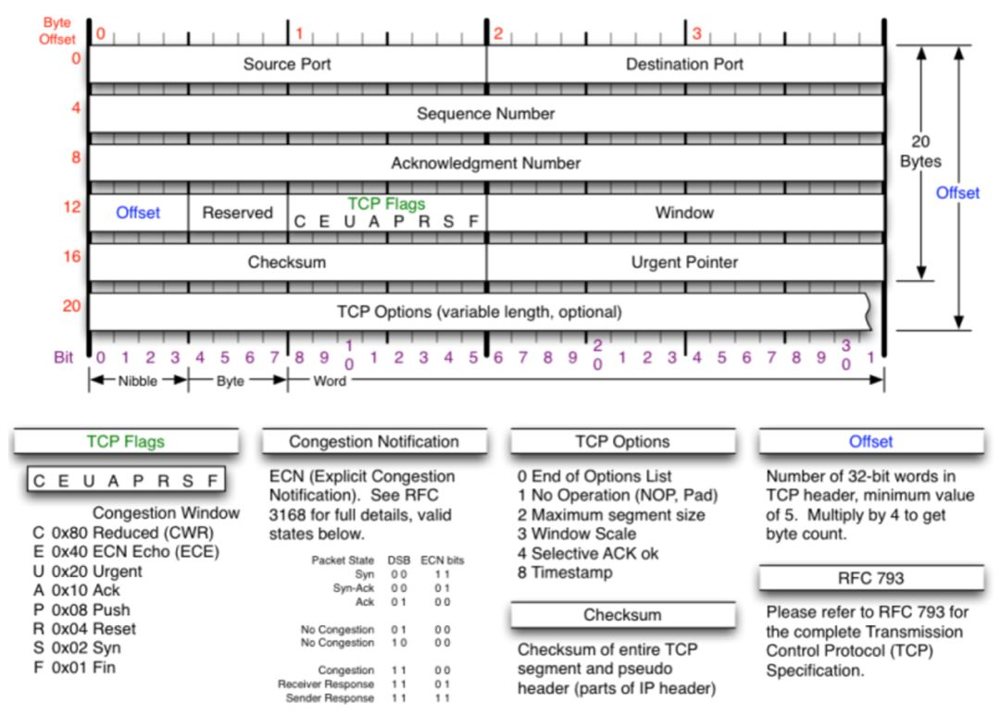
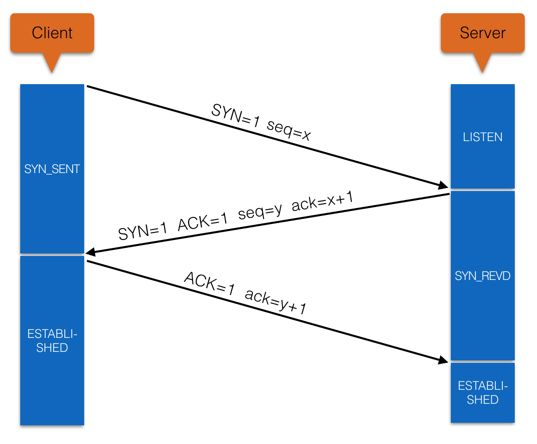

# TCP/IP 网络模型

[TOC]

## 1 网络的分层体系结构

计算机网络是一个非常庞大且复杂的系统，所以在设计之初就严格遵守着分层的设计理念。分层将庞大的问题细分为了若干个局部的小问题，具有下列好处：
* 分层隔离
* 灵活性好
* 易于实现和维护
* 能促进标准化工作

主流网络分层体系结构有两种：
1. OSI（Open Systems Interconnection Reference Model，开放系统互联基本参考模型），就是常说的七层网络模型
2. TCP/IP（Transmission Control Protocol/Internet Protocol，传输控制协议/因特网协议）四层网络模型，以其中最重要的 TCP 协议和 IP 协议命名

因为 OSI 的设计过于理想不合实际，再加上当时应用 TCP/IP 模型的因特网（Internet）已经覆盖了全球大部分地区。TCP/IP 模型则被作为了事实上的国际标准。

## 2 TCP/IP 网络模型

* 应用层的 “HTTP 数据” 是实际需要被传输的数据
* “HTTP 数据” 被下发到传输层，并添加上 TCP 首部成为传输层的 PDU（Protocol Data Unit，协议数据单元），称作数据段（Segment）
* 数据段再被下发到网络层，添加了 IP 首部后成为网络层的 PDU，称作数据包（Packet）
* 数据包再被下发到数据链路层添加了 Ethernet 首部后得到的 PDU 被称为数据帧（Frame）
* 数据帧最后被下发到物理层，以 01 电信号（比特数据位）的形式在物理介质中传输

### 2.1 物理介质层

物理介质是连接网络终端设备（计算机、交换机、路由器）的物理手段，物理介质层主要解决的问题是：
* 规范了网络终端设备之间的电气、机械、流程和功能等方面的要求
* 规范了电频、速率、最大传输距离和物理接口等特征

### 2.2 数据链路层

数据链路层先后提出过包括有 Ethernet v.2、IEEE 802.2、Internetwork 在内的多种协议，其中又以 Ethernet 协议占据主导地位。

#### 2.2.1 Ethernet 协议

Ethernet 协议，即以太网协议，规定了电信号的分组方式。一组电信号称为一个数据帧，数据帧又由帧首、数据和帧尾三部分组成。

* 数据帧首部：占 14 字节，包含有目标主机网卡 MAC 地址、源主机网卡 MAC 地址以及数据帧类型标识
* 数据：从上层（网络层）传递下来的数据包，范围在 [46, 1500] 个字节之间
* 数据帧尾部：占 4 个字节，是 CRC 校验序列，用来确定数据帧在传输过程中是否有损坏

#### 2.2.2 MAC 地址

MAC 地址为 6 字节，使用 12 个十六进制数表示，e.g. 00:01:6C:06:A6:29
* 前 6 个十六进制数为厂商编号，由 IEEE（电气和电子工程师协会）分配给厂商
* 后 6 个则为该厂商的网卡流水号，由厂商自己分配

**以太网协议数据帧定位原理**

以太网协议采用广播形式，将数据帧发给本地网络内所有的主机，主机在接收数据帧后会解析数据帧首部的目标主机网卡 MAC 地址，再和自身的网卡 MAC 地址对比。若相同，就接收数据帧做下一步处理。若不同，则丢弃。

为了增幅广播的性能和组网的灵活性，一般会在本地网络中架设交换机来支持信号转发，交换机也是数据链路层的代表设备。

数据链路层主要解决的问题是：对电信号进行分组并形成具有特定意义的数据帧，然后以广播的形式通过物理介质发送给接收方。

### 2.3 网络层

从理论来讲，使用 MAC 地址就可以实现定位到这里世界上任意一台计算机，前提是广播的作用域也是全球范围的，但这并不现实。MAC 地址的定位方式存在本地子网的局限性。

所以除了以太网协议之外，还迫切的需要解决下列问题：
* 如何轻易的进行子网划分
* 如何隔离子网之间的广播信号
* 在隔离广播信号的前提下，如何保证子网之间的计算机依旧能够通信

#### 2.3.1 IP 协议

IP（Internet Protocol，因特网协议）是网络层的核心协议，规定了网络层的封装规范，将上层（传输层）传递下来的数据段附加上 IP 首部封装成 IP 数据包，又称数据报文，IP 数据包同样由包首部和数据两部分组成，只是数据部分实际为传输层的数据段。

数据包首部长度为 20 字节，数据部分最大长度为 65515 字节，一个 IP 数据包总长达 65535 字节。而下层数据帧的数据部分最长为 1500 个字节，所以如果 IP 数据包的实际长度超过了 1500，就需要对 IP 数据包进行分片处理，由多个数据帧发送。

**IP 数据包首部**

* Version 版本号：标识 IP 地址的版本，目前有 IPv4 和 IPv6 两个版本
* Header Length 首部长度：标识 IP 首部长度
* Type of Service 服务类型：前 3 位标识优先级，4-7 位分别标识时延、吞吐量、可靠性、开销（一个数据包只能有一位生效)
* Total Length 总长度：标识 IP 数据包总长
* Identification 鉴定字段：IP 数据包的唯一标识，如果数据包被分片传输，接收方会根据分片中的该字段值来判断哪些分片属于同一个数据包，以此进行分片重组。通常的每发送一份数据包该值就会被加 1。
* IP Flags 标志位：标识 IP 数据包是否被分片。
* Fragment Offset 偏移量：在接收方进行分片重组时，标识分片的顺序，指明了分片起始点相对于数据包起始点的偏移量。因为 IP 协议是无连接的非可靠传输协议，所以需要该字段来应对分片传输错序的情况。
* TTL(time to live) 生存时间：标识生存时长，指明了数据报可以经过的路由器数量，防止丢失数据包的无休止传播。初始值由源主机设置（通常为32或64），每经过一个路由器，该字段值就会减 1。如果数据包的 TTL 减至 0，那么路由器会丢弃该数据包并发送一个 ICMP 超时消息给数据包的源主机 IP 地址。
* Protocol 协议：标识数据包数据部分来自于哪个协议（ICMP/IGMP/TCP/UDP/GRE/ESP）。
* Header Checksum 首部校验和：根据 IP 数据包首部计算出来的校验和
* Source Addres 源地址：IP 数据包源主机的 IP 地址
* Destination Address 目标地址：IP 数据包的目标主机 IP 地址，是网关路由的关键依据。
* Option 选项：一个可变长的可选信息

**IP 地址**

因为 MAC 地址无法满足复杂的网络环境需求，所以 IP 协议制定了一套逻辑上的网络地址（IP/子网掩码）。IP 地址有 IPv4 和 IPv6 两个版本，通过子网掩码将 IP 地址分为网络号、主机号两个部分，前者标识了一个子网，后者标识了子网中的主机。如果两台主机处在同一子网，那么它们的网络号必须是相同的。

IP 地址解决了 “如何轻易的进行子网划分” 的问题。

**ARP 协议**

引入 IP 地址后，接入网络的主机至少拥有一个 IP 地址和 MAC 地址。需要强调的是，IP 地址本质上是一个逻辑地址，为了解决上层复杂的子网架构问题而生，并不能作为最终定位主机的依据，这仍要依靠 MAC 地址来完成。因此，网络层还需要找到一种方法来完成 IP to MAC 的映射，ARP (Address Resolution Protocol) 协议应运而生。

地址解析原理：主机间的通信时，ARP 协议首先会发起一个请求 IP 数据包，IP 数据包的首部包含有目标主机 IP 地址，这个数据包经由数据链路层、物理介质层，最终广播到子网内所有主机，主机接受到该 IP 数据包后解析出其首部所包含的目标主机 IP 地址，再和自身 IP 地址进行比对。若相同，则根据数据包首部包含的源主机 IP 地址将 MAC 地址返回；若不相同，则丢弃该数据包。

**路由协议**

通过 ARP 协议的地址解析原理不难发现，ARP 协议同样具有子网局限性。为了突破这一限制实现跨子网通信，网络层实现了路由协议。

路由协议提供了异构网（子网间）互联的能力，可以将一个子网的 IP 数据包发送到另一个子网。所谓 “路由” 即指导数据包转发的路径信息。路由协议是运行在路由器上的协议，在错综复杂的网络世界中，路由器充当了交通枢纽的角色，它会视实际的网络环境来选择最佳路径进行数据包转发，路由器是网络层的代表设备。

*IP 数据包路由原理*：主机间的通信时，首先会通过 IP 协议来判断两台主机是否处在同一子网。若是，直接交给 ARP 协议和以太网协议来完成子网广播。若不是，以太网协议则会将 IP 数据包发送到子网网关（一般为路由器）进行路由决策，在经过若干次网关路由转发之后，IP 数据包就进入到目标主机 IP 地址所处的子网中，最后还是通过子网广播完成主机定位。

可见，路由器和路由协议解决了 “如何隔离子网之间的广播信号” 和 “子网之间的计算机依旧能够通信” 的问题。

### 2.4 传输层

通过物理介质层、数据链路层和网络层的底层支撑，或者说通过 MAC 地址和 IP 地址的支撑，得以实现了主机间在全球互联网中的互联互通，所以三者也会被归纳为「基础传输层」。

不过仅仅支持 “主机定位” 依旧是不足以满足需求的，还需要完成主机上的 “应用程序定位” 才可以。

传输层规定为每个应用程序都指定一个特殊的 “地址” 来辅助定位，这个 “地址” 就是 -- 进程端口（Port）。

传输层的主要作用就是建立进程与进程之间的通信，即 Port 到 Port 之间的数据传输，主要有 `UDP 协议`和 `TCP 协议`两种实现。

可用端口号在 [0, 65535] 之间，其中 [0, 1023] 属于系统端口，由操作系统原生服务进程使用，其余为用户端口，由用户自由分配。传输层的 PUD 为数据段（Segment），其首部也有 TCP 首部和 UDP 首部两种类型。

数据段首部为 8 字节，数据部分为上层应用数据占 65527 字节，总长不超过 65,535 字节，正好作为下层 IP 数据包的数据部分。

#### 2.4.1 TCP 协议

TCP（Transmission Control Protocol，传输控制协议），是一种面向连接的可靠传输协议，提供可靠（无差错、不丢失、不重复、按顺序）的字节流数据传输服务。在传输效率和可靠性之间选择了后者，所以有开销大、传输速度慢的缺点。

面向连接：在使用 TCP 通信之前，需要进行 “三次握手” 建立发收双方连接，通信结束后还要进行 “四次挥手” 确保断开连接。

字节流传输：TCP 会将数据当作字节流进行处理，不尝试理解所传输的数据含义，仅把数据看作一连串的字节序列。

TCP 的可靠性传输具有非常复杂的实现细节，包括但不限于：
* ACK 确定机制：当接收方接收到数据段后，会返回 ACK 确认
* 定时重发： 发送方发送数据段后，会启动定时器，超时未接收到 ACK 确认，会重发该数据段
* 数据校验：接收方会对数据段进行数据校验，如果发现数据段有差错，会将该数据段丢弃，等待超时重传
* 顺序传输：TCP 字节流会为每个字节排序，确保数据传输顺序的正确性
* 滑动窗口：TCP 数据段长度可根据收发双方的缓存、网络等状态而调整。接收方只允许发送方发送接收缓冲区所能接纳的数据，防止缓冲区溢出

**数据段首部**

* Sequence Number 序列号：字节流中的每个字节都要按序编号，该字段值为本数据段数据部分的第一个字节的序号
* Acknowledgment Number 确认号：确认序列号
* Offset 偏移量：数据段首部的长度，字段值为首部长度除以 4
* Reserved 预留：保留位，供今后使用
* TCP flags 标签：标识数据段性质。
* Window 窗口：标识发送者接收窗口的大小
* CheckSum 校验值：用于检查数据段在传输过程中是否出现差错
* Urgent Pointer 紧急指针：当字段值为 1 时生效，标识本数据段具有紧急数据

TCP Flags 字段，是非常重要的功能标识，占 8 位:
1. C(CWR)、E(ECE)：用于支持 ECN（显示阻塞通告）
2. U(URGENT)：当值为 1 时，标识此数据段有紧急数据（比如紧急关闭），应优先传送，要与紧急指针字段配合使用
3. A(ACK)：仅当字段值为 1 时才有效，建立 TCP 连接后，所有数据段都必须把 ACK 字段值置为 1
4. P(PUSH)：若 TCP 连接的一端希望另一端立即响应，PSH 字段便可以 “催促” 对方，不再等到缓存区填满才发送返回
5. R(RESET)：若 TCP 连接出现严重差错，该字段的值置为 1，表示先断开 TCP 连接，再重连
6. S(SYN，Synchronize Sequence Numbers)：用于建立和释放连接，当字段值为 1 时，表示建立连接。
7. F(FIN)：用于释放连接，当字段值为 1 时，表明发送方已经发送完毕，要求释放 TCP 连接

**三次握手**

