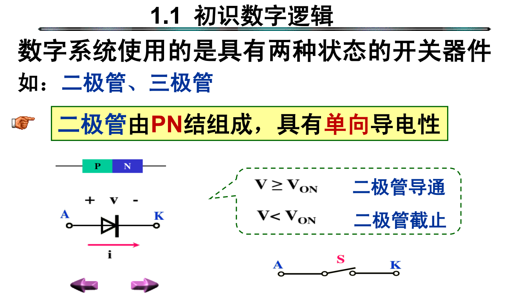

# Digital Logic Design

## 1 Introduction

* Content

* Connection

### 1.1 初识数字逻辑

* diode

* triode

### 1.2 编码

1. BCD码 (binary-coded decimal), 8421BCD码

2. 余3码 (excess-3 code)

* 无权吗
* 自补码
* 8421code + 0011

3. 格雷码 (gray code)

* 任何两位相邻编码只有1位码元不同
* 无权码
* 优势：连续变化时，每次只有1位码元发生改变，比较可靠

**任意给定的二进制数对应的典型格雷码**
> 计算法
