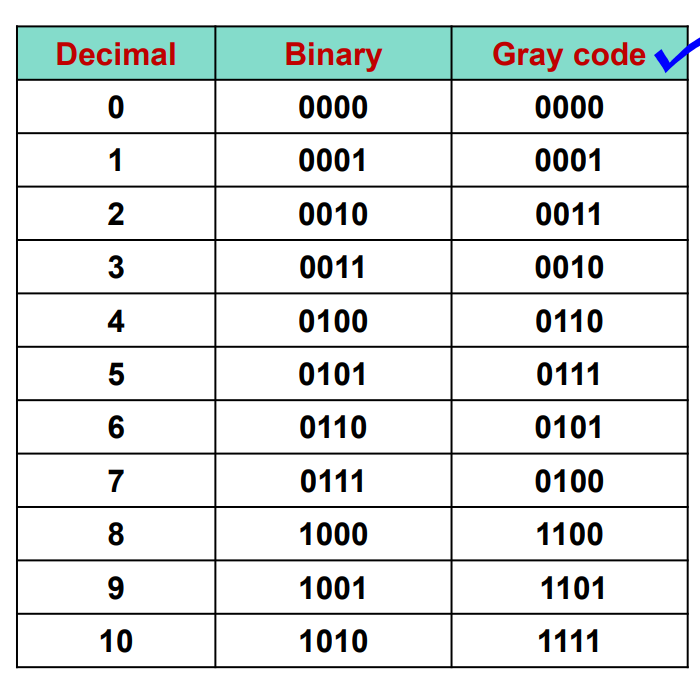

# Digital Logic Design

[TOC]

## 1 Introduction

* Content

* Connection

### 1.1 初识数字逻辑

* diode

* triode

### 1.2 编码

1. BCD码 (binary-coded decimal), 8421BCD码

2. 余3码 (excess-3 code)

* 无权吗
* 自补码
* 8421code + 0011

3. 格雷码 (gray code)

* 任何两位相邻编码只有1位码元不同
* 无权码
* 优势：连续变化时，每次只有1位码元发生改变，比较可靠

**任意给定的二进制数对应的典型格雷码**
> 计算法

## 2 逻辑代数基础

### 2.1 基本逻辑运算

1. AND
2. OR
3. NOT

### 2.2 复合逻辑运算

1. 与非
2. 或非
3. 与或非
4. 异或
5. 同或（异或非，异或取反）

### 2.3 逻辑函数表达方法

1. 逻辑表达式
2. 逻辑图
3. 真值表
    * 标准与或式（乘积之和）
    * 标准或与式（和之积）
4. 卡诺图

### 2.4 逻辑代数定理及规则

1. 公理
2. 定理
    * 交换律
        > A + B = B + A, A * B = B * A
    * 结合律
        > (A + B) + C = A + (B + C), (A * B) * C = A * (B * C)
    * 分配律
        > A * (B + C) = AB + AC, A + BC = (A + B) * (A + C)

3. 特殊定理
    * 摩根定理
        
    * 对偶规则
        > 两个逻辑表达式相等，它们的对偶也相等

### 2.5 代数化简法

* 优点：不受变量数目的约束
* 缺点：技巧性强，很多情况下，难以判断化简结果是否最简

## 3 最大项和最小项

### 3.1 最大项和最小项表达式

