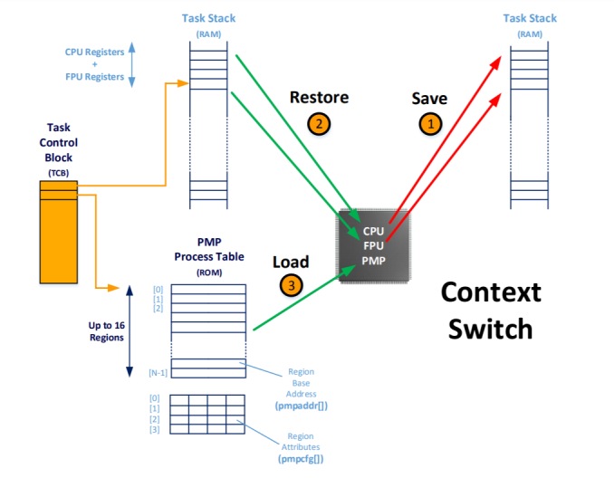
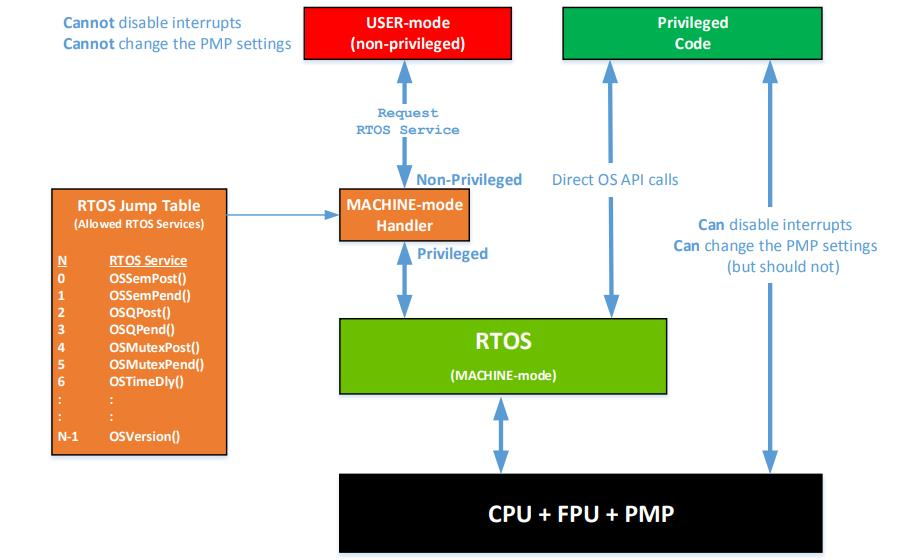
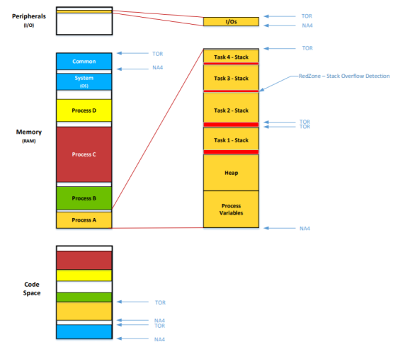

# Physical Memory Protection with an embedded RTOS to achieve process separation and isolation

## 1 What is an RTOS

### 1.1 Multitasking

* Software that **manages the time of CPU**
  * Application is split into multiple tasks
  * The RTOS's job is to run the **most** important task that is ready-to-run
* An RTOS provides **services** to your application
  * Task management
  * Time management
  * Resource management
  * Message passing
  * Soft Timer management

### 1.2 Preemptive Scheduling

### 1.3 Tasks

* Each task:

  * is assigned a priority based on its importance
  * has its own set of **CPU registers**
  * requires a **stack**
  * manages its own variables, arrays and structures
  * possibly manages I/O devices
  * is typically an infinite loop **waiting** for an event:
  * contains mostly the application code

### 1.4 Typical RTOS without Physical Memory Protection

* Without a PMP, RTOS tasks run in machine mode

  * Access to all resources
  * Done for **performance** reasons

* Drawbacks:

  * Reliability of the system is in the hands of the application code
    * ISRs and tasks have **full** access to the memory address space
    * Tasks **can** disable interrupts
    * Task stacks can overflow **without** detection
    * Code can **execute** out of RAM
      * Susceptible to code injection attacks
    * A misbehaved task can take the whole system down
  * Expensive to get safety certification for the whole product

### 1.5 Context Switch (without a PMP)

## 2 RTOS with a PMP

### 2.1 Process Model

* Tasks are **grouped** by processes

  * Can have **multiple** tasks per process

* ISRs have **full** access to memory

  * Would be very complex otherwise

* Benefits:

  * Memory of one process is **not accessible** to other processes

    * Unless they **share** a common memory space
    * Some processes might not need to be safety certified
      * Less expensive and faster time-to-market

  * User tasks **can't** disable interrupts

  * Task stack overflows can be detected by the PMP

### 2.2 Each Task requires a Process Table

* Creating process tables is the most difficult part of using an PMP
  * Requires using `#pragma` in C code to define **Regions**
    * Toolchain specific
    * Might mean editing existing code files to add `#pragma`
  * Tedious manual effort because of module dependencies

### 2.3 Context Switch

* only the OS can update the PMP

### 2.4 User tasks run in User-mode

### 2.5 Setting Regions

### 2.6 Stack overflow detection

* Red Zone:
  * Small area at the bottom of each task stack
  * Typically 32 bytes
    * Removes from available task stack
    * Larger zone is better but more wasteful
  * CPU exception if data is pushed into that area
    * Not guaranteed to catch every overflows!

### 2.7 Handling Faults

* What happens when a task accesses data outside a valid region?
  * Based on the region's attributes, the PMP issues one of three types of an exception:
    * Instruction Access Fault
    * Load Access Fault
    * Store Access Fault
  * What can we do when one of these faults is detected?
    * Depends greatly on the application
    * The RTOS should **save** information about the offending task
      * To help developers correct the problem
    * The RTOS should provide a **callback** function for each task
      * To allow the application to perform a **controlled shutdown** sequence
        * i.e. Actuators to be placed in a safe state
    * Report the fault
    * Terminate the offending task:
      * Do we also need to terminate **other tasks** associated with the process?
      * What happens to the resources owned by the task(s)?
    * Restart the application

### 2.8 Recommendations

* As a minimum: clear the X(execute) bit
  * Except possibly for code that runs software updates
* As a minimum: use a region for stack overflow detection
  * i.e. Red Zone
* Run the application in User-mode
* ISRs should have full access to the memory
  * Greatly simplifies the ISR design
  * But ISRs should be kept short
* Limit peripheral access to its process
* Reduce inter-process communications
  * Processes should be isolated from one another
* Avoid global heap
  * Virtually impossible to setup the PMP for a global heap
* Limit the RTOS APIs available to the user
  * Prevent creating and deleting tasks in User-mode
* Allocate RTOS objects in RTOS space
  * Processes can provide references to these objects
* Determine what to do when you get a PMP fault
  * Callback to execute an optional shutdown sequence
* Have a way to log and report faults
  * Helps developers correct issues

## 3 Summary

* Tasks are **grouped** by process
  * A process can consist of one or more tasks
* Each task must define a **process table**
  * The process table defines **regions**
    * Each region gives permission to access a range of memory or I/O space
  * The RTOS **loads** the process table into the PMP during a context switch
    * Adds overhead
* User code gets RTOS services through a **machine-mode handler**
  * Adds overhead
* ISRs have **full** access to memory
* You need to determine what happens when you get a PMP fault
* The developer is responsible for creating the process tables and splitting the memory in regions