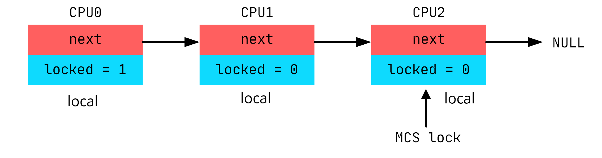

## SPINLOCK 前世今生

以高速缓存为主题，围绕着 spinlock 的前世今生，尝试探索 spinlock 和 Cache 之间的恩怨情仇

### 1 wild spinlock

spinlock 是互斥原语，用于不可睡眠上下文环境访问共享数据的互斥

~~~ c
struct spinlock {
    int locked;
};

void spin_lock(struct spinlock *lock)
{
    while (lock->locked);
    lock->locked = 1;
}

void spin_unlock(struct spinlock *lock)
{
    lock->locked = 0;
}
~~~

`spin_lock` 中判断 locked 是 0 的同时需要将 locked 置 1 必须保证是原子操作

~~~ c
void spin_lock(struct spinlock *lock)
{
    // atomic, return 0 means be successful to get lock
    while (test_and_set(&lock->locked));
}
~~~

`test_and_set` 是无条件置1操作，CPU 写变量时会通过 `MESI` 协议发送 invalid 消息给其他 CPU。然后修改变量为1。譬如，CPU1 修改变量之前，会发送 invalid 消息给 CPU0，然后修改变量。CPU2 修改变量前发送 invalid 消息给 CPU1，然后修改变量。CPU3 发送 invalid 消息给 CPU2 ，然后修改变量。CPU4-7 也在重复这些事情。这就无形之中增加了带宽压力，使性能下降。

实际 CPU1-CPU7 一直在 spin，修改变量也没有意义，只有 CPU0 unlock 的时候，修改才有价值。

~~~ c
void spin_lock(struct spinlock *lock)
{
    while (lock->locked || test_and_set(&lock->locked));
}
~~~

### 2 ticket spinlock

某些等待的 CPU 可能会有饥饿现象。例如，CPU1-CPU7 在原地 spin，CPU0 释放锁的时候，CPU1-CPU7 哪个 CPU 的 cache 先看到 locked 的值，就会先获得锁。

引入排队机制，以 FIFO 的顺序处理申请者。

`spin_lock` 中 `xadd` 也是一条原子操作，原子的将变量加1，并返回变量之前的值。

~~~ c
struct spinlock {
    unsigned short owner;
    unsigned short next;
};

void spin_lock(struct spinlock *lock)
{
    unsigned short next = xadd(&lock->next, 1);
    while (lock->owner != next);
}

void spin_unlock(struct spinlock *lock)
{
    lock->owner++;
}
~~~

### 3 qspinlock

CPU1 申请锁，并更新 spinlock 变量 next 成员。所以会 invalid CPU0 的 cache。然后更新next的值。

CPU0 释放锁后，CPU1-CPU7 也只有一个 CPU 可以获得锁，理论上没有必要影响其他 CPU 的缓存，只需要影响接下来应该获取锁的 CPU（按照 FIFO 的顺序）。

这说明 ticket spinlock 不是 scalable（同样最初的 wild spinlock 也存在此问题）。

~~~ c
struct mcs_spinlock {
    struct mcs_spinlock *next;
    int locked;
};
~~~

首先 CPU0 申请 spinlock 时，发现链表是空，并且锁是释放状态。所以 CPU0 获得锁。

CPU1 继续申请 spinlock ，需要 spin 等待。所以将 CPU1 对应的 mcs_spinlock 结构体加入单链表尾部。然后 spin 等待 CPU1 对应的 mcs_spinlock 结构体 locked 成员被置1。

[Linux Kernel 代码参考](https://elixir.bootlin.com/linux/v5.4.33/source/kernel/locking/mcs_spinlock.h)

### 4 Summary

- spinlock 历程：
    + wild spinlock 历程:
        1. raw spin lock, 变量互斥
        2. atomic instruction, `test_and_set` 指令级保证互斥
        3. 减少 cache 间 invalid 操作，先判断变量，再进行置位操作
    + ticket spinlock:
        1. 解决饥饿现象，引入排队机制 FIFO
    + q_spinlock:
        1. 在排队的机制上，理论上没有必要影响其他 CPU 的缓存，引入 `mcs spinlock` ，进一步减少 cache invalid 操作

文章参考： https://zhuanlan.zhihu.com/p/133445693
