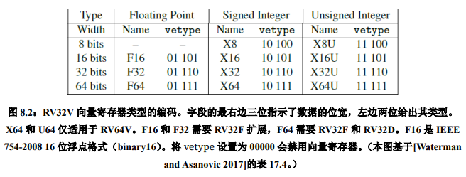
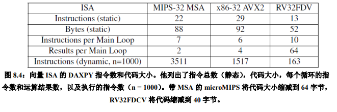
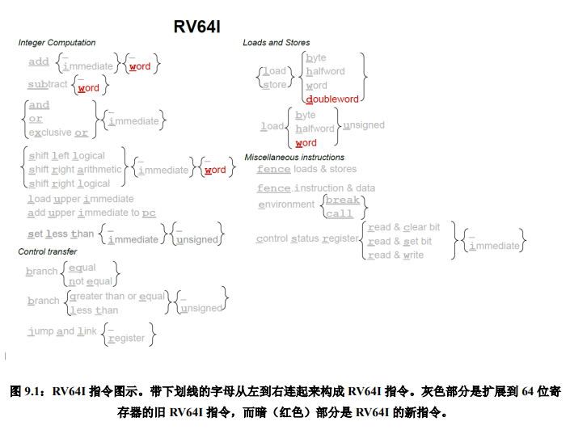
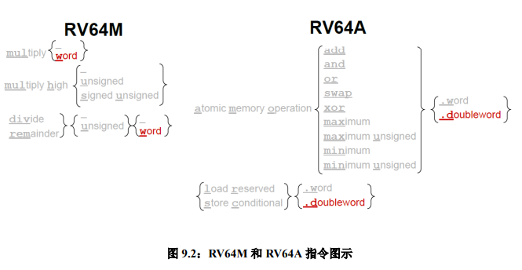
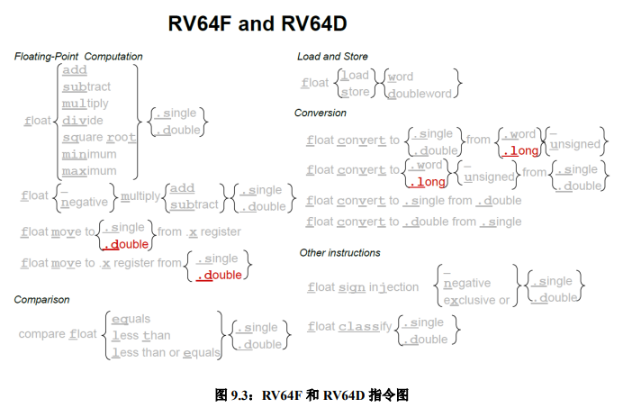
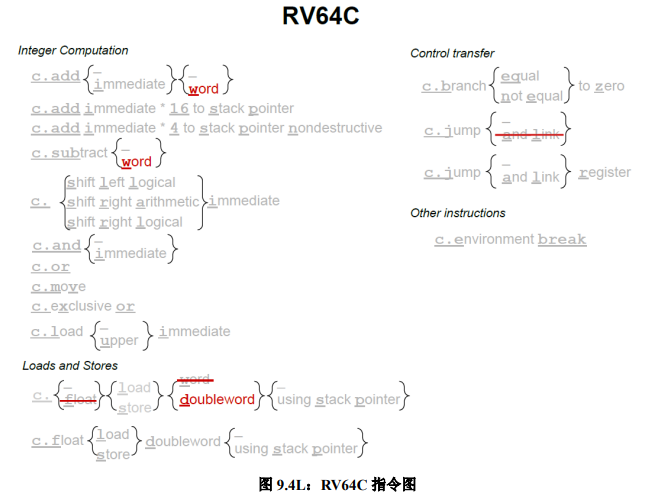
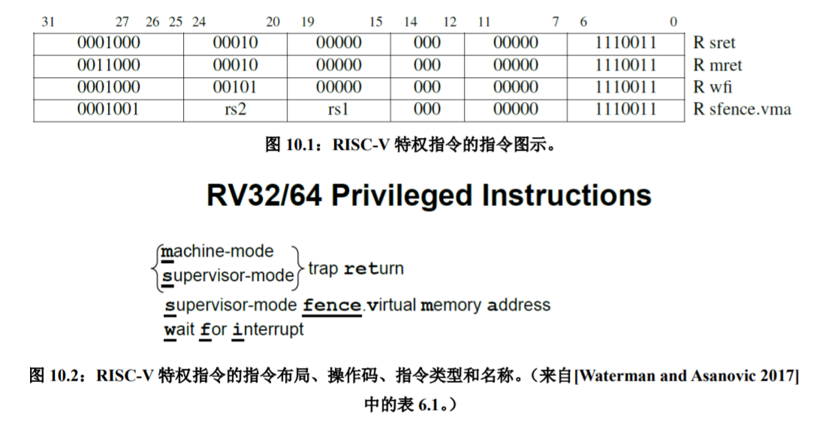
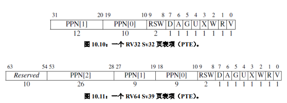

# RISC-V Reader v2p1

## 1 为什么要有RISC-V？

**成本**

- 原因在于目前的硅生产工艺会在晶圆上留下一些散布的小瑕疵。因此晶粒越小，有缺陷部分所占比重会越低。
- cost ≈ f(die area^2) 成本与面积约为平方关系。

**简洁性**

**性能**

**架构和具体实现的分离**

**程序大小**

**易于编程/编译/链接**

## 2 RV32I：RISC-V 基础整数指令集

### 2.2 指令格式

六种基本指令格式:
1. 寄存器-寄存器操作的 R 类型指令
2. 短立即数和访存 load 操作的 I 型指令
3. 访存 store 操作的 S 型指令
4. 条件跳转操作的 B 类型指令
5. 长立即数的 U 型指令
6. 无条件跳转的 J 型指令

**乱序执行处理器**
> 这是一种高速的、流水化的处理器。它们一有机会就执行指令，而不是在按照程序顺序。这种处理器的一个关键特性是寄存器重命名，把程序中的寄存器名称映射到大量的内部物理寄存器。条件执行的问题是不管条件是否成立，都必须给这些指令中的寄存器分配相应的物理寄存器。但内部物理寄存器的可用性是影响乱序处理器的关键性能资源。

### 2.3 寄存器

### 2.4 整数计算

* 算术指令 add, sub
* 逻辑指令 and, or, xor
* 移位指令 sll, srl, sra

**利用 xor 指令进行的花式操作**
> 可以在不使用中间寄存器的情况下交换两个值！此代码交换 x1 和 x2 的值。提示：异或操作是交换的 (𝑎 ⊕ 𝑏 = 𝑏 ⊕ 𝑎)，结合的 ((𝑎 ⊕ 𝑏) ⊕ 𝑐 = 𝑎 ⊕ (𝑏 ⊕ 𝑐))，是它自己的逆操作 (𝑎 ⊕ 𝑎 = 0)，并且有一个单位元(𝑎 ⊕ 0 = 𝑎)。

~~~ asm
xor x1,x1,x2 # x1’ == x1^x2, x2’ == x2
xor x2,x1,x2 # x1’ == x1^x2, x2’ == x1’^x2 == x1^x2^x2 == x1
xor x1,x1,x2 # x1” == x1’^x2’ == x1^x2^x1 == x1^x1^x2 == x2, x2’ == x1
~~~

### 2.5 Load 和 Store

**字节序问题**
> RISC-V 选择 little endian

### 2.6 条件分支

**不使用条件码实现大位宽数据的加法**
> 在 RV32I 中是通过 sltu 计算进位来实现的
~~~ asm
add a0,a2,a4  # 加低 32 位: a0 = a2 + a4
sltu a2,a0,a2 # 若 (a2+a4) < a2 那么 a2’ = 1, 否则 a2’ = 0
add a5,a3,a5  # 加高 32 位: a5 = a3 + a5
add a1,a2,a5  # 加上低 32 位的进位
~~~

**软件检查溢出**
> RISC-V 依赖于软件溢出检查
~~~ asm
add t0, t1, t2
slti t3, t2, 0       # t3 = (t2<0)
slt t4, t0, t1       # t4 = (t1+t2<t1)
bne t3, t4, overflow # 若 ((t2<0) && (t1+t2>=t1)) || ((t2>=0) && (t1+t2<t1)) 则为溢出
~~~

### 2.7 无条件跳转

跳转并链接指令（jal）具有双重功能。

若将下一条指令 PC + 4 的地址保存到目标寄存器中，通常是返回地址寄存器 ra，便可以用它来实现过程调用。

如果使用零寄存器（x0）替换 ra 作为目标寄存器，则可以实现无条件跳转，因为 x0 不能更改。

### 2.8 杂项

控制状态寄存器指令（csrrc、csrrs、csrrw、csrrci、csrrsi、csrrwi）

`ecall` 指令用于向运行时环境发出请求，例如系统调用。调试器使用 `ebreak` 指令将控制转移到调试环境。

`fence` 指令对外部可见的访存请求，如设备 I/O 和内存访问等进行串行化。外部可见指对处理器的其他核心、线程，外部设备或协处理器可见。`fence.i` 指令同步指令和数据流。

## 3 RISC-V 汇编语言

### 3.1 导言

### 3.2 函数调用规范（Calling convention）

**保存寄存器和临时寄存器为什么不是连续编号**
> 为了支持 RV32E——一个只有 16 个寄存器的嵌入式版本的 RISC-V，只使用寄存器 x0 到 x15——一部分保存寄存器和一部分临时寄存器都在这个范围内。其它的保存寄存器和临时寄存器在剩余 16 个寄存器内。RV32E 较小，但由于和 RV32I 不匹配，目前还没有编译器支持。

### 3.3 汇编器

汇编程序的开头是一些汇编指示符（assemble directives）。它们是汇编器的命令，具有告诉汇编器代码和数据的位置、指定程序中使用的特定代码和数据常量等作用。

RISC-V 编译器支持多个 ABI，具体取决于 F 和 D 扩展是否存在。RV32 的 ABI 分别名为 ilp32，ilp32f 和 ilp32d。ilp32 表示 C 语言的整型（int），长整型（long）和指针（pointer）都是 32 位，可选后缀表示如何传递浮点参数。

**链接器松弛（linker relaxation）**

> 跳转并链接指令（jump and link）中有 20 位的相对地址域，因此一条指令就足够跳到很远的位置。尽管编译器为每个外部函数的跳转都生成了两条指令，很多时候其实一条就已经足够了。从两条指令到一条的优化同时节省了时间和空间开销，因此链接器会扫描几遍代码，尽可能地把两条指令替换为一条。每次替换会导致函数和调用它的位置之间的距离缩短，所以链接器会多次扫描替换，直到代码不再改变。这个过程称为链接器松弛，名字来源于求解方程组的松弛技术。除了过程调用之外，对于 gp 指针±2KiB 范围内的数据访问，RISC-V 链接器也会使用一个全局指针替换掉 lui 和 auipc 两条指令。对 tp 指针±2KiB 范围内的线程局部变量访问也有类似的处理。

| Directive           | Description                                                  |
| ------------------- | ------------------------------------------------------------ |
| .align n            | Align the next datum on a 2^n byte boundary.                 |
| .balign n           | Align the next datum on a n byte boundary.                   |
| .string "str"       | Store the string str in memory and null-terminate it.        |
| .byte b1, ..., bn   | Store the n 8-bit quantities in successive bytes of memory.  |
| .half h1, ..., hn   | Store the n 16-bit quantities in successive bytes of memory. |
| .word w1, ..., wn   | Store the n 32-bit quantities in successive bytes of memory. |
| .dword d1, ..., dn  | Store the n 64-bit quantities in successive bytes of memory. |
| .float f1, ..., fn  | Store the n single-precision floating-point numbers in successive memory words. |
| .double d1, ..., dn | Store the n double-precision floating-point numbers in successive memory words. |
| .option rvc         | Compress subsequent instructions.                            |
| .option norvc       | Don't compress subsequent instructions.                      |
| .option relax       | Allow linker relaxations for subsequent instructions.        |
| .option norelax     | Don't allow linker relaxations for subsequent instructions.  |
| .option pic         | Subsequent instructions are position-independent code.       |
| .option nopic       | Subsequent instructions are position-dependent code.         |
| .option push        | Push the current setting of all .option to a stack, so that a subsequent .option pop will restore their value. |
| .option pop         | Pop the option stack, restoring all .option to their setting at the time of the last .option push. |

### 3.5 静态链接和动态链接

编译器产生的代码和静态链接的代码很相似。其不同之处在于，跳转的目标不是实际的函数，而是一个只有三条指令的存根函数（stub unction）。存根函数会从内存中的一个表中加载实际的函数的地址并跳转。不过，在第一次调用时，表中还没有实际的函数的地址，只有一个动态链接的过程的地址。当这个动态链接过程被调用时，动态链接器通过符号表找到实际要调用的函数，复制到内存中，更新记录实际的函数地址的表。后续的每次调用的开销就是存根函数的三条指令的开销。

## 4 乘法和除法指令

### 4.1 导言

为了正确地得到一个有符号或无符号的 64 位积，RISC-V 中带有四个乘法指令。要得到整数 32 位乘积（64 位中的低 32 位）就用 mul 指令。要得到高 32 位，如果操作数都是有符号数，就用 mulh 指令；如果操作数都是无符号数，就用 mulhu 指令；如果一个有符号一个无符号，可以用 mulhsu 指令。在一条指令中完成把 64 位积写入两个 32位寄存器的操作会使硬件设计变得复杂，所以 RV32M 需要两条乘法指令才能得到一个完整的 64 位积。

**mulhsu 对于多字有符号乘法很有用**
> 当乘数有符号且被乘数无符号时，mulhsu 产生乘积的上半部分。当乘数的最高有效字（包含符号位）与被乘数的较低有效字（无符号）相乘时，它是多字有符号乘法的子步骤。

**mulh 和 mulhu 可以检查乘法的溢出**
> 如果 mulhu 的结果为零，则在使用 mul 进行无符号乘法时不会溢出。类似地，如果 mulh 结果中的所有位与 mul 结果的符号位匹配（即当 mul 结果为正时 mulh 结果为 0，mul 结果为负时 mulh 结果为十六进制的 ffffffff），则使用 mul 进行有符号乘法时不会溢出。

对许多微处理器来说，整数除法是相对较慢的操作。如前述，除数为 2 的幂次的无符号除法可以用右移来代替。事实证明，通过乘以近似倒数再修正积的高 32 位的方法，可以优化除数为其它数的除法。RV32M 中用乘法来实现除以常数操作的代码。

## 5 RV32F 和 RV32D：单精度和双精度浮点数

### 5.1 导言

### 5.3 浮点加载，存储和算术指令

它们也有最小值和最大值指令（fmin.s，fmin.d，fmax.s，fmax.d），这些指令在不使用分支指令进行比较的情况下，将一对源操作数中的较小值或较大值写入目的寄存器。

许多浮点算法（例如矩阵乘法）在执行完乘法运算后会立即执行一条加法或减法指令。因此，RISC-V 提供了指令用于先将两个操作数相乘然后将乘积加上（fmadd.s，fmadd.d）或减去（fmsub.s，fmsub.d）第三个操作数，最后再将结果写入目的寄存器。

这些融合的乘法 - 加法指令比单独的使用乘法及加法指令更准确，也更快，因为它们只（在加法之后）舍入过一次，而单独的乘法及加法指令则舍入了两次（先是在乘法之后，然后在加法之后）。

RV32F 和 RV32D 没有提供浮点分支指令，而是提供了浮点比较指令，这些根据两个浮点的比较结果将一个整数寄存器设置为 1 或 0：feq.s，feq.d，flt.s，flt.d，fle.s，fle.d。

~~~ asm
flt x5，f1，f2   # 如果 f1 < f2，则 x5 = 1;否则 x5 = 0
bne x5，x0，Exit # 如果 x5！= 0，则跳转到 Exit
~~~

### 5.4 浮点转换和搬运

|                           | From                   | From                      | From                   | From                   |
| ------------------------- | ---------------------- | ------------------------- | ---------------------- | ---------------------- |
| To                        | 32b signed integer (w) | 32b unsigned integer (wu) | 32b floating point (s) | 64b floating point (d) |
| 32b signed integer (w)    | -                      | -                         | fcvt.w.s               | fcvt.w.d               |
| 32b unsigned integer (wu) | -                      | -                         | fcvt.wu.s              | fcvt.wu.d              |
| 32b floating point (s)    | fcvt.s.w               | fcvt.s.wu                 | -                      | fcvt.s.d               |
| 64b floating point (d)    | fcvt.d.w               | fcvt.d.wu                 | fcvt.d.s               | -                      |

RV32F 还提供了将数据从 f 寄存器（fmv.x.w）移动到 x 寄存器的指令，以及反方向移动数据的指令（fmv.w.x）。

## 6 原子指令

### 6.1 导言

RV32A 有两种类型的原子操作：
1. atomic memory operation
2. load reserved / store conditional (lr/sc)

**compare-and-swap 操作：**
> 比较一个寄存器中的值和另一个寄存器中的内存地址指向的值，如果它们相等，将第三个寄存器中的值和内存中的值进行交换。这是一条通用的同步原语。

加载保留和条件存储只需要两个源寄存器，用它们可以实现原子的比较交换。用 `lr/sc` 实现内存字 M[a0] 的比较-交换操作:
~~~ asm
# Compare-and-swap (CAS) memory word M[a0] using lr/sc.
# Expected old value in a1; desired new value in a2.
0x00: lr.w a3, (a0)     # load old value
0x04: bne a3, a1, 0x80  # old value equals a1?
0x08: sc.w a3, a2, (a0) # swap in new value if so
0x0c: bnez a3, 0x0      # retry if store failed
    ... code following successful CAS goes here ...
0x80:                   # unsuccessful CAS
~~~

**内存一致性模型**
RISC-V 具有宽松的内存一致性模型（relaxed memory consistency model），因此其他线程看到的内存访问可以是乱序的。图 6.2 中，所有的 RV32A 指令都有一个请求位（`aq`）和一个释放位（`rl`）。`aq` 被置位的原子指令保证其它线程在随后的内存访问中看到顺序的 AMO 操作；`rl` 被置位的原子指令保证其它线程在此之前看到顺序的原子操作。

~~~ asm
# Critical section guarded by test-and-set spinlock using an AMO.
0x00: li t0, 1                  # initialize lock value
0x04: amoswap.w.aq t1, t0, (a0) # attempt to acquire lock
0x08: bnez t1, 0x4              # retry if unsuccessful
    ... critical section goes here ...
0x20: amoswap.w.rl x0, x0, (a0) # release lock
~~~

## 7 压缩指令

RV32C 采用了一种新颖的方法：每条短指令必须和一条标准的 32 位 RISC-V 指令一一对应。此外，16 位指令只对**汇编器和链接器**可见，并且是否以短指令取代对应的宽指令由它们决定。编译器编写者和汇编语言程序员可以幸福地忽略 RV32C 指令及其格式，他们能感知到的则是最后的程序大小小于大多数其它 ISA 的程序。

基于以下的三点观察，架构师们成功地将指令压缩到了 16 位：
1. 对十个常用寄存器（`a0-a5`，`s0-s1`，`sp` 以及 `ra`）访问的频率远超过其他寄存器；
2. 许多指令的写入目标是它的源操作数之一；
3. 立即数往往很小，而且有些指令比较喜欢某些特定的立即数。

因此，许多 RV32C 指令：
1. 只能访问那些常用寄存器；
2. 一些指令隐式写入源操作数的位置；
3. 几乎所有的立即数都被缩短了，load 和 store 操作只使用操作数整
数倍尺寸的无符号数偏移量。

尽管处理器的设计者们不能忽略 RV32C 的存在，但是有一个技巧可以让实现的代价变小：在执行之前用一个解码器将所有的 16 位指令转换为等价的 32 位指令。

## 8 向量

### 8.1 导言

本章重点介绍数据并行，当存在大量数据可供应用程序同时计算时，我们称之为数据级并行性。数组是一个常见的例子。虽然它是科学应用的基础，但它也被多媒体程序使用。前者使用单精度和双精度浮点数据，后者通常使用 8 位和 16 位整数数据。

最著名的数据级并行架构是单指令多数据(SIMD，Single Instruction Multiple Data)。

向量计算机从内存中中收集数据并将它们放入长的，顺序的向量寄存器中。在这些向量寄存器上，流水线执行单元可以高效地执行运算。然后，向量架构将结果从向量寄存器中取出，并将其并分散地存回主存。

`将向量的长度和每个时钟周期可以进行的最大操作数分离，是向量体系结构的关键所在`：向量微架构可以灵活地设计数据并行硬件而不会影响到程序员，程序员可以不用重写代码就享受到长向量带来的好处。

### 8.2 向量计算指令

每个向量指令都有几种类型，具体取决于源操作数是否都是向量（.vv 后缀），或者源操作数包含一个向量和一个标量（.vs 后缀）。

对诸如减法和除法之类的非对称运算，他们还会使用向量指令的第三种变体。其中第一个操作数是标量，第二个是向量（.sv 后缀）。

融合的（fused）乘法-加法指令有三个操作数，因此它们有着最多的向量和标量选项的组合：.vvv、.vvs，.vsv 和.vss。

### 8.3 向量寄存器和动态类型

RV32V 添加了 32 个向量寄存器，它们的名称以 v 开头，但每个向量寄存器的元素个数不同。该数量取决于操作的宽度和专用于向量寄存器的存储大小，而这取决于处理器的设计者。

RV32V 采用了一种新颖的方法，即将数据类型和长度与向量寄存器相关联而不是与指令操作码相关联。

可以用 `vsetdcfg` 指令来设置向量寄存器的类型。

**RV32V 可以快速切换上下文**
> 向量架构不如 SIMD 架构受欢迎的一个原因是：大家担心增加大型向量寄存器会延长中断时保存和恢复程序（上下文切换）的时间。动态寄存器类型对此很有帮助。程序员必须告诉处理器正在使用哪些向量寄存器，这意味着处理器需要在上下文切换中仅保存和恢复那些寄存器。

### 8.4 向量的 Load 和 Store 操作

Load 用以 vld 指令中地址为起始地址的顺序存储的数据来填充向量寄存器。向量寄存器的数据类型确定数据元素的大小，向量长度寄存器 `vl` 中设置了要取的元素数量。

> 例如，如果 a0 中存有 1024，且 v0 的类型是 X32，则 vld v0, 0(a0) 会生成地址 1024，1028，1032，1036，……直到达到由 vl 设置的限制。

向量架构通过**跨步**数据传输来支持 vlds 和 vsts 数据访问。对于 vlds 与 vsts，虽然可以通过将步长设置为元素大小来达到与 vld 和 vst 相同的效果，但 vld 和 vst 保证了所有的访问都是顺序的，这可以提供更高的内存带宽。另一个原因是，对于常见的按单位步长访问，使用 vld 和 vst 可以缩减代码长度，并减少执行的指令数。

毕竟使用 vlds 和 vsts 指令来需要指定两个源寄存器，一个给出起始地址，另一个给出以字节为单位的步长，而对于单位步长的访问，多花指令来设置第二个寄存器，无遗是一种浪费。

> 例如，假设 a0 中的起始地址是地址 1024，且 a1 中行的长度是 64 字节。vlds v0, a0, a1 会将这个地址序列发送到内存：1024, 1088(1024 + 1 × 64), 1152(1024 + 2 × 64), 1216(1024 + 3 × 64)，以此类推，直到向量长度寄存器 vl 告诉它停止。返回的数据被顺序写入目标向量寄存器的各个元素。

为了支持稀疏数组，向量架构用 vldx 和 vstx 提供索引数据传输。这些指令的一个源寄存器是向量寄存器，另一个是标量寄存器。标量寄存器具有稀疏数组的起始地址，向量寄存器的每个元素包含稀疏数组的非零元素的字节索引。

> 假设 a0 中的起始地址是地址 1024，向量寄存器 v1 在前四个元素中有这些字节索引：16，48，80，160。vldx v0, a0, v1 会将这个地址序列发送到内存：1040（1024 + 16）, 1072(1024 + 48), 1104(1024 + 80), 1184(1024 + 160)。它将返回的数据顺序写入目标向量寄存器的元素中。

带索引的 load 也称为收集(gather)；带索引的 store 通常称为分散(scatter)。

### 8.6 向量运算的条件执行

RV32V 指定 `vp0` 或 `vp1` 作为控制向量操作的掩码。要对所有元素执行一个正常的操作，必须将这两个谓词寄存器中的一个设置为全 1。RV32V 中有一条 `vpswap` 指令，用于将其他六个谓词寄存器的一个快速交换到 `vp0` 或 `vp1`。谓词寄存器也是动态启用的，禁用它们可以快速清除所有谓词寄存器中的值。

下面这段代码将把 vp0 中所有的偶数位设为 1，奇数位设为 0，并且将把 v0 中所有的偶数元素替换为 v1 和 v2 中对应元素的和。v0 中的奇数元素不会改变。
~~~ asm
vplt.vs    vp0, v3, x0 # 将 v3 < 0 的掩码位置 1
add.vv,vp0 v0, v1, v2  # 将 v0 的掩码为 1 的对应元素替换为 v1+v2
~~~

### 8.7 其他向量指令

设置向量寄存器数据类型的指令（`vsetdcfg`）

`setvl`，它将向量长度寄存器（`vl`）设置为源操作数和最大向量长度（`mvl`）中的较小值。

向量选择（`vselect`）按第二个源向量（索引向量）指定的元素位置，从第一个源数据向量中取得元素，从而生成一个新的结果向量：
~~~ asm
vselect vedst, vsrc, vindices # vindices 存有 0 到 mvl-1 的值，它们用来从 vsrc 中选取元素
~~~

向量合并（`vmerge`）类似于向量选择，但它用向量谓词寄存器来选择源向量中要用到元素。。新的结果向量由根据谓词寄存器从两个源寄存器之一取得元素产生。若谓词向量寄存器元素为 0，则新元素来自 vsrc1；如果为 1，则来自 vsrc2。
~~~ asm
vmerge,vp0 vdest, vsrc1, vsrc2 # vp0 的第 i 位决定 vdest 中新元素 i 来自 vsrc1（若第 i 位是 0）还是 vsrc2（第 i 位为 1）
~~~

向量提取指令从一个向量的中间开始取元素，并将它们放在第二个向量寄存器的开头：
~~~ asm
vextract vdest, vsrc, start # start 是一个标量寄存器，其中存储着从 vsrc 中取元素的起始位置
~~~

### 8.8 例子：用 RV32V 写成的 DAXPY 程序

DAXPY Program:
~~~ c
void daxpy(size_t n, double a, const double x[], double y[])
{
    for (size_t i = 0; i < n; i++) {
        y[i] = a * x[i] + y[i];
    }
}
~~~

~~~ asm
# a0 is n, a1 is pointer to x[0], a2 is pointer to y[0], fa0 is a.
00: li t0, 2 << 25
04: vsetdcfg t0             # enable 2 64b float pointer registers 根据定义，硬件按数字顺序分配配置好的寄存器，这样便有了 v0 和 v1

loop:
08: setvl t0, a0            # vl = t0 = min(mvl, n)  
0c: vld v0, a1              # load vector x
10: slli t1, t0, 3          # t1 = vl * 8 (in bytes)
14: vld v1, a2              # load vector y
18: add a1, a1, t1          # increment C pointer to x by vl*8
1c: vfmadd v1, v0, fa0, v1  # v1 += v0 * fa0
20: sub a0, a0, t0          # n -= vl
24: vst v1, a2              # store Y
28: add a2, a2, t1          # increment C pointer to y by vl*8
2c: bnez a0, loop           # repeat if n != 0
30: ret
~~~

### 8.10 结束语

SIMD 和向量处理之间的最为显著的区别不在于代码的长短。SIMD 执行的指令数比 RV32V 多 10 到 20 倍，因为每个 SIMD 循环在向量模式下只操作 2 到 4 个元素，而不是 RV32V 的 64 个元素。额外的取指和译码意味着在执行相同任务时要耗费更多的能量。

即使动态指令的数量差别很大，但在我们看来，这并不是 SIMD 和向量架构的最主要的差异。没有向量长度寄存器会让指令数和循环控制代码暴增。像 MIPS-32 和 x86-32 这些遵循增量主义的 ISA 必须每次在将 SIMD 寄存器宽度翻倍时，都复制所有那些为较窄的SIMD 寄存器定义的指令。

相比之下，RV32V 代码不受向量寄存器的可用存储空间的大小影响。如果向量内存变大，不仅 RV32V 不会改变，而且你甚至不用重新编译。处理器提供了最大向量长度 `mvl` 的值，因此无论处理器将用于向量的存储空间从 1024 字节提升到了 4096 字节，还是将其降低到 256 字节，代码都不受影响。

不同于 SIMD 中由 ISA 指示所需的硬件，而且更改 ISA 意味着更改编译器那样，RV32V ISA 允许处理器设计人员为其应用分配合适资源用于数据并行，而不必影响程序员或编译器。可以说 SIMD 违反了第一章中将 ISA 架构和实现分离开来的 ISA 设计原则。

## 9 RV64：64 位地址指令

### 9.1 导言

要切换到 64 位 ISA，ISA 只添加了少数指令。指令集只添加了 32 位指令对应的字(word)，双字(doubleword)和长整数(long)版本的指令，并将所有寄存器（包括 PC）扩展为 64 位。

RV64 和 RV32 之间基本是超集关系，但是有一个例外是压缩指令。RV64C 取代了一些RV32C 指令，因为其他一些指令对于 64 位地址可以取得更好的代码压缩效果。

**RV64 ABI 包括 lp64，lp64f 和 lp64d**
> lp64 表示 C 语言中的长整型以及指针类型为 64 位; 整型仍然是 32 位。后缀 f 和 d 表示如何传递浮点参数。

### 9.3 程序大小

程序大小的差异如此得大，以至于 RV64 可以较低的指令高速缓存缺失率来提供更高的性能，或者可以使用更小的指令缓存来降低成本，但依然能提供令人满意的缺失率。

## 10 RV32/64 特权架构

### 10.1 导言

特权架构添加的指令非常少。作为替代，几个新的控制状态寄存器（CSR）显示了附加的功能。

`wfi` 通知处理器目前没有任何有用的工作，所有它应该进入低功耗模式，直到任何使能有效的中断等待处理，即 `mie & mip ≠ 0`。

**wfi 不论全局中断使能有效与否都有用**
> 如果在全局中断使能有效（mstatus.MIE = 1）时执行 wfi，然后有一个使能有效的中断等待执行，则处理器跳转到异常处理程序。另一方面，如果在全局禁用中断时执行 wfi，接着一个使能有效的中断等待执行，那么处理器继续执行 wfi 之后的代码。

### 10.4 嵌入式系统中的用户模式和进程隔离

用户模式（U 模式）拒绝使用这些功能，并在尝试执行 M 模式指令或访问 CSR 的时候产生非法指令异常。

实现了 M 和 U 模式的处理器具有一个叫做物理内存保护（PMP，Physical Memory Protection）的功能，允许 M 模式指定 U 模式可以访问的内存地址。

* PMP entries are statically prioritized. The lowest-numbered PMP entry that matches any byte of an access determines whether that access succeeds or fails.
* The matching PMP entry must match all bytes of an access, or the access fails, irrespective of the L, R, W, and X bits.
> For example, if a PMP entry is configured to match the four-byte range 0xC–0xF, then an 8-byte access to the range 0x8–0xF will fail, assuming that PMP entry is the highest-priority entry that matches those addresses.

* If no PMP entry matches an M-mode access, the access succeeds. (blacklist mechanism)
* If no PMP entry matches an S-mode or U-mode access, but at least one PMP entry is implemented, the access fails. (whitelist mechanism)
> If at least one PMP entry is implemented, but all PMP entries’ A fields are set to OFF, then all S-mode and U-mode memory accesses will fail.

### 10.5 现代操作系统的监管者模式

S 模式比 U 模式权限更高，但比 M 模式低。与 U 模式一样，S 模式下运行的软件不能使用 M 模式的 CSR 和指令，并且受到 PMP 的限制。

`mideleg`（Machine Interrupt Delegation，机器中断委托）CSR 控制将哪些中断委托给 S 模式。mideleg[5]对应于 S 模式的时钟中断，如果把它置位，S 模式的时钟中断将会移交 S 模式的异常处理程序，而不是 M 模式的异常处理程序。

`sie`（Supervisor Interrupt Enable，监管者中断使能）和 `sip`（Supervisor Interrupt Pending，监管者中断待处理）CSR 是 S 模式的控制状态寄存器，他们是 mie 和 mip 的子集。它们有着和 M 模式下相同的布局，但在 sie 和 sip 中只有与由 `mideleg` 委托的中断对应的位才能读写。那些没有被委派的中断对应的位始终为零。

无论委派设置是怎样的，发生异常时控制权都不会移交给权限更低的模式。在 M 模式下发生的异常总是在 M 模式下处理。在 S 模式下发生的异常，根据具体的委派设置，可能由 M 模式或 S 模式处理，但永远不会由 U 模式处理。

### 10.6 基于页面的虚拟内存

S 模式提供了一种传统的虚拟内存系统，它将内存划分为固定大小的页来进行地址转换和对内存内容的保护。

Sv32 页表项（page-table entry，PTE）的布局，从左到右分别包含如下所述的域：
* V 位决定了该页表项的其余部分是否有效（V = 1 时有效）。若 V = 0，则任何遍历到此页表项的虚址转换操作都会导致页错误。
* R、W 和 X 位分别表示此页是否可以读取、写入和执行。如果这三个位都是 0，那么这个页表项是指向下一级页表的指针，否则它是页表树的一个叶节点。
* U 位表示该页是否是用户页面。若 U = 0，则 U 模式不能访问此页面，但 S 模式可以。若 U = 1，则 U 模式下能访问这个页面，而 S 模式不能。
* G 位表示这个映射是否对所有虚址空间有效，硬件可以用这个信息来提高地址转换的性能。这一位通常只用于属于操作系统的页面。
* A 位表示自从上次 A 位被清除以来，该页面是否被访问过。
* D 位表示自从上次清除 D 位以来页面是否被弄脏（例如被写入）。
* RSW 域留给操作系统使用，它会被硬件忽略。
* PPN 域包含物理页号，这是物理地址的一部分。若这个页表项是一个叶节点，那么 PPN 是转换后物理地址的一部分。否则 PPN 给出下一节页表的地址。

## 11 RISC-V 未来的可选扩展

1. **B** 标准扩展：位操作
2. **E** 标准扩展：嵌入式
    * 为了降低对低端核心的开销，这个扩展少了 16 个寄存器。
3. **H** 特权态架构扩展：支持管理程序（Hypervisor）
4. **J** 标准扩展：动态翻译语言（Just-In-Time）
5. **L** 标准扩展：十进制浮点
    * 二进制数的问题在于无法表示出一些常用的十进制小数，如 0.1。
    * RV32L 使得计算基数可以和输入输出的基数相同。
6. **N** 标准扩展：用户态中断
7. **P** 标准扩展：封装的单指令多数据（Packed-SIMD）指令
8. **Q** 标准扩展：四精度浮点（quad word）
