# RISC-V Reader v2p1

## 1 为什么要有RISC-V？

**成本**

- 原因在于目前的硅生产工艺会在晶圆上留下一些散布的小瑕疵。因此晶粒越小，有缺陷部分所占比重会越低。
- cost ≈ f(die area^2) 成本与面积约为平方关系。

**简洁性**

**性能**

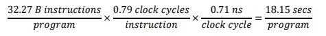

**架构和具体实现的分离**

**程序大小**

**易于编程/编译/链接**

## 2 RV32I：RISC-V 基础整数指令集

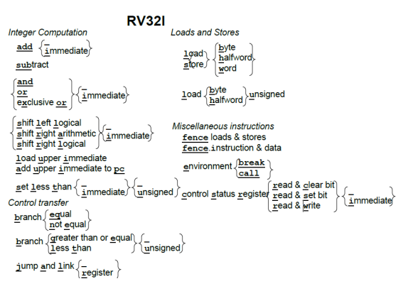

### 2.2 指令格式

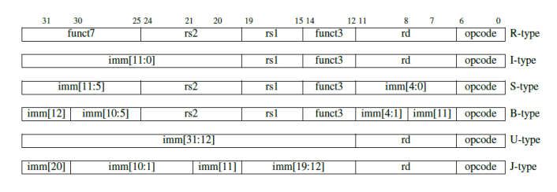

六种基本指令格式:
1. 寄存器-寄存器操作的 R 类型指令
2. 短立即数和访存 load 操作的 I 型指令
3. 访存 store 操作的 S 型指令
4. 条件跳转操作的 B 类型指令
5. 长立即数的 U 型指令
6. 无条件跳转的 J 型指令

**乱序执行处理器**
> 这是一种高速的、流水化的处理器。它们一有机会就执行指令，而不是在按照程序顺序。这种处理器的一个关键特性是寄存器重命名，把程序中的寄存器名称映射到大量的内部物理寄存器。条件执行的问题是不管条件是否成立，都必须给这些指令中的寄存器分配相应的物理寄存器。但内部物理寄存器的可用性是影响乱序处理器的关键性能资源。

### 2.3 寄存器

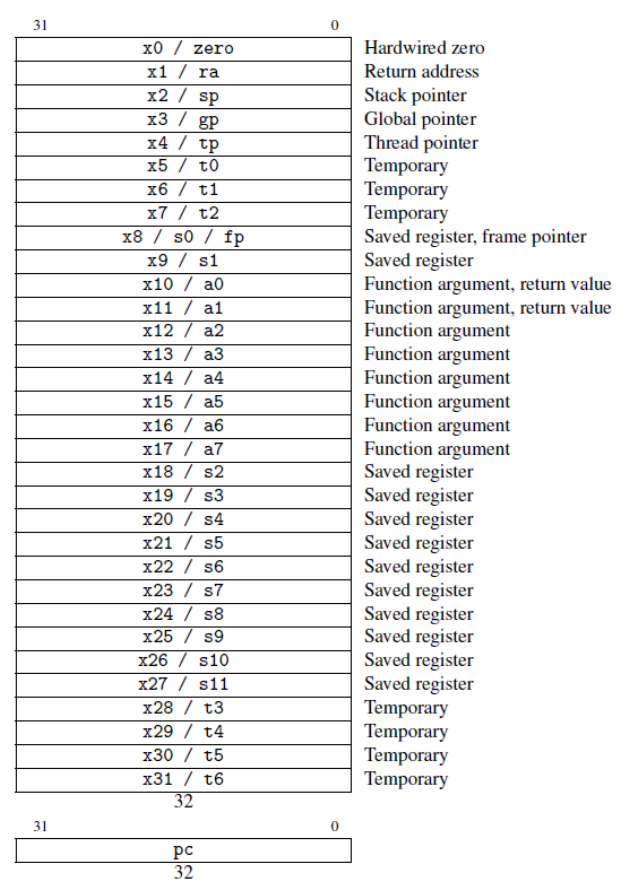

### 2.4 整数计算

* 算术指令 add, sub
* 逻辑指令 and, or, xor
* 移位指令 sll, srl, sra

**利用 xor 指令进行的花式操作**
> 可以在不使用中间寄存器的情况下交换两个值！此代码交换 x1 和 x2 的值。提示：异或操作是交换的 (𝑎 ⊕ 𝑏 = 𝑏 ⊕ 𝑎)，结合的 ((𝑎 ⊕ 𝑏) ⊕ 𝑐 = 𝑎 ⊕ (𝑏 ⊕ 𝑐))，是它自己的逆操作 (𝑎 ⊕ 𝑎 = 0)，并且有一个单位元(𝑎 ⊕ 0 = 𝑎)。

~~~ asm
xor x1,x1,x2 # x1’ == x1^x2, x2’ == x2
xor x2,x1,x2 # x1’ == x1^x2, x2’ == x1’^x2 == x1^x2^x2 == x1
xor x1,x1,x2 # x1” == x1’^x2’ == x1^x2^x1 == x1^x1^x2 == x2, x2’ == x1
~~~

### 2.5 Load 和 Store

**字节序问题**
> RISC-V 选择 little endian

### 2.6 条件分支

**不使用条件码实现大位宽数据的加法**
> 在 RV32I 中是通过 sltu 计算进位来实现的
~~~ asm
add a0,a2,a4 # 加低 32 位: a0 = a2 + a4
sltu a2,a0,a2 # 若 (a2+a4) < a2 那么 a2’ = 1, 否则 a2’ = 0
add a5,a3,a5 # 加高 32 位: a5 = a3 + a5
add a1,a2,a5 # 加上低 32 位的进位
~~~

**软件检查溢出**
> RISC-V 依赖于软件溢出检查
~~~ asm
add t0, t1, t2
slti t3, t2, 0 # t3 = (t2<0)
slt t4, t0, t1 # t4 = (t1+t2<t1)
bne t3, t4, overflow # 若 ((t2<0) && (t1+t2>=t1)) || ((t2>=0) && (t1+t2<t1)) 则为溢出
~~~

### 2.7 无条件跳转

跳转并链接指令（jal）具有双重功能。

若将下一条指令 PC + 4 的地址保存到目标寄存器中，通常是返回地址寄存器 ra，便可以用它来实现过程调用。

如果使用零寄存器（x0）替换 ra 作为目标寄存器，则可以实现无条件跳转，因为 x0 不能更改。

### 2.8 杂项

控制状态寄存器指令（csrrc、csrrs、csrrw、csrrci、csrrsi、csrrwi）

`ecall` 指令用于向运行时环境发出请求，例如系统调用。调试器使用 `ebreak` 指令将控制转移到调试环境。

`fence` 指令对外部可见的访存请求，如设备 I/O 和内存访问等进行串行化。外部可见指对处理器的其他核心、线程，外部设备或协处理器可见。`fence.i` 指令同步指令和数据流。

## 3 RISC-V 汇编语言

### 3.1 导言

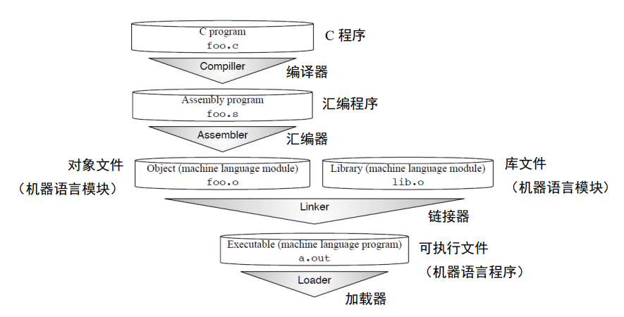

### 3.2 函数调用规范（Calling convention）

**保存寄存器和临时寄存器为什么不是连续编号**
> 为了支持 RV32E——一个只有 16 个寄存器的嵌入式版本的 RISC-V，只使用寄存器 x0 到 x15——一部分保存寄存器和一部分临时寄存器都在这个范围内。其它的保存寄存器和临时寄存器在剩余 16 个寄存器内。RV32E 较小，但由于和 RV32I 不匹配，目前还没有编译器支持。

### 3.3 汇编器

汇编程序的开头是一些汇编指示符（assemble directives）。它们是汇编器的命令，具有告诉汇编器代码和数据的位置、指定程序中使用的特定代码和数据常量等作用。

RISC-V 编译器支持多个 ABI，具体取决于 F 和 D 扩展是否存在。RV32 的 ABI 分别名为 ilp32，ilp32f 和 ilp32d。ilp32 表示 C 语言的整型（int），长整型（long）和指针（pointer）都是 32 位，可选后缀表示如何传递浮点参数。

**链接器松弛（linker relaxation）**

> 跳转并链接指令（jump and link）中有 20 位的相对地址域，因此一条指令就足够跳到很远的位置。尽管编译器为每个外部函数的跳转都生成了两条指令，很多时候其实一条就已经足够了。从两条指令到一条的优化同时节省了时间和空间开销，因此链接器会扫描几遍代码，尽可能地把两条指令替换为一条。每次替换会导致函数和调用它的位置之间的距离缩短，所以链接器会多次扫描替换，直到代码不再改变。这个过程称为链接器松弛，名字来源于求解方程组的松弛技术。除了过程调用之外，对于 gp 指针±2KiB 范围内的数据访问，RISC-V 链接器也会使用一个全局指针替换掉 lui 和 auipc 两条指令。对 tp 指针±2KiB 范围内的线程局部变量访问也有类似的处理。

| Directive           | Description                                                  |
| ------------------- | ------------------------------------------------------------ |
| .align n            | Align the next datum on a 2^n byte boundary.                 |
| .balign n           | Align the next datum on a n byte boundary.                   |
| .string "str"       | Store the string str in memory and null-terminate it.        |
| .byte b1, ..., bn   | Store the n 8-bit quantities in successive bytes of memory.  |
| .half h1, ..., hn   | Store the n 16-bit quantities in successive bytes of memory. |
| .word w1, ..., wn   | Store the n 32-bit quantities in successive bytes of memory. |
| .dword d1, ..., dn  | Store the n 64-bit quantities in successive bytes of memory. |
| .float f1, ..., fn  | Store the n single-precision floating-point numbers in successive memory words. |
| .double d1, ..., dn | Store the n double-precision floating-point numbers in successive memory words. |
| .option rvc         | Compress subsequent instructions.                            |
| .option norvc       | Don't compress subsequent instructions.                      |
| .option relax       | Allow linker relaxations for subsequent instructions.        |
| .option norelax     | Don't allow linker relaxations for subsequent instructions.  |
| .option pic         | Subsequent instructions are position-independent code.       |
| .option nopic       | Subsequent instructions are position-dependent code.         |
| .option push        | Push the current setting of all .option to a stack, so that a subsequent .option pop will restore their value. |
| .option pop         | Pop the option stack, restoring all .option to their setting at the time of the last .option push. |

### 3.5 静态链接和动态链接

编译器产生的代码和静态链接的代码很相似。其不同之处在于，跳转的目标不是实际的函数，而是一个只有三条指令的存根函数（stub unction）。存根函数会从内存中的一个表中加载实际的函数的地址并跳转。不过，在第一次调用时，表中还没有实际的函数的地址，只有一个动态链接的过程的地址。当这个动态链接过程被调用时，动态链接器通过符号表找到实际要调用的函数，复制到内存中，更新记录实际的函数地址的表。后续的每次调用的开销就是存根函数的三条指令的开销。

## 4 乘法和除法指令

### 4.1 导言

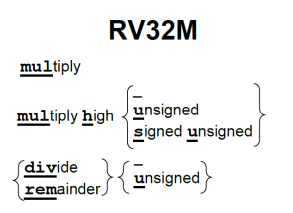
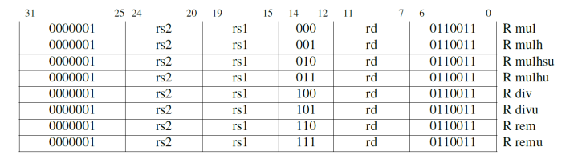

为了正确地得到一个有符号或无符号的 64 位积，RISC-V 中带有四个乘法指令。要得到整数 32 位乘积（64 位中的低 32 位）就用 mul 指令。要得到高 32 位，如果操作数都是有符号数，就用 mulh 指令；如果操作数都是无符号数，就用 mulhu 指令；如果一个有符号一个无符号，可以用 mulhsu 指令。在一条指令中完成把 64 位积写入两个 32位寄存器的操作会使硬件设计变得复杂，所以 RV32M 需要两条乘法指令才能得到一个完整的 64 位积。

**mulhsu 对于多字有符号乘法很有用**
> 当乘数有符号且被乘数无符号时，mulhsu 产生乘积的上半部分。当乘数的最高有效字（包含符号位）与被乘数的较低有效字（无符号）相乘时，它是多字有符号乘法的子步骤。

**mulh 和 mulhu 可以检查乘法的溢出**
> 如果 mulhu 的结果为零，则在使用 mul 进行无符号乘法时不会溢出。类似地，如果 mulh 结果中的所有位与 mul 结果的符号位匹配（即当 mul 结果为正时 mulh 结果为 0，mul 结果为负时 mulh 结果为十六进制的 ffffffff），则使用 mul 进行有符号乘法时不会溢出。

对许多微处理器来说，整数除法是相对较慢的操作。如前述，除数为 2 的幂次的无符号除法可以用右移来代替。事实证明，通过乘以近似倒数再修正积的高 32 位的方法，可以优化除数为其它数的除法。RV32M 中用乘法来实现除以常数操作的代码。

## 5 RV32F 和 RV32D：单精度和双精度浮点数

### 5.1 导言

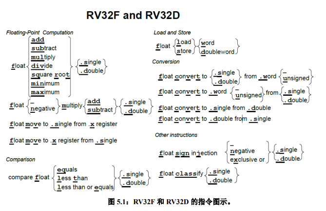
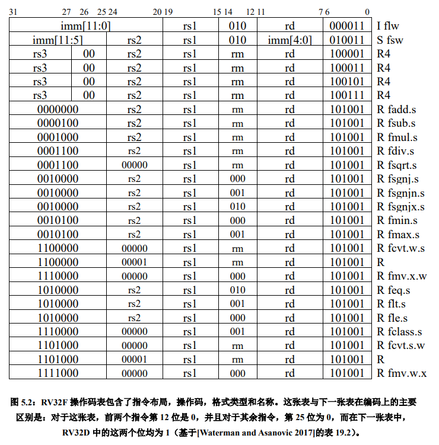
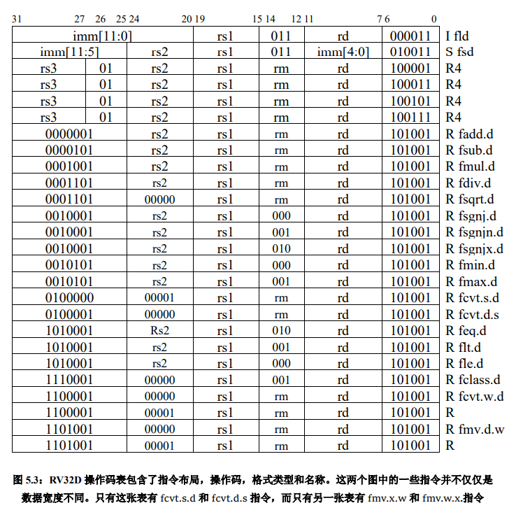

### 5.3 浮点加载，存储和算术指令

它们也有最小值和最大值指令（fmin.s，fmin.d，fmax.s，fmax.d），这些指令在不使用分支指令进行比较的情况下，将一对源操作数中的较小值或较大值写入目的寄存器。

许多浮点算法（例如矩阵乘法）在执行完乘法运算后会立即执行一条加法或减法指令。因此，RISC-V 提供了指令用于先将两个操作数相乘然后将乘积加上（fmadd.s，fmadd.d）或减去（fmsub.s，fmsub.d）第三个操作数，最后再将结果写入目的寄存器。

这些融合的乘法 - 加法指令比单独的使用乘法及加法指令更准确，也更快，因为它们只（在加法之后）舍入过一次，而单独的乘法及加法指令则舍入了两次（先是在乘法之后，然后在加法之后）。

RV32F 和 RV32D 没有提供浮点分支指令，而是提供了浮点比较指令，这些根据两个浮点的比较结果将一个整数寄存器设置为 1 或 0：feq.s，feq.d，flt.s，flt.d，fle.s，fle.d。

~~~ asm
flt x5，f1，f2 ＃如果 f1 < f2，则 x5 = 1;否则 x5 = 0
bne x5，x0，Exit ＃如果 x5！= 0，则跳转到 Exit
~~~

### 5.4 浮点转换和搬运

|                           | From                   | From                      | From                   | From                   |
| ------------------------- | ---------------------- | ------------------------- | ---------------------- | ---------------------- |
| To                        | 32b signed integer (w) | 32b unsigned integer (wu) | 32b floating point (s) | 64b floating point (d) |
| 32b signed integer (w)    | -                      | -                         | fcvt.w.s               | fcvt.w.d               |
| 32b unsigned integer (wu) | -                      | -                         | fcvt.wu.s              | fcvt.wu.d              |
| 32b floating point (s)    | fcvt.s.w               | fcvt.s.wu                 | -                      | fcvt.s.d               |
| 64b floating point (d)    | fcvt.d.w               | fcvt.d.wu                 | fcvt.d.s               | -                      |

RV32F 还提供了将数据从 f 寄存器（fmv.x.w）移动到 x 寄存器的指令，以及反方向移动数据的指令（fmv.w.x）。

## 6 原子指令

### 6.1 导言

RV32A 有两种类型的原子操作：
1. atomic memory operation
2. load reserved / store conditional (lr/sc)

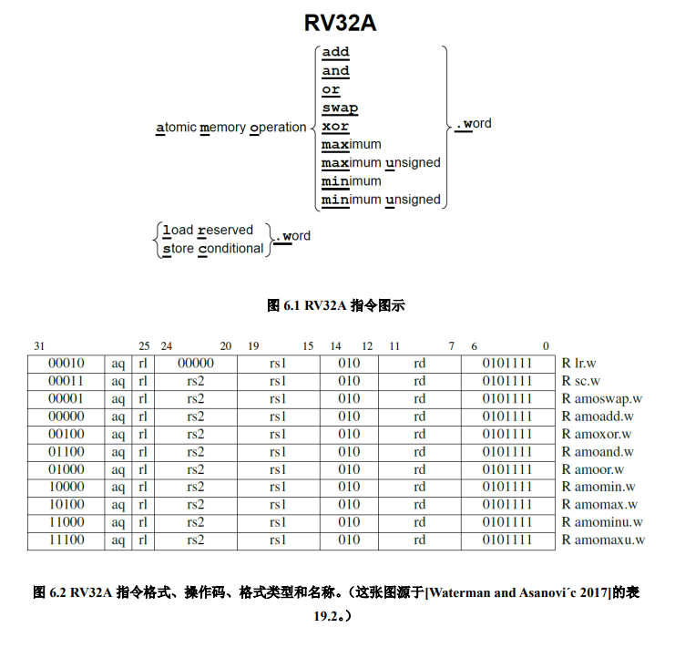

**compare-and-swap 操作：**
> 比较一个寄存器中的值和另一个寄存器中的内存地址指向的值，如果它们相等，将第三个寄存器中的值和内存中的值进行交换。这是一条通用的同步原语。

加载保留和条件存储只需要两个源寄存器，用它们可以实现原子的比较交换。用 `lr/sc` 实现内存字 M[a0] 的比较-交换操作:
~~~ asm
# Compare-and-swap (CAS) memory word M[a0] using lr/sc.
# Expected old value in a1; desired new value in a2.
0x00: lr.w a3, (a0)     # load old value
0x04: bne a3, a1, 0x80  # old value equals a1?
0x08: sc.w a3, a2, (a0) # swap in new value if so
0x0c: bnez a3, 0x0      # retry if store failed
    ... code following successful CAS goes here ...
0x80:                   # unsuccessful CAS
~~~

**内存一致性模型**
RISC-V 具有宽松的内存一致性模型（relaxed memory consistency model），因此其他线程看到的内存访问可以是乱序的。图 6.2 中，所有的 RV32A 指令都有一个请求位（`aq`）和一个释放位（`rl`）。`aq` 被置位的原子指令保证其它线程在随后的内存访问中看到顺序的 AMO 操作；`rl` 被置位的原子指令保证其它线程在此之前看到顺序的原子操作。

~~~ asm
# Critical section guarded by test-and-set spinlock using an AMO.
0x00: li t0, 1                  # initialize lock value
0x04: amoswap.w.aq t1, t0, (a0) # attempt to acquire lock
0x08: bnez t1, 0x4              # retry if unsuccessful
    ... critical section goes here ...
0x20: amoswap.w.rl x0, x0, (a0) # release lock
~~~

## 7 压缩指令

RV32C 采用了一种新颖的方法：每条短指令必须和一条标准的 32 位 RISC-V 指令一一对应。此外，16 位指令只对**汇编器和链接器**可见，并且是否以短指令取代对应的宽指令由它们决定。编译器编写者和汇编语言程序员可以幸福地忽略 RV32C 指令及其格式，他们能感知到的则是最后的程序大小小于大多数其它 ISA 的程序。

基于以下的三点观察，架构师们成功地将指令压缩到了 16 位：
1. 对十个常用寄存器（`a0-a5，s0-s1，sp 以及 ra`）访问的频率远超过其他寄存器；
2. 许多指令的写入目标是它的源操作数之一；
3. 立即数往往很小，而且有些指令比较喜欢某些特定的立即数。

因此，许多 RV32C 指令：
1. 只能访问那些常用寄存器；
2. 一些指令隐式写入源操作数的位置；
3. 几乎所有的立即数都被缩短了，load 和 store 操作只使用操作数整
数倍尺寸的无符号数偏移量。

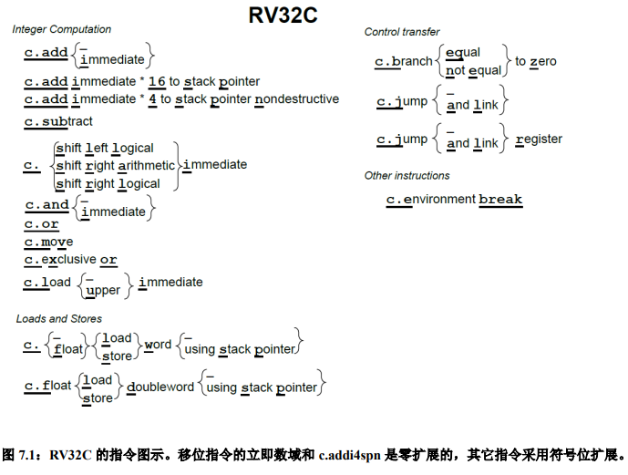

尽管处理器的设计者们不能忽略 RV32C 的存在，但是有一个技巧可以让实现的代价变小：在执行之前用一个解码器将所有的 16 位指令转换为等价的 32 位指令。

## 8 向量

### 8.1 导言

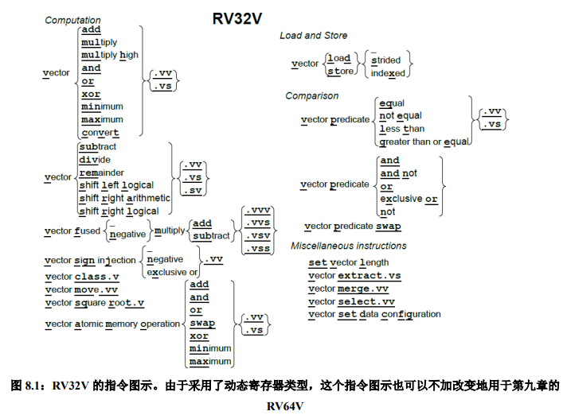

